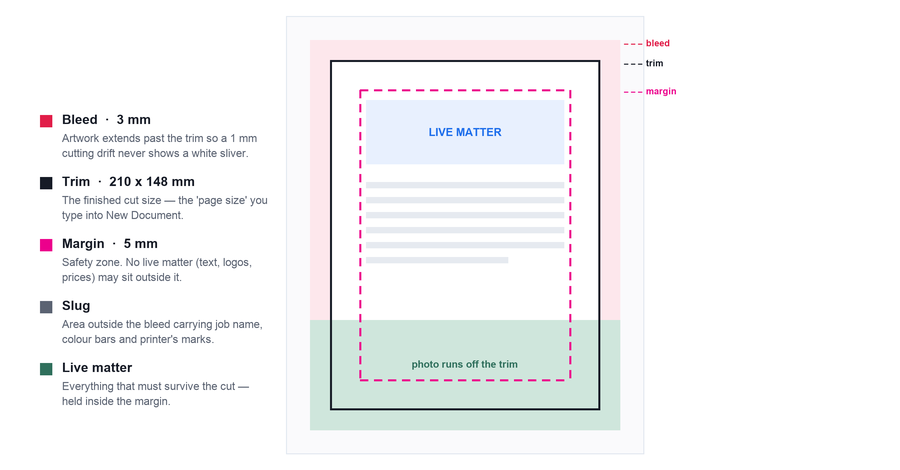
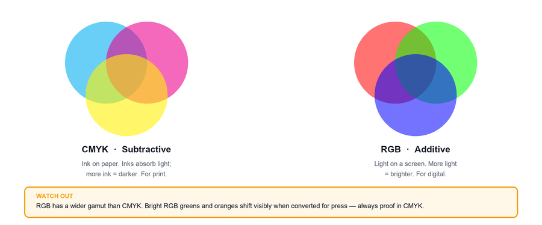
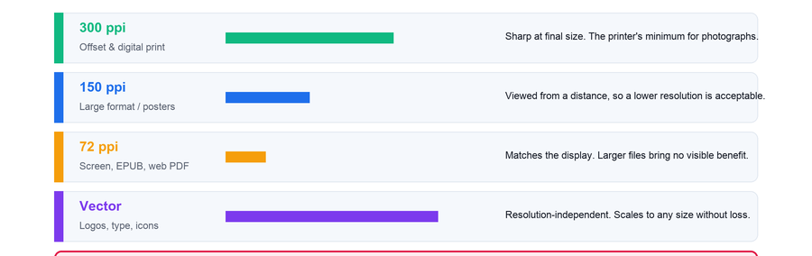
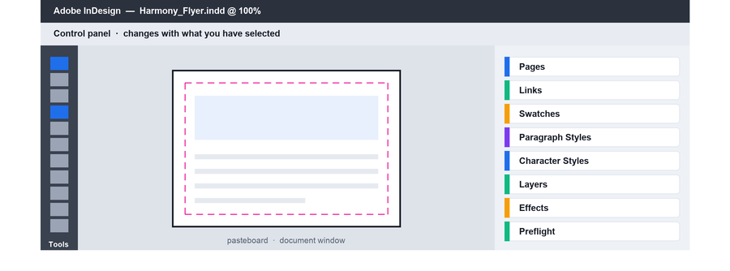
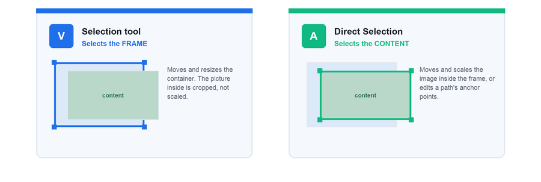
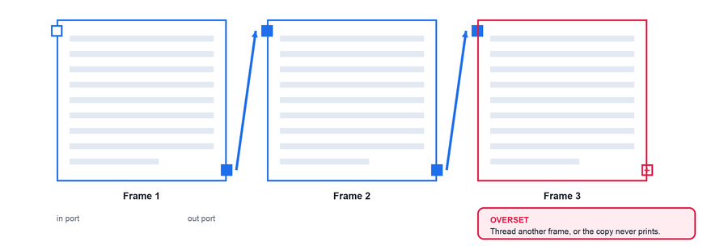
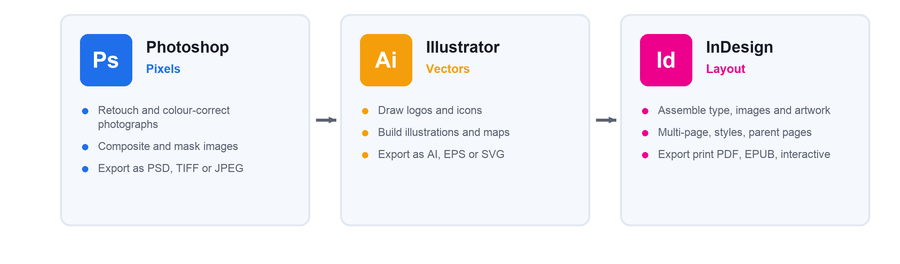
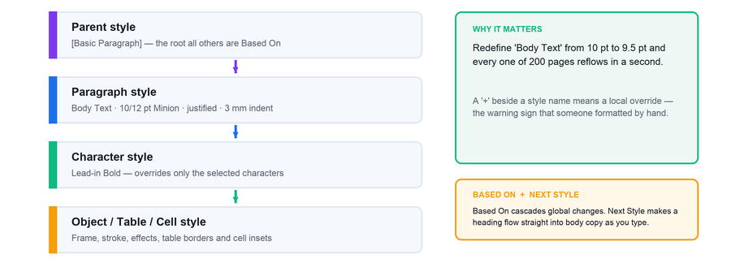
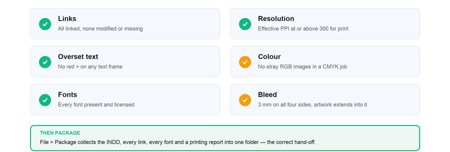
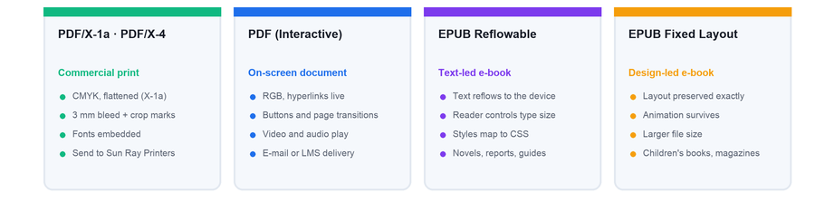

# Creating Stunning Print and Digital Publications with InDesign
**Learner Guide** · Version v13.0 · 22 August 2026
WSQ Course Reference: **TGS-2021007827** · Tertiary Infotech Academy Pte Ltd · UEN: 201200696W

> Skills Framework: Manual and Digital Drawings Production (RET-DNI-4004-1.1)

## About This Course
Creating Stunning Print and Digital Publications with InDesign is a 1-day (8-hour) WSQ course, reference TGS-2021007827, delivered by Tertiary Infotech Academy Pte Ltd. It teaches you to take a publication from a client brief through to a file a commercial printer or a digital platform will accept without a query.

This Learner Guide is your step-by-step reference. The slide deck used in class shows what each feature is for and why it matters; this guide gives you the exact procedure, menu path by menu path. You may use this guide during the open-book assessment.

### The Running Case Study — Harmony Petals
Every lab is set at **Harmony Petals**, a Singapore florist with three retail outlets. You are its junior layout designer. **Priya**, the marketing manager, briefs you; **Sun Ray Printers** produces the printed work.

## Learning Outcomes
- **LO1 · Establish & create** — Establish the drawing layout requirement from a client brief — trim, bleed, margins, columns, colour mode and binding — and create the correctly specified InDesign document with parent pages, grids and guides.
- **LO2 · Utilize InDesign tools** — Utilize the InDesign drawing toolset — text frames and threading, the Pen and shape tools, paths and Pathfinder, colour, gradients, transparency and effects, transform, align and layers — to build the page.
- **LO3 · Refine the drawings** — Refine the layout with professional typography, paragraph/character/object styles, tables, interactivity and a preflighted, correctly packaged export for both print and digital delivery.

## Skills Framework Alignment

| Ref | Statement |
|---|---|
| **A1** | Establish drawing requirements |
| **A2** | Determine document dimensions, angles, shapes and finished sizes of project requirements |
| **A3** | Identify and select appropriate mediums for drawings |
| **A4** | Refine drawings to meet project requirements within scope of authority |
| **K1** | Types, techniques and processes of manual production drawings |
| **K2** | Types of computer-aided drawing equipment, software, techniques and processes |
| **K3** | Conventional signs and markings for drawings |

## Before You Start

| | |
|---|---|
| **Knowledge & skills** | Able to operate a computer confidently. Minimum 3 GCE 'O' Levels including English, or WPL Level 5. |
| **Experience** | Minimum 1 year of working experience. |
| **Attitude** | Positive learning mindset and willingness to participate in hands-on practice. |
| **Software** | Adobe InDesign (2024 or later) installed on a Windows or macOS laptop. |
| **Hardware** | Laptop with a mouse; a minimum 1280 x 800 display is recommended. |
| **Files** | The course lab files, downloaded from the LMS before the class starts. |

## Assessment
- Oral Questioning (OQ) — 5 questions, 15 minutes, 1:1 with the assessor, open book. Covers the underpinning knowledge K1–K3.
- Practical Performance (PP) — hands-on InDesign layout tasks, 75 minutes, open book. Covers the abilities A1–A4.
- Format: Open Book — course slides, this Learner Guide and approved materials only.
- Graded Competent (C) or Not Yet Competent (NYC) on every ability and knowledge statement.
- A minimum of 75% attendance is required to be eligible for assessment and funding.

---

## Topic 01 — Get Started on InDesign
*Establish drawing & layout requirements · Explore the interface · Create documents · Manage pages*

Topic weighting: 30%

### Key Concepts
- Adobe InDesign is the industry-standard page-layout application for print and digital publishing — it assembles type, images and vector artwork into a precisely specified, production-ready document, and it is the only Creative Cloud application built around the multi-page, multi-master, style-driven workflow that publications demand.
- InDesign is a layout tool, not an image editor or an illustration tool: pixels are retouched in Photoshop, vector artwork is drawn in Illustrator, and both are *placed* into InDesign as linked assets. Knowing which application owns which job is the single biggest efficiency gain for a junior designer.
- Purpose, audience and delivery medium are design inputs, not afterthoughts. A publication brief should identify what the document must achieve, who will read it, where it will be used, which accessibility needs matter and how success will be approved before layout begins.
- Rights clearance belongs in the production brief. Confirm copyright ownership, stock-image licence terms, model or location releases, font licences and required attribution before a third-party asset enters the layout; a technically perfect document can still be unusable when permissions are missing.
- Visual hierarchy, alignment, contrast, proximity, repetition, balance and white space help readers find meaning quickly. These principles are tested against the audience and medium, not applied as decoration, and accessible typography and colour contrast are part of that design judgement.
- File management is part of layout production: use a clear job folder, versioned filenames, a dedicated Links folder and an approval record. Keep source, working, proof and released files distinct so feedback can be traced and an earlier approved version can be recovered.
- Every job begins with a written specification: the trim size (final cut size), the bleed (artwork extending past trim, 3 mm in Singapore/ISO practice), the slug (production marks area), the safety/margin (no live matter inside), the binding method and the intended output. Get the spec wrong and the whole file is re-done.
- Colour mode is decided by the output, not by preference: CMYK for offset and digital print, RGB for screen, EPUB and interactive PDF. Setting the wrong Intent in the New Document dialog silently sets the wrong colour space, transparency blend space and default swatch library.
- Resolution follows the medium: 300 ppi at final size for print, 72–150 ppi for screen, and vector wherever possible for logos and type. Effective PPI (not native PPI) is what actually prints — scaling a placed image up in InDesign lowers its effective resolution.
- The InDesign interface is workspace-driven — the Tools panel, the Control panel (context-sensitive to the current selection), the Properties panel, the panel dock and the document window. Saving a custom workspace (Window > Workspace > New Workspace) is how professionals keep a consistent, fast layout environment.
- Two selection tools do very different jobs: the black Selection tool moves and resizes the *frame*, and the white Direct Selection tool edits the *content* inside the frame or the individual anchor points of a path. Most beginner frustration in InDesign is a wrong-selection-tool problem.
- A parent page (formerly 'master page') is a reusable background applied to many document pages — running heads, folios, footers, column structure and repeating logos live there. Change the parent once and every page based on it updates automatically.
- Automatic page numbering is inserted as a *marker* (Type > Insert Special Character > Markers > Current Page Number) on the parent page, not as typed digits, so numbering re-flows correctly when pages are added, removed or re-ordered.
- Sections and section markers let one document carry front matter in roman numerals and body matter in arabic numerals, with chapter prefixes — essential for books, reports and catalogues.
- Grids and guides are the invisible skeleton of professional layout: a baseline grid locks body text to a common rhythm across columns and pages, a document grid aligns objects, and ruler guides (page guides vs spread guides) position elements precisely. Layout > Create Guides builds a full modular grid in one dialog.
- The Adjust Layout feature (File > Adjust Layout) re-flows an existing layout automatically when the page size, margins or bleed change — turning a formerly day-long re-work into a single dialog, and a genuine productivity skill to demonstrate to an employer.
- A book file (File > New > Book) is a collection of InDesign documents that share styles, swatches and parent pages, with continuous pagination across the whole set — the standard way to produce a long publication as manageable chapter files.
- Preferences that matter from day one: units and increments (millimetres for Singapore print), Auto-activate Adobe Fonts, Smart Text Reflow and the Interface scaling. Set them with no document open and they become the application default for every new job.

*Figure 1.1 — The anatomy of a print page: trim, bleed, margin and slug.*

*Figure 1.2 — Colour mode follows the output: CMYK for ink, RGB for screen.*

*Figure 1.3 — Resolution follows the medium; effective PPI is what prints.*

*Figure 1.4 — The InDesign workspace.*

*Figure 1.5 — The frame and its content are two different things.*

### Lab 1 — Establish the Layout Requirement from a Client Brief

**The situation.** You are the junior layout designer at **Harmony Petals**, a Singapore florist with three retail outlets. The marketing manager, Priya, forwards an e-mail brief at 9.40 am: "We need an A5 landscape promotional flyer for the Mid-Autumn range, full-colour, printed both sides on 200 gsm art card, 5,000 copies, litho at Sun Ray Printers. Photos bleed off all four edges. Please confirm the specification before you start." Priya has not stated the bleed, the margins or the colour mode. Sun Ray Printers' website states a 3 mm bleed and a 5 mm minimum safety margin. Getting this wrong costs the 5,000-copy print run.

| | |
|---|---|
| **Learning outcome** | LO1 |
| **Objective** | Establish drawing and layout requirements from a client brief and translate them into a written InDesign document specification (TSC A1, A2). |
| **You will produce** | A completed Document Specification Sheet (trim, bleed, slug, margins, columns, colour mode, resolution, output) signed off before any file is created, plus InDesign preferences set to millimetres. |
| **Tools and panels** | Adobe InDesign · Document Specification Sheet · Preferences > Units & Increments |
| **Starter InDesign file** | `restaurant-menu.indd` |
| **Printable lab guide** | `INSTRUCTIONS.pdf` in the same lab folder |

**What you will do.** Interrogate a real client brief, identify what is specified and what is missing, and produce a completed Document Specification Sheet. You then set the InDesign application preferences (units in millimetres) that every subsequent lab depends on.

#### Set Up the Lab Package

1. Open the Lab 01 folder and read `README.pdf`.
2. Duplicate `restaurant-menu.indd` as `Lab-01-Working.indd`; never edit the supplied original.
3. Create an `Evidence/` folder and capture the starting state of the most relevant production panel.
4. Keep all supporting assets inside this lab folder so links stay portable.

> **Starter role:** Existing publication to audit against the client brief before any production work begins.

#### Step-by-Step Procedure

1. Open restaurant-menu.indd as a production-audit sample. Use File > Document Setup, Window > Links and Window > Output > Preflight to record its current page, link and output state before interpreting the new client brief.
   > `File > Document Setup  ·  Window > Links  ·  Window > Output > Preflight`
2. Record the publication's purpose, primary audience, delivery medium, accessibility needs and approval owner. Flag any image, font, model-release or location-release rights that still require confirmation.
   > `Brief audit: purpose  ·  audience  ·  medium  ·  accessibility  ·  rights`
3. Read the brief and list every stated requirement — size, orientation, colour, stock, quantity, print process, finishing.
4. Identify the missing specifications. The brief omits bleed, margins, slug and colour mode; these must be confirmed with the printer, not assumed.
5. Look up Sun Ray Printers' specification: 3 mm bleed on all four sides, 5 mm minimum safety margin from trim, PDF/X-1a supply.
6. Compute the sizes. A5 landscape trim = 210 x 148 mm. Add 3 mm bleed on all sides for the artwork area = 216 x 154 mm.
   > `Trim 210 x 148 mm  |  Bleed 3 mm  |  Artwork 216 x 154 mm`
7. Decide the colour mode from the output: litho press = CMYK. Set image resolution at 300 ppi effective at final size.
8. Complete the Document Specification Sheet and have it checked by the trainer, acting as Priya, before proceeding.
9. Close all documents. Choose Edit (Windows) or InDesign (macOS) > Preferences > Units & Increments and set Horizontal and Vertical to Millimeters.
   > `Preferences > Units & Increments > Millimeters`
10. In Preferences > File Handling, enable Auto-activate Adobe Fonts so missing fonts are resolved automatically.
   > `Preferences > File Handling > Auto-activate Adobe Fonts`

#### Verify Your Work

> ✅ **Done when:** Your Specification Sheet states trim 210 x 148 mm, bleed 3 mm, artwork 216 x 154 mm, CMYK, 300 ppi, PDF/X-1a — and the InDesign rulers now read in millimetres.

#### Evidence to Keep

- Completed specification sheet
- Annotated audit screenshot
- Approved output decision
- Final working file saved as `Lab-01-Completed.indd`

#### Stretch Challenge

Identify one accessibility risk and one rights or licensing risk in the supplied menu, then record the corrective action in the brief.

#### If It Doesn't Work

If the rulers still show picas or inches, you changed preferences with a document open — that only changes the current document. Close all documents and set the preference again to make it the application default.

#### Discussion Questions

1. Which four items in Priya's brief are production specifications, and which two are still missing?
2. Why is 3 mm bleed required when the photographs are described as running 'off all four edges'?
3. The job is litho-printed. What colour mode must the document use, and what would happen at the printer if RGB were used instead?
4. The flyer is A5 landscape. State the trim size in millimetres, and the document size including bleed.
5. Why must units be set to millimetres with no document open, rather than after creating the file?

### Lab 2 — Create the Document and Explore the InDesign Workspace

**The situation.** The Harmony Petals specification from Lab 1 is signed off. Priya now needs the empty, correctly specified file created and saved to the shared drive so the copywriter can start dropping text in. She also asks you to standardise your workspace, because last month a colleague spent twenty minutes hunting for the Links panel while a client waited on a call.

| | |
|---|---|
| **Learning outcome** | LO1 |
| **Objective** | Create an InDesign document to a stated specification and navigate the workspace, panels and selection tools with confidence (TSC A2, A3). |
| **You will produce** | Harmony_Flyer.indd — an A5 landscape, 2-page, CMYK document with 3 mm bleed and 5 mm margins, plus a saved custom workspace named 'Publication Layout'. |
| **Tools and panels** | Adobe InDesign · Start workspace · New Document dialog · Panels & workspaces |
| **Starter InDesign file** | `parent-pages.indd` |
| **Printable lab guide** | `INSTRUCTIONS.pdf` in the same lab folder |

**What you will do.** Create the flyer document from the signed-off specification, learn the Start workspace and the New Document dialog including presets and Adobe Stock templates, then build and save a custom workspace containing the panels a layout designer actually uses.

#### Set Up the Lab Package

1. Open the Lab 02 folder and read `README.pdf`.
2. Duplicate `parent-pages.indd` as `Lab-02-Working.indd`; never edit the supplied original.
3. Create an `Evidence/` folder and capture the starting state of the most relevant production panel.
4. Keep all supporting assets inside this lab folder so links stay portable.

> **Starter role:** Workspace exploration sample. Keep it open for comparison while creating Harmony_Flyer.indd from a new document.

#### Step-by-Step Procedure

1. Launch InDesign, open parent-pages.indd and use it to identify the document tab, page/pasteboard, Tools panel, Control or Properties panel, panel dock and status bar. Close it without saving.
   > `Open parent-pages.indd  ·  close without saving`
2. Study the Start workspace — recent files, presets, and the Adobe Stock template gallery.
3. Choose File > New > Document. Select the Print intent so the colour mode defaults to CMYK and units to millimetres.
   > `File > New > Document  ·  Intent: Print`
4. Set Width 210 mm, Height 148 mm, Orientation Landscape, Pages 2, and clear Facing Pages — this is a single-sided flyer printed both sides, not a spread.
   > `210 x 148 mm  ·  Landscape  ·  2 pages  ·  Facing Pages OFF`
5. Set all four Margins to 5 mm. Expand Bleed and Slug and set Bleed to 3 mm on all four sides.
   > `Margins 5 mm  ·  Bleed 3 mm`
6. Click Create, then File > Save As and name the file Harmony_Flyer.indd in your working folder.
   > `File > Save As  ·  Harmony_Flyer.indd`
7. Identify the red bleed line, the black trim edge and the magenta margin guide on screen. Confirm all three are visible.
8. Explore the Tools panel. Select a frame with the black Selection tool (V), then with the white Direct Selection tool (A), and observe what each one selects.
   > `V = Selection (frame)  ·  A = Direct Selection (content / points)`
9. Open Window > Links, Window > Pages, Window > Colour > Swatches and Window > Output > Preflight, and dock them together on the right.
   > `Window > Links / Pages / Swatches / Preflight`
10. Choose Window > Workspace > New Workspace, name it 'Publication Layout', tick Panel Locations and Menu Customization, and click OK.
   > `Window > Workspace > New Workspace`
11. Press W to toggle Preview mode and see the flyer as it will trim; press W again to return to Normal.
   > `W = Preview / Normal toggle`

#### Verify Your Work

> ✅ **Done when:** Harmony_Flyer.indd opens at 210 x 148 mm landscape with a visible 3 mm red bleed guide and 5 mm margins, and 'Publication Layout' appears in the Window > Workspace list.

#### Evidence to Keep

- Harmony_Flyer.indd
- New Document settings screenshot
- Saved Publication Layout workspace
- Final working file saved as `Lab-02-Completed.indd`

#### Stretch Challenge

Save the finished document settings as a reusable Harmony A5 Print preset and prove it appears in the New Document dialog.

#### If It Doesn't Work

No red bleed line visible? Bleed was left at 0 — fix it in File > Document Setup without recreating the file. Guides missing entirely? Press W to leave Preview mode, or use View > Grids & Guides > Show Guides.

#### Discussion Questions

1. What is the difference between the Print, Web and Mobile intents in the New Document dialog, and what does each one change behind the scenes?
2. You need to move a photograph's frame without changing the photograph inside it. Which selection tool do you use, and why?
3. Where would you find the Links panel, and why does a production designer keep it visible at all times?
4. What does 'Facing Pages' do, and why is it switched OFF for a single-sided flyer but ON for a magazine?
5. How does saving a custom workspace protect against the twenty-minute panel hunt Priya described?

### Lab 3 — Build a Parent Page with Automatic Page Numbering

**The situation.** Harmony Petals is also producing a 16-page **Seasonal Care Guide**. The previous designer typed the page numbers by hand. Marketing has now asked for two extra pages to be inserted at page 4, which means every folio after it is wrong, and the printer has separately advised that the outer margin must increase from 12 mm to 18 mm for the perfect binding. Re-doing this manually would take the rest of the day.

| | |
|---|---|
| **Learning outcome** | LO1 |
| **Objective** | Manage pages using parent pages, automatic numbering markers and the Adjust Layout feature so a multi-page publication remains maintainable (TSC A2, A4). |
| **You will produce** | HP_LongDoc.indd with an A-Parent carrying an automatic folio and running footer, applied to all pages, surviving a 2-page insertion and an 18 mm margin change. |
| **Tools and panels** | Adobe InDesign · Pages panel · Parent pages · Current Page Number marker · Adjust Layout |
| **Starter InDesign file** | `HP_LongDoc.indd` |
| **Printable lab guide** | `INSTRUCTIONS.pdf` in the same lab folder |

**What you will do.** Open the supplied long document, build a proper parent page carrying a running footer and an automatic page-number marker, apply it across the publication, then insert pages and change the margins — proving that the automatic numbering and Adjust Layout do the re-work for you.

#### Set Up the Lab Package

1. Open the Lab 03 folder and read `README.pdf`.
2. Duplicate `HP_LongDoc.indd` as `Lab-03-Working.indd`; never edit the supplied original.
3. Create an `Evidence/` folder and capture the starting state of the most relevant production panel.
4. Keep all supporting assets inside this lab folder so links stay portable.

> **Starter role:** Long-document starter for parent pages, folios and section numbering.

#### Step-by-Step Procedure

1. Open HP_LongDoc.indd from the Topic 1 lab folder and open Window > Pages.
   > `Open HP_LongDoc.indd`
2. In the Pages panel, double-click A-Parent to edit it. Both parent pages appear in the document window.
3. Select the Type tool (T) and draw a text frame in the bottom outer corner of the left parent page, wide enough for a three-digit number plus a label.
   > `T = Type tool`
4. With the cursor in the frame, choose Type > Insert Special Character > Markers > Current Page Number. The letter 'A' appears.
   > `Type > Insert Special Character > Markers > Current Page Number`
5. Type a space then 'Harmony Petals Seasonal Care Guide'. Set it to 8 pt, and align it to the outer edge.
6. Copy the frame, paste it onto the right parent page, and set its alignment to the opposite outer edge so the folio always sits on the outside.
   > `Edit > Paste in Place, then reposition`
7. Return to page 1 by double-clicking it in the Pages panel. Confirm real page numbers now appear on every page.
8. In the Pages panel menu choose Insert Pages, insert 2 pages after page 3, and confirm every subsequent folio renumbers itself automatically.
   > `Pages panel menu > Insert Pages > 2 pages after page 3`
9. Choose File > Document Setup, click Adjust Layout, change the outer margin to 18 mm, and click OK. Watch the existing page elements re-flow.
   > `File > Document Setup > Adjust Layout  ·  outer margin 18 mm`
10. Review three or four pages and correct any element the automatic adjustment has left visually unbalanced.

#### Verify Your Work

> ✅ **Done when:** Every page carries a correct, automatically generated folio; after inserting two pages the numbering is still correct end to end; the outer margin measures 18 mm and content has re-flowed to respect it.

#### Evidence to Keep

- Updated HP_LongDoc.indd
- Pages panel screenshot
- Inserted-page numbering proof
- Final working file saved as `Lab-03-Completed.indd`

#### Stretch Challenge

Add a second parent for a chapter opener and begin a new section with roman-numeral front matter followed by arabic body pages.

#### If It Doesn't Work

Folio shows 'A' on document pages too? You typed the letter A instead of inserting the marker — delete it and use the Markers menu. Cannot select the footer on a document page? That is correct: parent items are locked. Use Ctrl/Cmd+Shift+click to override just that instance.

#### Discussion Questions

1. Why must a page number be inserted as a Current Page Number *marker* rather than typed digits?
2. The letter 'A' appears in the text frame on the parent page. What will it display on document page 7?
3. Objects from a parent page appear with a dotted border on document pages and cannot be selected normally. How do you override a single parent item on one page, and when is that justified?
4. What exactly does File > Adjust Layout change, and what does it not change?
5. Your document has front matter in roman numerals and a body in arabic numerals. Which feature makes that possible in one file?

### Lab 4 — Set Up Grids, Guides and a Modular Column Structure

**The situation.** The Harmony Petals brochure has come back from the client with one comment: "It looks untidy — the pictures and the headings don't line up." Priya wants the two product photographs aligned exactly and the whole page built on a repeatable structure so that the next six brochures in the series look like a family rather than six unrelated documents.

| | |
|---|---|
| **Learning outcome** | LO1 |
| **Objective** | Determine document dimensions and structure by building a baseline grid, a document grid and a modular guide system that aligns every element on the page (TSC A2, A4). |
| **You will produce** | HP_Brochure_1.indd with a 12 pt baseline grid, a 3-column x 4-row modular grid with 4 mm gutters, and the two product images aligned exactly to the grid. |
| **Tools and panels** | Adobe InDesign · Preferences > Grids · Layout > Create Guides · Ruler guides · Smart Guides |
| **Starter InDesign file** | `HP_Brochure_1.indd` |
| **Printable lab guide** | `INSTRUCTIONS.pdf` in the same lab folder |

**What you will do.** Diagnose why an unaligned page reads as untidy, then build the invisible skeleton that fixes it: a baseline grid for the type, a document grid for objects, ruler guides for specific positions, and a full modular grid created in one dialog with Layout > Create Guides.

#### Set Up the Lab Package

1. Open the Lab 04 folder and read `README.pdf`.
2. Duplicate `HP_Brochure_1.indd` as `Lab-04-Working.indd`; never edit the supplied original.
3. Create an `Evidence/` folder and capture the starting state of the most relevant production panel.
4. Keep all supporting assets inside this lab folder so links stay portable.

> **Starter role:** Brochure starter for baseline grids, guides and modular alignment.

#### Step-by-Step Procedure

1. Open HP_Brochure_1.indd from the Topic 1 lab folder and assess the current alignment of the two images.
   > `Open HP_Brochure_1.indd`
2. Choose Preferences > Grids. Set the baseline grid Start at 0 mm, Relative To Top Margin, and Increment Every 12 pt to match a 12 pt body leading.
   > `Preferences > Grids  ·  Increment Every 12 pt`
3. In the same dialog set the Document Grid to 5 mm gridline spacing with 5 subdivisions.
   > `Document Grid: 5 mm, 5 subdivisions`
4. Show the grids with View > Grids & Guides > Show Baseline Grid and Show Document Grid.
   > `View > Grids & Guides > Show Baseline Grid`
5. Choose Layout > Create Guides. Set Rows 4, Row Gutter 4 mm, Columns 3, Column Gutter 4 mm, Fit Guides to Margins, and tick Remove Existing Ruler Guides.
   > `Layout > Create Guides  ·  4 rows / 3 columns / 4 mm gutters`
6. Drag a horizontal ruler guide from the top ruler to sit exactly on the second row line; note the Y value in the Control panel as you drag.
7. Drag from the ruler with the pointer over the pasteboard to create a spread guide, and compare its extent with the page guide you just made.
8. Enable View > Grids & Guides > Snap to Guides, then drag the first product image so its top-left corner snaps to a grid intersection.
   > `View > Grids & Guides > Snap to Guides`
9. Drag the second image and use the green Smart Guides to align its top edge and its vertical centre with the first image.
10. Select both images, open Window > Object & Layout > Align, and click Align Top Edges then Distribute Horizontal Centers to confirm the alignment numerically.
   > `Window > Object & Layout > Align`
11. Press W for Preview and confirm the page now reads as ordered, with no visible guides.
   > `W = Preview`

#### Verify Your Work

> ✅ **Done when:** Both images sit exactly on grid intersections, the Align panel confirms their top edges match, and the page shows a consistent 3 x 4 modular structure with 4 mm gutters.

#### Evidence to Keep

- Updated HP_Brochure_1.indd
- Grid and guide settings screenshot
- 100 percent alignment proof
- Final working file saved as `Lab-04-Completed.indd`

#### Stretch Challenge

Create an alternate four-column layout and use Adjust Layout to compare what reflows automatically and what still needs manual correction.

#### If It Doesn't Work

Objects will not snap? Snap to Guides is off, or you are zoomed too far out for the snap zone to engage — zoom to at least 100%. Baseline grid not visible? It only displays above a threshold zoom set in Preferences > Grids > View Threshold.

#### Discussion Questions

1. What is the difference between a baseline grid and a document grid, and what does each one align?
2. Why should the baseline grid increment match the leading of your body text?
3. State the difference between a page guide and a spread guide, and how you create each one.
4. Layout > Create Guides asks for Number and Gutter. If a 190 mm text area is divided into 3 columns with 4 mm gutters, how wide is each column?
5. Grids and guides never print. Why, then, are they considered a production requirement rather than a personal preference?

### Topic 01 Recap
- You can now establish drawing and layout requirements from a client brief and translate them into a written indesign document specification.
- You can now create an indesign document to a stated specification and navigate the workspace, panels and selection tools with confidence.
- You can now manage pages using parent pages, automatic numbering markers and the adjust layout feature so a multi-page publication remains maintainable.
- You can now determine document dimensions and structure by building a baseline grid, a document grid and a modular guide system that aligns every element on the page.

---

## Topic 02 — Basic InDesign Drawing Techniques
*Text & threading · Frames & paths · Graphics & colour · Manage objects*

Topic weighting: 40%

### Key Concepts
- Everything on an InDesign page lives inside a frame. A text frame holds a story, a graphics frame holds a placed image, and an unassigned frame is a coloured shape. A frame and its content are two separate things that can be selected, moved and scaled independently — this is the mental model the whole application is built on.
- Text enters a layout by typing, by File > Place (the professional route — it keeps the source file's structure and can be linked), by pasting, or by Type > Fill With Placeholder Text when the copy has not arrived yet and the design still has to be shown to a client.
- Threading connects frames so a single story flows between them: click the out port of a frame, then click or drag on the next frame. A red plus sign in the out port means overset text — copy that exists in the story but has nowhere to sit. Overset text is invisible on the printed page and is the most common production error in a junior designer's file.
- Four ways to flow text after loading the cursor: click for a single frame, Shift-click for autoflow (adds pages), Alt/Option-click for semi-autoflow (keeps the cursor loaded), and Shift+Alt/Option-click for fixed-page autoflow. Knowing autoflow turns a 40-page text import from an afternoon into a few seconds.
- Smart Text Reflow (Preferences > Type) adds and deletes pages automatically as the story grows or shrinks — indispensable for text-led publications such as reports and books.
- Graphics are *placed*, never embedded by default: File > Place creates a link to the original file, and the Links panel is the production control panel for every placed asset — showing modified links, missing links, effective PPI, colour space and scale. A file that goes to print with a missing or low-resolution link is a rejected job.
- Frame fitting controls the relationship between an image and its frame: Fill Frame Proportionally, Fit Content Proportionally, Fit Frame to Content and Content-Aware Fit. Setting Object > Object Layer Options > Frame Fitting Options on a frame *before* placing is the professional habit.
- Paths are made of anchor points joined by segments; direction handles on a smooth point control the shape and size of the adjoining curves. The Pen tool creates corner points by clicking and smooth points by click-dragging — the single most transferable vector skill across InDesign, Illustrator and every other design tool.
- The Pencil tool draws freehand paths and reshapes existing ones; the Smooth and Erase tools refine them. For layout work these are used for organic decorative shapes rather than precision artwork.
- Compound paths (Object > Paths > Make Compound Path) punch transparent holes through a shape — how a doughnut, a stencilled letterform or a knocked-out window in a colour block is made. The Pathfinder panel (Add, Subtract, Intersect, Exclude Overlap, Minus Back) combines shapes into new compound shapes.
- Clipping paths and text wrap control how images sit within text: Object > Clipping Path > Detect Edges silhouettes an image without an alpha channel, and the Text Wrap panel pushes body copy around the silhouette rather than the rectangular frame — the difference between an amateur and a professional-looking magazine page.
- Colour in InDesign is applied to the *stroke* (the border) or the *fill* (the interior) of an object, and to text. Swatches are named, reusable and — critically — global: edit the swatch and every object using it updates. Unnamed colours mixed straight in the Colour panel are the reason files go to print with 40 nearly-identical blues.
- Spot colours (Pantone) are pre-mixed inks specified for brand-critical colour and special finishes; process colours are built from CMYK. Every spot colour on a page is an extra printing plate and an extra cost, so the swatch type is a commercial decision, not just a visual one.
- The Colour Theme tool extracts a harmonious five-colour theme from any image or artwork on the page and adds it to the Swatches panel — the fastest professional route from a client's photograph to a coherent palette.
- Gradients (linear and radial) create graduated blends and can be applied directly to live text. Transparency, blending modes and the nine InDesign effects — drop shadow, inner shadow, outer and inner glow, bevel & emboss, satin, and three feathers — are applied per level (object, stroke, fill or text) from the Effects panel.
- Objects are positioned precisely, never by eye: the X/Y and W/H fields in the Control panel with a chosen reference point, Smart Guides for live alignment feedback, the Align panel (align to selection, margins, page or spread, plus Distribute Spacing), and Object > Transform for numeric rotate, scale, shear and reflect.
- Layers are transparent sheets that control stacking, visibility, locking and printing. A professional file separates background, images, text and non-printing notes onto named layers — which also makes multi-language versions and client-specific variants trivial to produce.
- Grouping, Object > Arrange (Bring to Front / Send to Back), locking and anchored objects (objects that flow inline with text) complete the object-management toolkit that keeps a complex page maintainable by someone other than its author.

*Figure 2.1 — Threading: one story flowing through several frames.*

*Figure 2.2 — Which Creative Cloud application owns which job.*

### Lab 5 — Create Text Frames and Import Client Copy from Word

**The situation.** **Harmony Petals** is preparing a three-fold brochure for its new Tiong Bahru outlet. Priya has just e-mailed **HP_Brochure_Mission.docx** — the company mission statement written in Word by the founder, complete with Calibri 11 pt, blue headings and tracked changes. The last time a colleague pasted Word copy straight into a layout, the Calibri styling overrode the brochure's typeface and Sun Ray Printers flagged a missing font at output, delaying the job by two days. Priya needs the mission text placed today, in the brochure's own typography, and she wants the remaining panels filled with dummy text so she can judge the visual balance before the final copy arrives on Friday.

| | |
|---|---|
| **Learning outcome** | LO2 |
| **Objective** | Determine the text areas of a layout and select the appropriate import method to bring supplied client copy into InDesign without corrupting the document's typography (TSC A2, A3). |
| **You will produce** | HP_Brochure_1.indd with the client mission statement placed into a correctly sized text frame using Remove Styles and Formatting, plus the remaining panels filled with placeholder text and a 3 mm text inset applied. |
| **Tools and panels** | Adobe InDesign · Type tool · File > Place · Import Options · Type > Fill with Placeholder Text · Text Frame Options |
| **Starter InDesign file** | `HP_Brochure_1.indd` |
| **Printable lab guide** | `INSTRUCTIONS.pdf` in the same lab folder |

**What you will do.** Draw and resize text frames to the brochure's column structure, then import the supplied Word file twice — once retaining its Word formatting and once discarding it — so you can see and explain the difference. You then fill the unwritten panels with placeholder text and inspect the frame's own options: inset, vertical justification and columns.

#### Set Up the Lab Package

1. Open the Lab 05 folder and read `README.pdf`.
2. Duplicate `HP_Brochure_1.indd` as `Lab-05-Working.indd`; never edit the supplied original.
3. Create an `Evidence/` folder and capture the starting state of the most relevant production panel.
4. Keep all supporting assets inside this lab folder so links stay portable.

> **Starter role:** Brochure starter with panel guides ready for imported client copy.

#### Step-by-Step Procedure

1. Open HP_Brochure_1.indd from the Topic 2 lab folder and identify the three panel columns established by the guides.
   > `Open HP_Brochure_1.indd`
2. Select the Type tool (T) and drag a text frame inside the left panel, snapping to the column guides top and bottom.
   > `T = Type tool`
3. With the insertion point in the frame, choose File > Place, tick Show Import Options, and select HP_Brochure_Mission.docx.
   > `File > Place  ·  Show Import Options ON`
4. In the Microsoft Word Import Options dialog choose Remove Styles and Formatting from Text and Tables, and set Manual Page Breaks to No Breaks. Click OK.
   > `Import Options > Remove Styles and Formatting from Text and Tables`
5. Undo the place (Ctrl/Cmd+Z), repeat the import choosing Preserve Styles and Formatting instead, and compare the two results on screen before undoing again and re-placing with Remove Styles.
   > `Ctrl/Cmd+Z`
6. Click into the middle panel with the Type tool, draw a second frame, and choose Type > Fill with Placeholder Text to flow dummy copy for layout assessment.
   > `Type > Fill with Placeholder Text`
7. Switch to the Selection tool (V) and resize a frame by dragging a corner handle; then hold Ctrl/Cmd while dragging the same handle and observe that the type now scales — undo that scaling.
   > `V = Selection  ·  Ctrl/Cmd+drag scales content`
8. With the mission frame selected, choose Object > Text Frame Options and set Inset Spacing to 3 mm on all four sides.
   > `Object > Text Frame Options  ·  Inset 3 mm`
9. In the same dialog set Vertical Justification Align to Top, then experiment with Center and Justify to see how each redistributes the copy in the frame.
   > `Text Frame Options > General > Vertical Justification`
10. Still in Text Frame Options, set Columns Number to 1 for the panel, then click Preview to confirm the result before clicking OK.
   > `Text Frame Options > Columns`
11. Save the file and note in the Links panel that a placed Word file appears as a link only if 'Create Links When Placing Text and Spreadsheet Files' was enabled in Preferences.
   > `File > Save  ·  Window > Links`

#### Verify Your Work

> ✅ **Done when:** The mission statement sits in the left panel in the brochure's own typeface with no Calibri present in Type > Find/Replace Font, the frame shows a 3 mm inset, and the middle panel is filled with placeholder text.

#### Evidence to Keep

- Updated HP_Brochure_1.indd
- Import Options screenshot
- Text Frame Options screenshot
- Final working file saved as `Lab-05-Completed.indd`

#### Stretch Challenge

Place the plain-text sample into a second frame, compare it with the Word import and document which formatting survived each route.

#### If It Doesn't Work

If blue Word headings and Calibri survive the import, you left 'Preserve Styles and Formatting' selected — undo, re-place with Show Import Options ticked and choose Remove Styles and Formatting. If the type appears stretched, you Ctrl/Cmd-dragged a corner handle and scaled the content: undo, or reset with Object > Transform > Clear Transformations.

#### Discussion Questions

1. Priya's Word file carries its own fonts and colours. What are the practical consequences of choosing 'Preserve Styles and Formatting' over 'Remove Styles and Formatting' for a job going to litho print?
2. You drag a text frame with the Selection tool and the type inside gets squashed. What did you do wrong, and which tool or modifier avoids it?
3. What is the difference between drawing a text frame with the Type tool and converting an existing graphic frame into a text frame?
4. Placeholder text is not real copy. Why does a professional designer still use it, and at what point in the workflow must it be removed?
5. A text frame's Inset Spacing is set to 0 mm and the type touches the frame edge, which becomes visible when a fill colour is applied. Explain why inset — not simply moving the frame — is the correct fix.

### Lab 6 — Thread Text Across Frames and Resolve Overset Copy

**The situation.** The Bellow Flower feature article, **HP_Brochure_BellowFlower.docx**, runs to about 900 words and must flow across four panels of the **Harmony Petals** brochure. Yesterday the file went to **Sun Ray Printers** with a red overset marker nobody noticed; the proof came back with the last paragraph of the founder's story simply missing, and the client refused to approve it. Priya has asked you to re-do the flow properly and to demonstrate, in front of her, that no copy is hidden. She also wants the article to autoflow so that if the copywriter adds two more paragraphs on Friday, the brochure extends itself rather than silently truncating.

| | |
|---|---|
| **Learning outcome** | LO2 |
| **Objective** | Refine a text layout by threading a story across multiple frames and pages, and diagnose and resolve overset text so no client copy is lost at output (TSC A2, A4). |
| **You will produce** | HP_Brochure_2.indd with the Bellow Flower story threaded across four frames, zero overset text, visible thread indicators, and a Preflight panel reporting no errors. |
| **Tools and panels** | Adobe InDesign · In/out ports · Autoflow (Shift-click) · Semi-autoflow (Alt/Opt-click) · View > Extras > Show Text Threads · Edit > Edit in Story Editor · Preflight panel |
| **Starter InDesign file** | `HP_Brochure_2.indd` |
| **Printable lab guide** | `INSTRUCTIONS.pdf` in the same lab folder |

**What you will do.** Import a long story and thread it manually between frames using the in and out ports, then repeat the flow using semi-autoflow and autoflow with modifier keys. You learn to spot the red plus sign of overset text, use Story Editor and Preflight to prove nothing is lost, and unthread a frame without deleting its content.

#### Set Up the Lab Package

1. Open the Lab 06 folder and read `README.pdf`.
2. Duplicate `HP_Brochure_2.indd` as `Lab-06-Working.indd`; never edit the supplied original.
3. Create an `Evidence/` folder and capture the starting state of the most relevant production panel.
4. Keep all supporting assets inside this lab folder so links stay portable.

> **Starter role:** Brochure starter containing frames that must be threaded and cleared of overset text.

#### Step-by-Step Procedure

1. Open HP_Brochure_2.indd and turn on View > Extras > Show Text Threads so the links between frames are visible when frames are selected.
   > `View > Extras > Show Text Threads`
2. With nothing selected, choose File > Place and select HP_Brochure_BellowFlower.docx; the cursor becomes a loaded text icon.
   > `File > Place  ·  HP_Brochure_BellowFlower.docx`
3. Click once inside the first panel guide area to place the story into a single frame; note the red plus sign in the out port at the lower right.
4. Switch to the Selection tool (V), click the red out port once — the cursor reloads — then click or drag in the second panel to thread the continuation.
   > `V, then click the out port`
5. Repeat for the third panel to confirm you can control the flow frame by frame.
6. Undo back to the loaded cursor, then hold Alt (Windows) or Option (macOS) and click to use semi-autoflow, which keeps the cursor loaded after each placement.
   > `Alt/Opt-click = semi-autoflow`
7. Undo again and hold Shift while clicking to autoflow the whole story, letting InDesign add frames and pages until the copy is exhausted.
   > `Shift-click = autoflow`
8. Select a middle frame and choose Edit > Edit in Story Editor; scroll to the end and confirm no text sits below the overset depth line.
   > `Edit > Edit in Story Editor  ·  Ctrl/Cmd+Y`
9. Open Window > Output > Preflight, enable it, and confirm the [Basic] profile reports 0 errors with no overset text entry.
   > `Window > Output > Preflight`
10. Select the final frame and click its in port, then click the out port of the preceding frame to break the thread; observe that the text re-flows back rather than being deleted.
   > `Click in port to unthread`
11. Re-thread the final frame, then use Layout > Pages and the Pages panel to verify no unintended pages were added by autoflow. Save the file.
   > `File > Save`

#### Verify Your Work

> ✅ **Done when:** Preflight reports 0 errors, Story Editor shows no copy below the overset line, and selecting any frame displays continuous thread arrows through all four panels.

#### Evidence to Keep

- Updated HP_Brochure_2.indd
- Visible text-thread screenshot
- No-overset Preflight screenshot
- Final working file saved as `Lab-06-Completed.indd`

#### Stretch Challenge

Insert enough copy to force a new page, then compare manual threading with Smart Text Reflow and record the safer choice for this brochure.

#### If It Doesn't Work

If clicking the out port creates a brand-new empty frame instead of continuing the story, you clicked with the Type tool rather than the Selection tool — press V first. If autoflow silently added six unwanted pages, you Shift-clicked with Smart Text Reflow enabled; undo, reduce the type size or enlarge the frames, then re-flow.

#### Discussion Questions

1. A red plus sign appears in the out port of a text frame. Explain precisely what it means and name three different ways to resolve it.
2. Compare manual flow, semi-autoflow and autoflow. Which modifier key triggers each, and in what production situation would you deliberately choose the slowest of the three?
3. You delete a threaded frame in the middle of a story. What happens to the text it contained, and why?
4. Why is Story Editor a more reliable way to find overset copy than scrolling the layout looking for red markers?
5. Priya's overset paragraph was invisible on screen but caused a rejected proof. What preflight or handover check should be standard before any file leaves the studio?

### Lab 7 — Place Graphics, Manage Links and Control Effective Resolution

**The situation.** **Harmony Petals** is producing its first 16-page magazine, *Petals Quarterly*, for distribution at all three outlets. The photographer has supplied images at 300 ppi, but a junior designer enlarged one bouquet photograph to fill a full page and the printed proof came back visibly pixelated — **Sun Ray Printers** confirmed the effective resolution had dropped to 96 ppi. That single page cost a S$480 reprint. Priya now requires every image in the magazine to be checked for effective PPI and every link to be present and up to date before the file is handed over.

| | |
|---|---|
| **Learning outcome** | LO2 |
| **Objective** | Identify and select appropriate image mediums and formats for print, place them into frames with correct fitting, and verify effective PPI meets the printer's requirement (TSC A3, A4). |
| **You will produce** | HP_Magazine_1.indd with all images placed, fitted with Fill Frame Proportionally, every link showing OK status, and a documented effective-PPI check confirming 300 ppi or better on every print image. |
| **Tools and panels** | Adobe InDesign · File > Place · Links panel · Object > Fitting · Frame Fitting Options · Content Grabber · Info panel |
| **Starter InDesign file** | `HP_Magazine_1.indd` |
| **Printable lab guide** | `INSTRUCTIONS.pdf` in the same lab folder |

**What you will do.** Place images into existing and new frames, learn the distinction between the frame and its content, apply the five fitting options, and use the Links panel to audit every placed graphic for status, actual PPI and effective PPI. You then deliberately break a link and repair it.

#### Set Up the Lab Package

1. Open the Lab 07 folder and read `README.pdf`.
2. Duplicate `HP_Magazine_1.indd` as `Lab-07-Working.indd`; never edit the supplied original.
3. Create an `Evidence/` folder and capture the starting state of the most relevant production panel.
4. Keep all supporting assets inside this lab folder so links stay portable.

> **Starter role:** Magazine starter for placing graphics, repairing links and checking effective resolution.

#### Step-by-Step Procedure

1. Open HP_Magazine_1.indd and open Window > Links so the panel is visible for the whole exercise.
   > `Open HP_Magazine_1.indd  ·  Window > Links`
2. Select an empty graphic frame, then choose File > Place and select a supplied bouquet image so it lands inside that frame.
   > `File > Place`
3. With nothing selected, place a second image and drag with the loaded cursor to draw a new frame at the exact size you want.
   > `File > Place, then drag`
4. Use the Selection tool (V) on the frame, then click the doughnut-shaped Content Grabber at the centre to select the image inside; move the image within the frame without moving the frame.
   > `V  ·  Content Grabber`
5. Apply Object > Fitting > Fill Frame Proportionally to the first image, then try Fit Content Proportionally and Fit Frame to Content to compare the outcomes.
   > `Object > Fitting > Fill Frame Proportionally`
6. Select a frame and choose Object > Fitting > Frame Fitting Options; set Fitting to Fill Frame Proportionally and Align From the centre so future placements auto-fit.
   > `Object > Fitting > Frame Fitting Options`
7. In the Links panel, expand the link information panel at the bottom and read Actual PPI and Effective PPI for each placed image.
   > `Links panel > link info`
8. Scale one image to 200% with the Selection tool and re-read Effective PPI; confirm it has halved and undo the scaling.
   > `Ctrl/Cmd+Z`
9. Outside InDesign, rename one source image file, return to InDesign and observe the red missing-link icon in the Links panel.
10. Select the missing link, click Relink, navigate to the renamed file and restore it; confirm the status changes to OK.
   > `Links panel > Relink`
11. Sort the Links panel by Effective PPI, confirm no print image falls below 300 ppi, and save the file.
   > `Links panel menu > Sort by Effective PPI`

#### Verify Your Work

> ✅ **Done when:** The Links panel shows every image with an OK status, no missing or modified icons, and an effective PPI of 300 or higher for every image destined for litho print.

#### Evidence to Keep

- Updated HP_Magazine_1.indd
- Links panel status screenshot
- Effective-PPI audit table
- Final working file saved as `Lab-07-Completed.indd`

#### Stretch Challenge

Open the text-to-image reference, compare generated/embedded content with linked assets and explain which is safer for printer handoff.

#### If It Doesn't Work

If clicking a fitted image only moves the frame and leaves the picture behind, you are dragging the frame with the Selection tool — click the Content Grabber, or use the Direct Selection tool (A), to move the content instead. A yellow warning triangle in the Links panel means the source file was edited since placing: select it and click Update Link before output.

#### Discussion Questions

1. Distinguish actual PPI from effective PPI. Which one determines print quality, and why?
2. An image is placed at 300 ppi and then scaled to 200%. What is its effective PPI, and is it acceptable for litho printing?
3. InDesign links to images rather than embedding them. State two advantages of linking and one risk it introduces at handover.
4. Compare Fit Content Proportionally with Fill Frame Proportionally. Which one can leave white space, which one can crop, and how do you decide?
5. Why would a designer choose a PSD or TIFF for a print magazine cover but a PNG or JPEG for a web banner?

### Lab 8 — Draw Custom Paths with the Pen and Pencil Tools

**The situation.** *Petals Quarterly* needs a custom petal-shaped motif to sit behind the contents page, and a hand-drawn 'Harmony' signature flourish for the editor's letter. The freelance illustrator quoted S$350 and a four-day turnaround; Priya has neither the budget nor the time, because the magazine goes to **Sun Ray Printers** on Thursday. She has asked whether the motif can be drawn natively in InDesign so it stays fully editable and prints as sharp vector artwork at any size, rather than as a raster file that would soften when scaled up for the outlet window posters.

| | |
|---|---|
| **Learning outcome** | LO2 |
| **Objective** | Establish drawing requirements and construct precise vector paths using anchor points, straight segments and Bezier curves to produce artwork to specification (TSC A1, A4). |
| **You will produce** | A closed, editable petal motif and an open signature flourish drawn as native InDesign vector paths in HP_Magazine_1.indd, with clean anchor points and no stray open segments. |
| **Tools and panels** | Adobe InDesign · Pen tool (P) · Add/Delete/Convert Anchor Point · Pencil tool (N) · Smooth tool · Direct Selection tool (A) · Stroke panel |
| **Starter InDesign file** | `HP_Magazine_1.indd` |
| **Printable lab guide** | `INSTRUCTIONS.pdf` in the same lab folder |

**What you will do.** Build vector artwork directly in InDesign: straight-edge paths, smooth curves, corner-to-smooth conversions, open versus closed paths and freehand shapes. You use the Pen tool for precision and the Pencil and Smooth tools for organic forms, then refine the result with the Direct Selection tool.

#### Set Up the Lab Package

1. Open the Lab 08 folder and read `README.pdf`.
2. Duplicate `HP_Magazine_1.indd` as `Lab-08-Working.indd`; never edit the supplied original.
3. Create an `Evidence/` folder and capture the starting state of the most relevant production panel.
4. Keep all supporting assets inside this lab folder so links stay portable.

> **Starter role:** Magazine starter for native vector drawing on a dedicated Motif layer.

#### Step-by-Step Procedure

1. Open HP_Magazine_1.indd, navigate to the contents page and create a new layer named 'Motif' in Window > Layers so the drawing stays separate from the layout.
   > `Window > Layers > New Layer`
2. Select the Pen tool (P) and click four times without dragging to draw a closed straight-edged shape, clicking back on the first anchor to close it.
   > `P = Pen tool`
3. Draw a second path, this time click-and-dragging at each anchor to pull out direction handles and create smooth curves for the petal outline.
4. While drawing, hold Alt/Option and drag a direction handle to break it, converting a smooth point into a corner so a curve meets a straight segment.
   > `Alt/Opt-drag = convert direction handle`
5. Close the petal path by returning to the first anchor point until a small circle appears beside the cursor, then click.
6. Switch to the Direct Selection tool (A), click an individual anchor point and drag its direction handles to refine the petal shape.
   > `A = Direct Selection tool`
7. Use the Pen tool over an existing segment to add an anchor point, and over an existing point to delete one; then use Object > Paths > Open Path on a copy to see the effect.
   > `Pen tool over segment = Add Anchor Point`
8. Select the Pencil tool (N), nested under the Pen tool, and draw the 'Harmony' flourish freehand in a single stroke.
   > `N = Pencil tool`
9. Choose the Smooth tool from the same flyout and drag along the flourish to reduce excess anchor points and even out the line.
   > `Smooth tool`
10. Open Window > Stroke, set the flourish to 1.5 pt with round caps and round joins, and apply a stroke colour from Swatches.
   > `Window > Stroke  ·  1.5 pt, round cap/join`
11. Select both drawings, zoom to 400% and inspect for stray or doubled anchor points; delete any with the Pen tool, then save the file.
   > `Ctrl/Cmd+4 = 400% zoom`

#### Verify Your Work

> ✅ **Done when:** The petal motif is a single closed path that accepts a fill colour, the flourish is an open stroked path, and the Direct Selection tool shows clean, evenly spaced anchor points with no duplicates.

#### Evidence to Keep

- Updated HP_Magazine_1.indd
- Anchor-point close-up screenshot
- Layers panel screenshot
- Final working file saved as `Lab-08-Completed.indd`

#### Stretch Challenge

Create a second petal with fewer anchor points, then compare smoothness and editability with the first version.

#### If It Doesn't Work

If a fill colour will not apply to the petal, the path never closed — select it and choose Object > Paths > Close Path. If the Pencil line has dozens of anchor points and looks lumpy, double-click the Pencil tool and raise the Smoothness value before redrawing, or run the Smooth tool along the existing path.

#### Discussion Questions

1. What is the difference between a corner point and a smooth point, and how do you convert one to the other while drawing?
2. You want a curve to end and a straight line to begin from the same anchor. Describe the exact sequence of clicks and modifier keys.
3. Explain the relationship between a direction handle's length and the shape of the curve it controls.
4. When would you choose the Pencil tool over the Pen tool, and what is the production cost of that choice in terms of anchor points?
5. The motif must also be used on a 2-metre outlet window poster. Why does drawing it as a vector path in InDesign solve a problem that a 300 ppi raster file cannot?

### Lab 9 — Combine Shapes with Pathfinder and Wrap Text Around a Clipping Path

**The situation.** The *Petals Quarterly* feature spread on orchids needs the body copy to hug the outline of a cut-out orchid photograph rather than sit in a plain rectangle. The supplied JPEG has a white background, and Priya's first attempt produced a rectangular text wrap that left an ugly white box in the middle of the column — a client reviewer described it as "looking like a mistake". She also needs a two-colour Harmony Petals logo mark built from overlapping circles, where the overlap must knock through to reveal the background rather than print as a solid. The spread is due at **Sun Ray Printers** on Thursday afternoon.

| | |
|---|---|
| **Learning outcome** | LO2 |
| **Objective** | Refine drawings to meet project requirements by combining shapes into compound paths, applying Pathfinder operations and wrapping body copy around an irregular image silhouette (TSC A2, A4). |
| **You will produce** | HP_Magazine_2.indd with a knock-through compound-path logo mark, a Pathfinder-combined decorative shape, and body copy wrapping cleanly around the orchid silhouette with a 3 mm offset. |
| **Tools and panels** | Adobe InDesign · Object > Paths > Make Compound Path · Window > Object & Layout > Pathfinder · Window > Text Wrap · Object > Clipping Path > Options · Detect Edges |
| **Starter InDesign file** | `HP_Magazine_2.indd` |
| **Printable lab guide** | `INSTRUCTIONS.pdf` in the same lab folder |

**What you will do.** Combine and subtract shapes using compound paths and the Pathfinder panel, then apply text wrap in all its variants — including wrapping around an object shape derived from a Photoshop path or detected edges — and control the wrap offset so the type never touches the image.

#### Set Up the Lab Package

1. Open the Lab 09 folder and read `README.pdf`.
2. Duplicate `HP_Magazine_2.indd` as `Lab-09-Working.indd`; never edit the supplied original.
3. Create an `Evidence/` folder and capture the starting state of the most relevant production panel.
4. Keep all supporting assets inside this lab folder so links stay portable.

> **Starter role:** Magazine starter for compound paths, Pathfinder operations, clipping and text wrap.

#### Step-by-Step Procedure

1. Open HP_Magazine_2.indd and go to the orchid feature spread.
   > `Open HP_Magazine_2.indd`
2. Draw two overlapping circles with the Ellipse tool (L), select both, and choose Object > Paths > Make Compound Path — the overlap knocks through to reveal the page behind.
   > `Object > Paths > Make Compound Path  ·  Ctrl/Cmd+8`
3. Apply a fill colour to confirm the knock-out, then choose Object > Paths > Release Compound Path to see the two separate shapes again, and re-make the compound path.
   > `Object > Paths > Release Compound Path`
4. Draw a rectangle overlapping a circle, select both and open Window > Object & Layout > Pathfinder; click Add, then undo and click Subtract, Intersect, Exclude Overlap and Minus Back in turn to compare each result.
   > `Window > Object & Layout > Pathfinder`
5. Keep the shape produced by Subtract as the decorative element and position it on the spread.
6. Select the orchid image frame and open Window > Text Wrap.
   > `Window > Text Wrap`
7. Click Wrap Around Bounding Box and observe the rectangular wrap; then click Wrap Around Object Shape.
   > `Text Wrap > Wrap Around Object Shape`
8. In the Text Wrap panel set Contour Options Type to Detect Edges so InDesign traces the orchid silhouette instead of the frame, and set Include Inside Edges if gaps in the flower should also receive text.
   > `Text Wrap > Contour Options > Detect Edges`
9. Set the Top Offset to 3 mm and click the chain icon so all four offsets match, keeping the type clear of the petals.
   > `Text Wrap offset 3 mm`
10. Fine-tune the generated wrap boundary with the Direct Selection tool (A), dragging individual anchor points where the type crowds the image.
   > `A = Direct Selection tool`
11. Select any text frame that is ignoring the wrap, confirm 'Ignore Text Wrap' is unticked in Object > Text Frame Options, then press W to preview the spread and save.
   > `Object > Text Frame Options > Ignore Text Wrap  ·  W = Preview`

#### Verify Your Work

> ✅ **Done when:** The logo overlap shows the page through it, the Pathfinder shape is a single path in the Layers panel, and body copy follows the orchid outline with an even 3 mm gap on all sides.

#### Evidence to Keep

- Updated HP_Magazine_2.indd
- Compound-path screenshot
- Text-wrap offset screenshot
- Final working file saved as `Lab-09-Completed.indd`

#### Stretch Challenge

Compare Detect Edges with a Photoshop alpha channel and state which gives the more stable silhouette for this image.

#### If It Doesn't Work

If the overlap prints solid instead of knocking through, you grouped the circles rather than making a compound path — ungroup and use Object > Paths > Make Compound Path. If Detect Edges traces a rectangle, the image has no transparency or clipping path: use Object > Clipping Path > Options > Detect Edges on the image first, or ask for a PSD with a proper alpha channel.

#### Discussion Questions

1. What visually distinguishes a compound path from two shapes simply grouped together, and why does the distinction matter for a printed logo?
2. Compare Pathfinder Subtract with Exclude Overlap. What is the difference in the resulting path, and when is each correct?
3. Text wrap is applied to an image but the type in one frame ignores it completely. Name two settings that would cause this.
4. Explain the difference between a clipping path created in Photoshop and one generated in InDesign by Detect Edges, and which you would trust for a client logo.
5. Why should Text Wrap offset be set in the Text Wrap panel rather than by nudging the text frame away from the image?

### Lab 10 — Build a Colour System with Swatches, Spot Colours and Gradients

**The situation.** **Harmony Petals** has just registered its brand pink as **Pantone 212 C** because it must match exactly across shop signage, packaging ribbon and *Petals Quarterly*. **Sun Ray Printers** has quoted the magazine as 4-colour process plus one spot, and warned that the last file they received contained 31 unnamed colours, three RGB swatches and two duplicate pinks — which would have produced an unusable set of separations. Priya wants a locked-down swatch palette in the file before any more pages are designed, and she wants a soft pink-to-white gradient for the section dividers.

| | |
|---|---|
| **Learning outcome** | LO2 |
| **Objective** | Identify and select appropriate colour mediums for the print process, and build a reusable, correctly specified swatch system including spot and process colours and gradients (TSC A1, A3). |
| **You will produce** | HP_Magazine_3.indd carrying a named swatch palette with Pantone 212 C as a spot colour, a Colour Theme palette extracted from the cover photograph, a pink-to-white linear gradient swatch, and zero RGB or unnamed colours. |
| **Tools and panels** | Adobe InDesign · Swatches panel · New Colour Swatch · Colour Books (Pantone+ Solid Coated) · Colour Theme tool · Gradient panel & Gradient Swatch tool · Window > Output > Separations Preview |
| **Starter InDesign file** | `HP_Magazine_3.indd` |
| **Printable lab guide** | `INSTRUCTIONS.pdf` in the same lab folder |

**What you will do.** Build a disciplined colour system: create and name process swatches, add a Pantone spot colour from a colour book, extract a harmonious palette from a photograph with the Colour Theme tool, create linear and radial gradients, and audit the document so no unnamed or RGB colours survive.

#### Set Up the Lab Package

1. Open the Lab 10 folder and read `README.pdf`.
2. Duplicate `HP_Magazine_3.indd` as `Lab-10-Working.indd`; never edit the supplied original.
3. Create an `Evidence/` folder and capture the starting state of the most relevant production panel.
4. Keep all supporting assets inside this lab folder so links stay portable.

> **Starter role:** Magazine starter for a controlled process/spot colour system and reusable gradients.

#### Step-by-Step Procedure

1. Open HP_Magazine_3.indd and open Window > Colour > Swatches.
   > `Window > Colour > Swatches`
2. From the Swatches panel menu choose New Colour Swatch, set Colour Type to Process, Colour Mode to CMYK, mix the brand secondary green, name it 'HP Leaf Green' and click OK.
   > `Swatches panel menu > New Colour Swatch`
3. Create another new swatch, set Colour Type to Spot and Colour Mode to Pantone+ Solid Coated, type 212 to jump to Pantone 212 C, and add it.
   > `New Colour Swatch > Spot > Pantone+ Solid Coated > 212 C`
4. Select the Pantone swatch, choose New Tint Swatch from the panel menu and create a 30% tint for background panels.
   > `Swatches panel menu > New Tint Swatch`
5. Select the Colour Theme tool (nested with the Eyedropper, Shift+I) and click the cover photograph to extract a five-colour harmony; open the theme flyout and add the theme to Swatches.
   > `Shift+I = Colour Theme tool`
6. Draw a rectangle for a section divider, then open Window > Colour > Gradient and set Type to Linear.
   > `Window > Colour > Gradient`
7. Drag the Pantone 212 C swatch onto the left gradient stop and Paper onto the right stop to build a pink-to-white blend, then set the Angle to 90 degrees.
   > `Gradient panel  ·  Angle 90`
8. Save the blend permanently by choosing New Gradient Swatch from the Swatches panel menu so it can be reused across the magazine.
   > `Swatches panel menu > New Gradient Swatch`
9. Select the Gradient Swatch tool (G) and drag across the rectangle to reset the gradient's start point, end point and direction.
   > `G = Gradient Swatch tool`
10. From the Swatches panel menu choose Select All Unused, then Delete Swatch, to strip the palette of colours nobody applied.
   > `Swatches panel menu > Select All Unused`
11. Open Window > Output > Separations Preview, set View to Separations, confirm exactly Cyan, Magenta, Yellow, Black and PANTONE 212 C are listed, then save and record the palette on your specification sheet.
   > `Window > Output > Separations Preview  ·  File > Save`

#### Verify Your Work

> ✅ **Done when:** Separations Preview lists exactly five plates — CMYK plus PANTONE 212 C — the Swatches panel contains only named swatches with no RGB icons, and the divider rectangle carries a saved gradient swatch.

#### Evidence to Keep

- Updated HP_Magazine_3.indd
- Swatches panel screenshot
- Separations or colour-space check
- Final working file saved as `Lab-10-Completed.indd`

#### Stretch Challenge

Build a colour group from one supplied photograph, then convert only the colours intended for print into named CMYK swatches.

#### If It Doesn't Work

If Separations Preview shows six or seven plates, duplicate or misnamed spot colours exist: use the Swatches panel menu > Merge Swatches, or double-click a stray spot swatch and change Colour Type to Process. RGB swatches show a distinctive icon in the Swatches panel — double-click each one and switch Colour Mode to CMYK, accepting that saturated blues and greens will visibly dull.

#### Discussion Questions

1. Explain the difference between a process colour and a spot colour in terms of what happens on the printing press and what it costs.
2. Why is a named swatch preferable to a colour mixed in the Colour panel, especially when a client changes the brand pink three weeks into a job?
3. The client supplied their brand pink as an RGB value. What must you do before that colour is used in a litho job, and what will change visually?
4. A tint swatch and a lighter mixed colour can look identical on screen. What is the production advantage of the tint?
5. How does Separations Preview let you prove to Sun Ray Printers that the file will output on exactly five plates?

### Lab 11 — Apply Transparency, Blending Modes and Effects for Print

**The situation.** The *Petals Quarterly* cover needs the masthead to sit over a full-bleed bouquet photograph with a soft dark gradient behind the type so the words stay readable. A previous attempt used a drop shadow set to Multiply at 100% opacity, and **Sun Ray Printers** returned the file with a transparency-flattening warning: the shadow had created a visible grey box on the proof where it crossed a spot-colour panel. Priya needs the cover finished by Wednesday and wants you to demonstrate that the effects will flatten predictably, because a second S$480 reprint is not in the budget.

| | |
|---|---|
| **Learning outcome** | LO2 |
| **Objective** | Refine layout elements using transparency, blending modes and the Effects panel while selecting settings appropriate to the chosen print medium (TSC A3, A4). |
| **You will produce** | HP_Magazine_3.indd cover with a gradient-feathered dark panel behind the masthead, a controlled drop shadow on the cover line, and a Flattener Preview showing no unexpected transparency interactions over the spot colour. |
| **Tools and panels** | Adobe InDesign · Window > Effects · Blending modes · Object > Effects > Drop Shadow / Gradient Feather · Window > Output > Flattener Preview · Transparency Blend Space |
| **Starter InDesign file** | `HP_Magazine_3.indd` |
| **Printable lab guide** | `INSTRUCTIONS.pdf` in the same lab folder |

**What you will do.** Work through the Effects panel systematically — object, stroke, fill and text level opacity, blending modes, drop shadow, inner shadow, feather, gradient feather and bevel — then check the result with the Flattener Preview and the Separations Preview so the transparency behaves at output.

#### Set Up the Lab Package

1. Open the Lab 11 folder and read `README.pdf`.
2. Duplicate `HP_Magazine_3.indd` as `Lab-11-Working.indd`; never edit the supplied original.
3. Create an `Evidence/` folder and capture the starting state of the most relevant production panel.
4. Keep all supporting assets inside this lab folder so links stay portable.

> **Starter role:** Magazine cover starter for transparency, blending modes and print-safe effects.

#### Step-by-Step Procedure

1. Open HP_Magazine_3.indd, go to the cover page and open Window > Effects.
   > `Window > Effects`
2. Select the bouquet photograph frame and reduce Object opacity to 80% in the Effects panel; observe how the whole frame including its stroke changes.
   > `Effects panel > Object > Opacity 80%`
3. Undo, then target Fill only in the Effects panel list and reduce its opacity, proving that the stroke stays fully opaque.
   > `Effects panel > Fill > Opacity`
4. Draw a dark rectangle across the lower third of the cover, set its blending mode to Multiply and study how it darkens the photograph without hiding it.
   > `Effects panel > Blending Mode > Multiply`
5. With the rectangle still selected, choose Object > Effects > Gradient Feather and drag the gradient so the panel fades from solid at the bottom to transparent at the top.
   > `Object > Effects > Gradient Feather`
6. Select the cover-line text frame and apply Object > Effects > Drop Shadow; set Mode Multiply, Opacity 60%, X and Y offset 1 mm, Size 2 mm and Blur appropriate to the type size.
   > `Object > Effects > Drop Shadow  ·  Multiply, 60%`
7. In the same Effects dialog, tick Preview and try Inner Shadow, Outer Glow and Bevel and Emboss on a duplicate object to compare their character.
   > `Object > Effects`
8. Use the fx icon at the foot of the Effects panel to copy an effect from one object to another by dragging it in the panel.
   > `Effects panel > drag fx icon`
9. Choose Edit > Transparency Blend Space > Document CMYK so transparency is calculated in the print colour space, not RGB.
   > `Edit > Transparency Blend Space > Document CMYK`
10. Open Window > Output > Flattener Preview, set Highlight to All Affected Objects, inspect where the shadow interacts with the spot-colour panel, adjust the shadow opacity until nothing unwanted is highlighted, and save.
   > `Window > Output > Flattener Preview  ·  File > Save`

#### Verify Your Work

> ✅ **Done when:** The masthead is legible over a smoothly faded dark panel, Flattener Preview highlights no transparency crossing the spot-colour element unexpectedly, and Transparency Blend Space is set to Document CMYK.

#### Evidence to Keep

- Updated HP_Magazine_3.indd
- Effects panel screenshot
- Flattener Preview screenshot
- Final working file saved as `Lab-11-Completed.indd`

#### Stretch Challenge

Apply the same effect separately at object, fill and text level and capture the visible difference between the three targets.

#### If It Doesn't Work

A grey box behind a shadow almost always means the shadow's blending mode was left at Normal, or the object sits over a spot colour in an RGB blend space — set Mode to Multiply and switch Edit > Transparency Blend Space to Document CMYK. If effects vanish on screen, View > Display Performance is set to Fast Display; switch to High Quality Display to judge the result.

#### Discussion Questions

1. The Effects panel lists Object, Stroke, Fill and Text as separate targets. Why does InDesign separate them, and give a design case for applying an effect to Fill only.
2. Explain what the Multiply blending mode actually does to the colours beneath it, and why it behaves differently over white than over a dark photograph.
3. Why can transparency over a spot colour cause problems on press, and what does the Flattener Preview show you about it?
4. A drop shadow looks correct on screen but prints as a hard grey rectangle. Identify the two most likely causes.
5. Compare Feather, Directional Feather and Gradient Feather. Which would you choose to fade a photograph into a white margin, and why?

### Lab 12 — Transform, Align and Organise Objects with Layers

**The situation.** **Harmony Petals** is producing an interactive PDF version of its outlet directory that must also print. Three language versions — English, Mandarin and Malay — will share the same layout, and Priya wants each language on its own layer so one file serves all three markets. The current file is a mess: 40 loose objects, a background photograph that keeps getting selected by accident, and six outlet icons that a reviewer said look "randomly scattered". The directory must be delivered to **Sun Ray Printers** for the print run and to the web agency as a PDF by Friday, so the file has to be genuinely maintainable, not just presentable.

| | |
|---|---|
| **Learning outcome** | LO2 |
| **Objective** | Manage objects by transforming them precisely, aligning and distributing them to the document structure, and organising the file with layers so it can be handed over and maintained (TSC A2, A4). |
| **You will produce** | HP_InteractiveDoc.indd restructured onto named layers (Background, Images, Text-EN, Text-ZH, Text-MS), with six outlet icons aligned and distributed at exact 8 mm spacing and the background layer locked. |
| **Tools and panels** | Adobe InDesign · Window > Layers · Window > Object & Layout > Align · Transform panel & Control panel · Object > Transform · Object > Arrange · Group / Lock |
| **Starter InDesign file** | `HP_InteractiveDoc.indd` |
| **Printable lab guide** | `INSTRUCTIONS.pdf` in the same lab folder |

**What you will do.** Apply precise numeric and interactive transformations, stack and group objects, align and distribute a set of icons using the Align panel with Use Spacing, then restructure the whole document onto named layers with locking, visibility control and layer-based stacking order.

#### Set Up the Lab Package

1. Open the Lab 12 folder and read `README.pdf`.
2. Duplicate `HP_InteractiveDoc.indd` as `Lab-12-Working.indd`; never edit the supplied original.
3. Create an `Evidence/` folder and capture the starting state of the most relevant production panel.
4. Keep all supporting assets inside this lab folder so links stay portable.

> **Starter role:** Multilingual interactive document starter for layers, precision transforms and distribution.

#### Step-by-Step Procedure

1. Open HP_InteractiveDoc.indd and open Window > Layers.
   > `Open HP_InteractiveDoc.indd  ·  Window > Layers`
2. Create five layers using New Layer from the Layers panel menu, named Background, Images, Text-EN, Text-ZH and Text-MS, and drag them into the correct stacking order.
   > `Layers panel menu > New Layer`
3. Select the background photograph and drag the small coloured square beside the selected layer in the Layers panel to move the object onto the Background layer.
   > `Drag the coloured proxy square`
4. Move the remaining images and text frames onto their appropriate layers the same way, then lock the Background layer by clicking its lock column so it stops being selected by accident.
   > `Layers panel > lock column`
5. Toggle the eye icon on Text-ZH and Text-MS to hide them, confirming only the English version is visible.
   > `Layers panel > visibility eye`
6. Select an outlet icon and use the Control panel to set exact X, Y, W and H values; click the chain icon first to constrain proportions.
   > `Control panel  ·  X / Y / W / H`
7. Open Window > Object & Layout > Transform and rotate the icon 15 degrees, then use Object > Transform > Rotate for a numeric dialog with a Copy option.
   > `Object > Transform > Rotate`
8. Apply Object > Transform Again > Transform Again (Ctrl/Cmd+Alt/Opt+3) to repeat the last transformation on another object.
   > `Object > Transform Again  ·  Ctrl/Cmd+Alt/Opt+3`
9. Select all six icons, open Window > Object & Layout > Align, set Align To to Align to Selection, and click Align Vertical Centers.
   > `Align panel > Align Vertical Centers`
10. In the Distribute Spacing section tick Use Spacing, enter 8 mm and click Distribute Horizontal Spacing so the gaps are identical regardless of icon width.
   > `Align panel > Distribute Spacing > Use Spacing 8 mm`
11. Click one icon a second time to make it the Key Object (its border thickens), switch Align To to Align to Key Object, align the others to it, then group them with Object > Group and save.
   > `Align to Key Object  ·  Object > Group  ·  File > Save`

#### Verify Your Work

> ✅ **Done when:** The Layers panel shows five correctly named layers with the Background locked, hiding Text-ZH and Text-MS leaves a complete English layout, and the six icons sit on one baseline with exactly 8 mm between them.

#### Evidence to Keep

- Updated HP_InteractiveDoc.indd
- Named Layers panel screenshot
- 8 mm distribution proof
- Final working file saved as `Lab-12-Completed.indd`

#### Stretch Challenge

Create a proof-only Notes layer, disable printing for it and verify that it remains visible on screen but absent from a print PDF.

#### If It Doesn't Work

If an object refuses to move to another layer, its current layer is locked — unlock it in the Layers panel first. If Bring to Front appears to do nothing, the object is on a lower layer: layer order always beats object order, so move the object to a higher layer rather than re-arranging within its own.

#### Discussion Questions

1. Explain the difference between the object stacking order within a layer and the stacking order of the layers themselves.
2. Why is locking an object different from hiding it, and when would you use each?
3. The Align panel offers Align to Selection, Align to Key Object, Align to Margins, Align to Page and Align to Spread. Give a production situation for Align to Key Object.
4. Distribute Horizontal Centers and Distribute Spacing with Use Spacing can give different results for objects of unequal width. Explain why, and which one Priya's icon row needs.
5. How does putting each language on its own layer save time compared with keeping three separate InDesign files?

### Topic 02 Recap
- You can now determine the text areas of a layout and select the appropriate import method to bring supplied client copy into indesign without corrupting the document's typography.
- You can now refine a text layout by threading a story across multiple frames and pages, and diagnose and resolve overset text so no client copy is lost at output.
- You can now identify and select appropriate image mediums and formats for print, place them into frames with correct fitting, and verify effective ppi meets the printer's requirement.
- You can now establish drawing requirements and construct precise vector paths using anchor points, straight segments and bezier curves to produce artwork to specification.
- You can now refine drawings to meet project requirements by combining shapes into compound paths, applying pathfinder operations and wrapping body copy around an irregular image silhouette.
- You can now identify and select appropriate colour mediums for the print process, and build a reusable, correctly specified swatch system including spot and process colours and gradients.
- You can now refine layout elements using transparency, blending modes and the effects panel while selecting settings appropriate to the chosen print medium.
- You can now manage objects by transforming them precisely, aligning and distributing them to the document structure, and organising the file with layers so it can be handed over and maintained.

---

## Topic 03 — Refine InDesign Drawings
*Typography & type on a path · Styles · Tables · Interactivity · Export & package*

Topic weighting: 30%

### Key Concepts
- Refinement is where a competent layout becomes a professional publication: typographic detail, systematic styles, structured tables, and an export that a printer or a digital platform will actually accept without a query.
- Typography vocabulary is the professional's toolkit: typeface vs font vs type style, x-height, cap height, ascender and descender, weight and width. Point size sets the letters; leading sets the line spacing; the classic starting ratio for body text is leading ≈ 120% of point size.
- Kerning adjusts the space between two specific characters (use Optical for display type, Metrics for well-made text faces); tracking adjusts space evenly across a range. Excessive tracking on body copy destroys readability — it is a headline and small-caps tool.
- Type on a path (Type > Type on a Path) flows text along any open or closed path, with Rainbow, Skew, 3D Ribbon, Stair Step and Gravity effects plus a Spacing control that fixes the fanning that occurs on tight curves.
- Paragraph-level craft: alignment and justification settings, hyphenation control, indents (including hanging indents), space before/after (never empty paragraph returns), drop caps, nested styles for run-in headings, and paragraph rules above and below.
- Bulleted and numbered lists are created through Type > Bulleted & Numbered Lists — never by typing hyphens — so that the marker, indent and font are controlled by the style and remain consistent throughout the publication.
- Glyphs (Type > Glyphs) give access to every character in a font — ligatures, alternates, ornaments, fractions and true small caps — and text variables (running headers, last page number, chapter title, modification date) insert content that updates itself.
- Styles are the single largest productivity multiplier in InDesign. A paragraph style holds every attribute of a paragraph; a character style overrides selected characters within it; object styles carry frame, stroke, fill, effects and text-frame options; table and cell styles do the same for tables. Redefine one style and the entire 200-page document reflows in a second.
- Style discipline: build styles Based On a parent style so global changes cascade; set Next Style so a heading automatically leads into body copy; use Find/Change and Load Styles to import a house style set from another document. A '+' beside a style name means a local override — a warning sign in a production file.
- Tables are created from scratch (Table > Insert Table) or converted from tab-delimited text (Table > Convert Text to Table). A cell behaves like a miniature text frame and can hold text, an inline graphic or another table. Header rows repeat automatically when a table breaks across frames or pages.
- Table formatting is controlled through Table Options (borders, row/column strokes, alternating fills, header and footer rows) and Cell Options (insets, vertical justification, diagonal lines), and locked in with table and cell styles for consistency across a data-heavy publication.
- Interactivity turns a layout into a digital publication: hyperlinks to URLs, files, e-mail addresses and text anchors; buttons with events and actions; animation with motion presets, the Timing panel and editable motion paths; page transitions; and placed video (H.264/MP4) and audio (MP3).
- A QR code generated inside InDesign (Object > Generate QR Code) is live, vector, colour-editable and infinitely scalable — the standard bridge from a printed page to a digital destination.
- Preflight (Window > Output > Preflight) checks the live document continuously against a profile — missing links, low effective resolution, overset text, RGB images in a CMYK job, missing fonts. The green light in the status bar before you export is the professional's final gate.
- Package (File > Package) collects the INDD, every linked asset, every used font and a printing-instructions report into one folder — the correct way to hand a job to a printer or another designer.
- Export is output-specific: PDF/X-1a or PDF/X-4 with marks and 3 mm bleed for print; Adobe PDF (Interactive) for on-screen documents with hyperlinks and buttons; EPUB Reflowable for text-led e-books that adapt to the reader's device; EPUB Fixed Layout where the design must be preserved exactly; JPEG/PNG for previews; and Publish Online for a shareable web version.
- Sharing for review (File > Share for Review) posts the layout for stakeholder comment with controlled access, and comments return into the Comments panel inside InDesign — replacing the e-mailed-PDF-and-marked-up-printout loop with a tracked, auditable process.

*Figure 3.1 — The styles cascade: change once, update everywhere.*

*Figure 3.2 — The preflight gate before every export.*

*Figure 3.3 — Choosing the export format by its destination.*

### Lab 13 — Set Type on a Path for a Curved Masthead

**The situation.** **Harmony Petals** is running a full-page advertorial in a Singapore lifestyle magazine for the Orchard outlet's first anniversary. The agency has supplied a circular wreath photograph and Priya wants the strapline "Fresh from our Orchard Road studio since 2024" to curve around the top of the wreath, exactly as it appears on the shop window decal. The junior designer tried to fake the curve by rotating each word into place; at 100% the letters visibly stagger and the magazine's art director has rejected the page. The reprint deadline is 5 pm and the magazine charges a S$450 late-artwork fee.

| | |
|---|---|
| **Learning outcome** | LO3 |
| **Objective** | Refine a layout by placing and controlling type on a path so display typography follows the artwork geometry accurately (TSC A4). |
| **You will produce** | HP_Magazine_5.indd with a live curved strapline set on an elliptical path, correctly flipped, spaced and aligned — editable text, not outlines. |
| **Tools and panels** | Adobe InDesign · Type on a Path tool · Ellipse & Pen tools · Type > Type on a Path > Options · Character panel (tracking) · Stroke panel |
| **Starter InDesign file** | `HP_Magazine_5.indd` |
| **Printable lab guide** | `INSTRUCTIONS.pdf` in the same lab folder |

**What you will do.** Draw a path with the Pen and Ellipse tools, attach live editable type to it with the Type on a Path tool, then control the result properly — flipping the type inside the curve, changing the path type effect, and correcting the letter spacing that curves always distort.

#### Set Up the Lab Package

1. Open the Lab 13 folder and read `README.pdf`.
2. Duplicate `HP_Magazine_5.indd` as `Lab-13-Working.indd`; never edit the supplied original.
3. Create an `Evidence/` folder and capture the starting state of the most relevant production panel.
4. Keep all supporting assets inside this lab folder so links stay portable.

> **Starter role:** Magazine starter with a masthead area ready for editable type on a path.

#### Step-by-Step Procedure

1. Open HP_Magazine_5.indd from the Topic 3 lab folder and delete the rotated word frames the previous designer left on the page.
   > `Open HP_Magazine_5.indd`
2. Select the Ellipse tool (L) and, holding Shift, draw a circle concentric with the wreath image, slightly larger than the wreath's outer edge.
   > `L = Ellipse tool  ·  Shift-drag for a circle`
3. Set the ellipse Fill to None and Stroke to None — the path is a guide for the type, not a drawn ring.
   > `Fill None  ·  Stroke None`
4. Choose the Type on a Path tool (nested under the Type tool) and click on the top of the circle's edge when the cursor shows a small plus sign.
   > `Type on a Path tool (Shift+T)`
5. Type the strapline 'Fresh from our Orchard Road studio since 2024' and set it to 18 pt in the house display font.
6. Switch to the Selection tool and drag the Center bracket to slide the whole strapline around the circle until it is centred at 12 o'clock.
   > `V = Selection tool  ·  drag the Center bracket`
7. Drag the Start and End brackets inwards to define the arc the text may occupy, so the words do not wrap round the bottom of the circle.
8. Choose Type > Type on a Path > Options. Try each Effect — Rainbow, Skew, 3D Ribbon, Stair Step and Gravity — and settle on Rainbow for a masthead.
   > `Type > Type on a Path > Options`
9. In the same dialog set Align to Center and To Path Ascender, and tick Flip if the type needs to sit inside the curve.
   > `Options: Align Center · To Path Ascender · Flip`
10. Open the Character panel and increase Tracking to about 40 to counteract the crowding that the curve introduces at the baseline.
   > `Window > Type & Tables > Character  ·  Tracking 40`
11. Press W for Preview, zoom to 200% and confirm every letter sits evenly on the arc with no visible stagger before saving.
   > `W = Preview`

#### Verify Your Work

> ✅ **Done when:** The strapline curves smoothly around the wreath as a single live text object — you can click into it with the Type tool and edit a word — and no stroke or fill from the guide path prints in Preview.

#### Evidence to Keep

- Updated HP_Magazine_5.indd
- Type on a Path Options screenshot
- Editable-path screenshot
- Final working file saved as `Lab-13-Completed.indd`

#### Stretch Challenge

Duplicate the masthead and compare Rainbow, Skew and Gravity effects, then justify the most readable choice.

#### If It Doesn't Work

Clicking on the path creates a new text frame instead of path type? You used the ordinary Type tool — switch to the Type on a Path tool and wait for the cursor's plus sign. If the text reads upside down along the bottom half, drag the flip indicator (the small marker at the centre bracket) across the path, or tick Flip in Type on a Path Options.

#### Discussion Questions

1. Type on a path stays live and editable while converted outlines do not. What production risk does converting to outlines create when the client changes one word?
2. Why does the Rainbow effect distort letter spacing more on a tight curve than on a shallow one, and what two controls correct it?
3. You need the strapline to read the right way up on the *inside* of the circle. Describe two different ways to achieve that.
4. The path itself is currently showing a 1 pt black stroke in the printed proof. Why does that happen, and how do you remove it without deleting the type?
5. Start, Center, End and the flip indicator are all handles on a path type object. Explain what each one moves and why they are easy to confuse.

### Lab 14 — Refine Character and Paragraph Formatting for Readability

**The situation.** The **Harmony Petals** Seasonal Care Guide has come back from a readability review commissioned by Priya after two customers phoned to say the care instructions were "hard to read on the bus". The reviewer's report is blunt: the lines are too tightly leaded, the display headings have ugly gaps after the capital W, the opening paragraph has no visual entry point, and the ingredient runs-in are all set in the same weight so nothing stands out. Priya needs the type fixed before the guide goes back to **Sun Ray Printers** on Thursday.

| | |
|---|---|
| **Learning outcome** | LO3 |
| **Objective** | Refine drawings to meet project requirements by applying professional character and paragraph typography — kerning, tracking, leading, drop caps and nested styles (TSC A3, A4). |
| **You will produce** | HP_Magazine_6.indd with optically kerned headings, a three-line drop cap on the opening paragraph, corrected leading throughout, and a nested style auto-formatting each run-in lead. |
| **Tools and panels** | Adobe InDesign · Character panel · Paragraph panel · Kerning & Tracking · Drop Caps and Nested Styles · Glyphs panel |
| **Starter InDesign file** | `HP_Magazine_6.indd` |
| **Printable lab guide** | `INSTRUCTIONS.pdf` in the same lab folder |

**What you will do.** Work through the typographic controls that separate amateur from professional pages: optical versus metrics kerning, tracking for display type, leading set as a paragraph value, a hanging drop cap, and a nested style that automatically formats the run-in lead of every paragraph.

#### Set Up the Lab Package

1. Open the Lab 14 folder and read `README.pdf`.
2. Duplicate `HP_Magazine_6.indd` as `Lab-14-Working.indd`; never edit the supplied original.
3. Create an `Evidence/` folder and capture the starting state of the most relevant production panel.
4. Keep all supporting assets inside this lab folder so links stay portable.

> **Starter role:** Magazine starter for kerning, leading, drop caps and nested paragraph treatments.

#### Step-by-Step Procedure

1. Open HP_Magazine_6.indd and use Type > Show Hidden Characters to see the paragraph and space marks you will be working around.
   > `Type > Show Hidden Characters (Ctrl/Cmd+Alt+I)`
2. Click into the main heading with the Type tool, select all of it, and in the Character panel set Kerning to Optical to even out the gap after the capital W.
   > `Character panel > Kerning: Optical`
3. Place the cursor between two specific letters that still look loose and apply manual kerning of -20 with Alt/Option+Left Arrow.
   > `Alt/Option + Left Arrow = kern -20`
4. Select the display heading and reduce Tracking to about -15 so the large type sits tighter, as display type should.
   > `Character panel > Tracking -15`
5. Select the body text and set the type size to 10 pt with leading 13 pt, entered in the Character panel's leading field rather than left on Auto.
   > `Character panel > 10 pt / 13 pt`
6. Click in the opening paragraph and, in the Paragraph panel, set Drop Cap Number of Lines to 3 and Drop Cap One or More Characters to 1.
   > `Paragraph panel > Drop Cap 3 lines / 1 character`
7. Open Paragraph panel menu > Drop Caps and Nested Styles, tick Align Left Edge and Scale for Descenders to tuck the drop cap correctly against the text.
   > `Paragraph panel menu > Drop Caps and Nested Styles`
8. Create a character style named 'Run-in Lead' — bold, small caps, in the Harmony Petals green — with Window > Styles > Character Styles > New Character Style.
   > `Window > Styles > Character Styles > New Character Style`
9. Reopen Drop Caps and Nested Styles, click New Nested Style, and set 'Run-in Lead' through 1 Em Dash so every lead-in formats automatically.
   > `New Nested Style: Run-in Lead · through · 1 · Em Dash`
10. Use Type > Glyphs to replace the three typed hyphens in the care instructions with a proper en dash and confirm the nested style still triggers.
   > `Type > Glyphs`
11. Turn on View > Extras > Show Text Threads, scan for any newly created overset, and save the file.
   > `View > Extras > Show Text Threads`

#### Verify Your Work

> ✅ **Done when:** Headings show even letter spacing at 300% zoom, body copy sits at 10/13, the opening paragraph carries a clean three-line drop cap, and every run-in lead formats itself the moment you type the em dash.

#### Evidence to Keep

- Updated HP_Magazine_6.indd
- Before/after typography screenshot
- No-overset proof
- Final working file saved as `Lab-14-Completed.indd`

#### Stretch Challenge

Create a second body-text treatment for screen reading and compare measure, point size and leading with the print version.

#### If It Doesn't Work

Nested style not applying? The delimiter you chose does not exist in the text — check with Show Hidden Characters that an em dash, not a hyphen, ends each lead-in. If the drop cap collides with the following line, raise the Drop Cap Number of Lines or enable Scale for Descenders; do not fix it by adding manual returns.

#### Discussion Questions

1. Explain the difference between kerning and tracking, and state which one you would never apply to a full paragraph of body text and why.
2. Metrics kerning uses pairs built into the font; Optical kerning is calculated by InDesign. When is Optical the better choice?
3. Body text is 10 pt with 12 pt leading. What is the leading expressed as a ratio, and what happens to readability if the leading is reduced to 10 pt?
4. A nested style formats the first n characters or up to a delimiter. Why is a nested style more maintainable than manually bolding each run-in lead?
5. Your drop cap overlaps the text below it. Which two settings govern a drop cap, and which one do you change to fix the overlap?

### Lab 15 — Build and Apply a House Style Set

**The situation.** **Harmony Petals** has grown to three outlets and Priya now commissions two freelance designers alongside you. The three of you have produced the same brochure template three different ways: one used 11 pt Helvetica headings, one 12 pt Arial, one 11.5 pt with a different green. A franchise partner spotted the inconsistency and asked whether the brand guidelines were real. Priya wants a single locked style set built into the brochure template so that any designer who opens it produces identical typography, and a global colour change takes seconds not hours.

| | |
|---|---|
| **Learning outcome** | LO3 |
| **Objective** | Refine drawings to project requirements by constructing a reusable paragraph, character and object style set that enforces a consistent house look across a publication (TSC A1, A4). |
| **You will produce** | HP_Brochure_7.indd carrying a complete house style set — Body / Body First / Heading 1 / Heading 2 / Caption paragraph styles with Based On and Next Style, two character styles, and an object style for image frames. |
| **Tools and panels** | Adobe InDesign · Paragraph Styles panel · Character Styles panel · Object Styles panel · Based On · Next Style · Quick Apply |
| **Starter InDesign file** | `HP_Brochure_7.indd` |
| **Printable lab guide** | `INSTRUCTIONS.pdf` in the same lab folder |

**What you will do.** Convert manually formatted text into a structured style system: build paragraph styles with Based On inheritance, character styles for local emphasis, object styles for picture frames and callout boxes, then chain the styles with Next Style so a whole article formats in one command. Finally, prove the value of the system by changing one parent style.

#### Set Up the Lab Package

1. Open the Lab 15 folder and read `README.pdf`.
2. Duplicate `HP_Brochure_7.indd` as `Lab-15-Working.indd`; never edit the supplied original.
3. Create an `Evidence/` folder and capture the starting state of the most relevant production panel.
4. Keep all supporting assets inside this lab folder so links stay portable.

> **Starter role:** Brochure starter with inconsistent manual formatting to replace with a maintainable style system.

#### Step-by-Step Procedure

1. Open HP_Brochure_7.indd and inspect the manually formatted text — note the three different heading treatments across the spread.
   > `Open HP_Brochure_7.indd`
2. Click into a well-formatted body paragraph, then open Window > Styles > Paragraph Styles and choose New Paragraph Style from the panel menu; the sampled formatting is pre-loaded.
   > `Window > Styles > Paragraph Styles > New Paragraph Style`
3. Name it 'Body', confirm 10 pt / 13 pt in Basic Character Formats, set a 3 mm Space After in Indents and Spacing, and click OK.
   > `Style Name: Body  ·  Space After 3 mm`
4. Create 'Body First' with Based On set to Body, and override only one thing — First Line Indent 0 mm — to prove inheritance.
   > `New Paragraph Style > Based On: Body`
5. Create 'Heading 1' at 20 pt bold in the Harmony Petals green, with Space Before 6 mm and Keep With Next 2 lines in the Keep Options pane.
   > `Keep Options > Keep with Next 2 lines`
6. Create 'Heading 2' Based On Heading 1 at 14 pt, then create 'Caption' at 8 pt italic.
7. Edit Heading 1 and set Next Style to Body First; edit Body First and set Next Style to Body, so the chain runs automatically.
   > `Style Options > General > Next Style`
8. Select the whole article, right-click Heading 1 in the panel and choose 'Apply Heading 1 then Next Style' to format the article in one action.
   > `Right-click style > Apply [style] then Next Style`
9. Clear any remaining local overrides by Alt/Option-clicking the style name, and confirm the plus sign disappears from the panel.
   > `Alt/Option + click the style name`
10. Select a formatted image frame with a 0.5 pt green stroke and a 2 mm text wrap, then choose New Object Style from the Object Styles panel menu and name it 'Product Image'.
   > `Window > Styles > Object Styles > New Object Style`
11. Apply 'Product Image' to the other three picture frames, then edit the 'Body' style's typeface once and watch every dependent style update across the document.

#### Verify Your Work

> ✅ **Done when:** Every paragraph in the brochure shows a style name with no plus sign, all four image frames report the 'Product Image' object style, and changing the Body typeface propagates to Body First automatically.

#### Evidence to Keep

- Updated HP_Brochure_7.indd
- Styles panel screenshot
- Redefine-style before/after proof
- Final working file saved as `Lab-15-Completed.indd`

#### Stretch Challenge

Open the menu reference and load your house styles into it, resolving same-name conflicts without flattening local content.

#### If It Doesn't Work

A style applies but the text does not change? Local overrides are winning — Alt/Option-click the style name to apply and clear overrides, or use Clear Overrides in the panel footer. If editing the parent does not change a child, the child's own definition overrides that attribute; delete the attribute from the child rather than editing it again.

#### Discussion Questions

1. What does the Based On field actually inherit, and what happens to every child style when you change the parent's typeface?
2. A style name in the Paragraph Styles panel shows a plus sign next to it. What does that mean and how do you clear it?
3. Explain when you would use a character style rather than a second paragraph style.
4. Next Style lets you format an entire article in one command. What must be true about the text's paragraph order for that to work?
5. An object style can control fill, stroke, effects, text wrap and frame fitting. Why is that more valuable on a 40-page catalogue than on a one-page flyer?

### Lab 16 — Import Data and Build a Formatted Price Table

**The situation.** **Harmony Petals** is publishing its 2026 corporate price list for hotel and events clients. Finance has supplied the 42-line rate card as a tab-delimited text file, TableData.txt, exported from their accounting system. The previous edition was retyped by hand into text frames; two prices were transcribed wrongly and Harmony Petals had to honour a S$2,800 quotation at the misprinted rate. Priya's instruction is explicit: no retyping, and the table must repeat its header row when it flows onto the second page.

| | |
|---|---|
| **Learning outcome** | LO3 |
| **Objective** | Refine a publication by importing tabular data, converting it to an InDesign table and formatting it with table and cell styles for repeatable, accurate presentation (TSC A3, A4). |
| **You will produce** | Tables_A.indd containing the imported 2026 rate card as a live InDesign table with a repeating header row, alternating fills, and a saved 'Rate Card' table style plus 'Price Cell' and 'Header Cell' cell styles. |
| **Tools and panels** | Adobe InDesign · File > Place · Table > Convert Text to Table · Table panel · Table Styles & Cell Styles panels · Table > Table Options |
| **Starter InDesign file** | `Tables_A.indd` |
| **Printable lab guide** | `INSTRUCTIONS.pdf` in the same lab folder |

**What you will do.** Place a tab-delimited data file, convert the text to a table, then control it properly — setting header rows that repeat across frames, adjusting row and column dimensions, applying alternating fills, and locking the presentation into a table style plus cell styles so the next quarterly update is a five-minute job.

#### Set Up the Lab Package

1. Open the Lab 16 folder and read `README.pdf`.
2. Duplicate `Tables_A.indd` as `Lab-16-Working.indd`; never edit the supplied original.
3. Create an `Evidence/` folder and capture the starting state of the most relevant production panel.
4. Keep all supporting assets inside this lab folder so links stay portable.

> **Starter role:** Table starter for imported tab-delimited data, repeating headers and table/cell styles.

#### Step-by-Step Procedure

1. Open Tables_A.indd and draw a text frame inside the margins on page 1 with the Type tool.
   > `Open Tables_A.indd  ·  T = Type tool`
2. With the cursor in the frame choose File > Place, select TableData.txt, tick Show Import Options and confirm the delimiter is Tab.
   > `File > Place  ·  TableData.txt  ·  Show Import Options`
3. Select all the placed text and choose Table > Convert Text to Table with Column Separator: Tab and Row Separator: Paragraph.
   > `Table > Convert Text to Table`
4. Click into the first row, then choose Table > Convert Rows > To Header so the row repeats on every frame the table flows into.
   > `Table > Convert Rows > To Header`
5. Drag the frame's out port and flow the overset portion of the table to page 2; confirm the header row reappears at the top.
6. Select all cells and choose Table > Cell Options > Text to set 1.5 mm inset on all four sides and vertical justification to Centre.
   > `Table > Cell Options > Text`
7. Select the price column and use the Control panel to right-align it, then set a fixed column width so figures align on the decimal.
   > `Control panel > Align Right`
8. Choose Table > Table Options > Alternating Fills, set Alternating Pattern to Every Other Row, and apply a 10% tint of the house green.
   > `Table > Table Options > Alternating Fills`
9. In Table > Table Options > Table Setup, set the Table Border to 0.5 pt and the row strokes to 0.25 pt so the rules do not overpower the data.
   > `Table > Table Options > Table Setup`
10. Create cell styles 'Header Cell' and 'Price Cell' from the formatted cells via Window > Styles > Cell Styles > New Cell Style.
   > `Window > Styles > Cell Styles > New Cell Style`
11. Create a table style named 'Rate Card' via Window > Styles > Table Styles, assigning the two cell styles to the Header and Body rows, then apply it to the whole table.
   > `Window > Styles > Table Styles > New Table Style`

#### Verify Your Work

> ✅ **Done when:** All 42 rate lines appear as a live table with no retyped figures, the header row repeats at the top of page 2, and applying the 'Rate Card' table style to a fresh table reproduces the formatting exactly.

#### Evidence to Keep

- Updated Tables_A.indd
- Table/Cell Styles screenshot
- Repeated-header proof
- Final working file saved as `Lab-16-Completed.indd`

#### Stretch Challenge

Thread the table across two frames and confirm its header repeats; then compare your result with the supplied progression references.

#### If It Doesn't Work

Convert Text to Table produces one giant column? The file uses commas or multiple spaces rather than tabs — reopen Show Import Options and set the correct delimiter, or use Edit > Find/Change to normalise the separators first. A red overset marker in the bottom-right cell means the text does not fit that cell: increase the row height or reduce the cell inset — never delete characters from the price data.

#### Discussion Questions

1. The data arrives tab-delimited. Which two delimiters does Convert Text to Table ask for, and what does each map to?
2. A header row is different from simply formatting the first row. What behaviour do you gain, and when does it matter?
3. Explain the difference between a table style and a cell style, and the order in which InDesign applies them.
4. Your table is too tall for the frame and shows a red overset symbol. List two legitimate fixes and one that would falsify the data.
5. Finance will re-issue TableData.txt every quarter. What is the fastest correct way to refresh the table without rebuilding the formatting?

### Lab 17 — Add Hyperlinks, Buttons and QR Codes for an Interactive Document

**The situation.** **Harmony Petals** is emailing a digital gift catalogue to its 4,200-strong corporate mailing list ahead of Chinese New Year. The first draft went out last year as a flat PDF; the e-commerce report showed only 11 clicks because none of the product names were linked and customers had to retype the URL. Priya wants every product to link to its online store page, a prominent 'Order Now' button on the cover, and a QR code on the back page so recipients reading a printed copy at the office can scan straight to the WhatsApp ordering line.

| | |
|---|---|
| **Learning outcome** | LO3 |
| **Objective** | Refine a publication for a digital medium by adding hyperlinks, interactive buttons and generated QR codes that function reliably in the exported file (TSC A3, A4). |
| **You will produce** | HP_InteractiveDoc_A.indd with every product name hyperlinked to its store URL, a working 'Order Now' button with a rollover state, and a scannable vector QR code on the back page. |
| **Tools and panels** | Adobe InDesign · Hyperlinks panel · Buttons and Forms panel · Object > Generate QR Code · EPUB Interactivity Preview · Window > Interactive |
| **Starter InDesign file** | `HP_InteractiveDoc_A.indd` |
| **Printable lab guide** | `INSTRUCTIONS.pdf` in the same lab folder |

**What you will do.** Turn a static catalogue into a working interactive document: create and manage URL and cross-reference hyperlinks with shared destinations, convert an object into a button with a rollover appearance and a Go To URL action, and generate a live vector QR code directly in InDesign. You then test everything before export.

#### Set Up the Lab Package

1. Open the Lab 17 folder and read `README.pdf`.
2. Duplicate `HP_InteractiveDoc_A.indd` as `Lab-17-Working.indd`; never edit the supplied original.
3. Create an `Evidence/` folder and capture the starting state of the most relevant production panel.
4. Keep all supporting assets inside this lab folder so links stay portable.

> **Starter role:** Interactive document starter for hyperlinks, buttons, cross-references and a vector QR code.

#### Step-by-Step Procedure

1. Open HP_InteractiveDoc_A.indd and switch to the Interactive workspace so the relevant panels are visible.
   > `Window > Workspace > Interactive for PDF`
2. Select the first product name with the Type tool, open Window > Interactive > Hyperlinks and choose New Hyperlink from the panel menu.
   > `Window > Interactive > Hyperlinks > New Hyperlink`
3. Set Link To: URL, enter the store URL, tick Shared Hyperlink Destination, and assign the character style 'Hyperlink' so links look clickable.
   > `New Hyperlink > Link To: URL  ·  Shared Hyperlink Destination`
4. Repeat for the remaining products, reusing the shared destination from the URL dropdown where two products point at the same category page.
5. Create an internal cross-reference from the contents page to the 'Delivery Terms' heading using New Cross-Reference in the Hyperlinks panel menu.
   > `Hyperlinks panel menu > New Cross-Reference`
6. Draw the 'Order Now' shape on the cover, select it, and choose Object > Interactive > Convert to Button.
   > `Object > Interactive > Convert to Button`
7. In Window > Interactive > Buttons and Forms, name the button 'OrderNow', set Event to On Release or Tap and add the action Go To URL with the store address.
   > `Buttons and Forms > Event: On Release or Tap  ·  Action: Go To URL`
8. Click [Rollover] in the Appearance list and change the fill to the darker house green so the button responds to the cursor.
   > `Buttons and Forms > Appearance > [Rollover]`
9. Go to the back page, choose Object > Generate QR Code, select Type: Web Hyperlink and enter the WhatsApp ordering link, then set the colour swatch.
   > `Object > Generate QR Code`
10. Click OK and place the loaded QR cursor in a frame at least 25 x 25 mm so it remains scannable in print.
11. Test everything with Window > Interactive > EPUB Interactivity Preview, click Play, and verify each link, the button rollover and the cross-reference.
   > `Window > Interactive > EPUB Interactivity Preview`

#### Verify Your Work

> ✅ **Done when:** Every product name opens its store page and the 'Order Now' button changes colour on rollover in the EPUB Interactivity Preview, and a phone camera scanning the QR code opens the WhatsApp ordering line.

#### Evidence to Keep

- Updated HP_InteractiveDoc_A.indd
- Hyperlinks panel screenshot
- Working button/QR test evidence
- Final working file saved as `Lab-17-Completed.indd`

#### Stretch Challenge

Add accessibility text to each hyperlink and test keyboard reading order as well as pointer interaction.

#### If It Doesn't Work

Links dead in the exported PDF? You exported Adobe PDF (Print) with Hyperlinks unticked — re-export using File > Export > Adobe PDF (Interactive), or tick Include Hyperlinks in the Print PDF's General pane. A QR code that will not scan is almost always too small or too low-contrast: enlarge it past 25 mm and keep it a dark colour on a plain light background with clear space around it.

#### Discussion Questions

1. What is the difference between a hyperlink and a button in InDesign, and which export formats support each?
2. Shared hyperlink destinations let one URL serve many links. Why does that matter when the store changes its domain?
3. A button needs a Normal and a Rollover appearance. Why does a Rollover state improve conversion, and where does it have no effect at all?
4. InDesign generates QR codes as live vector objects rather than placed images. What two practical advantages does that give the print production team?
5. Your hyperlinks work in the InDesign preview but not in the exported PDF. Name the two most likely causes in the export settings.

### Lab 18 — Animate Objects with Motion Presets and Page Transitions

**The situation.** **Harmony Petals** sponsors a children's reading corner at a Bukit Timah community library and has commissioned an animated version of *The Little Red Hen* to play on the touchscreen kiosk. The library's IT officer reports that the current version "plays everything at once and then stops" — every object animates on page load with no sequencing, so children cannot follow the story. Priya also wants a Harmony Petals branded slide-in on the final page. The kiosk goes live at the school-holiday launch in nine days.

| | |
|---|---|
| **Learning outcome** | LO3 |
| **Objective** | Refine a digital publication by applying animation, motion paths, timing controls and page transitions appropriate to the delivery medium (TSC A3, A4). |
| **You will produce** | An animated Harmony Petals page in HP_Magazine_7.indd with at least three sequenced animations, one custom motion path and a page transition, benchmarked against Little_Red_Hen-anim-after.indd. |
| **Tools and panels** | Adobe InDesign · Animation panel · Timing panel · Object > Interactive > Convert to Motion Path · Page Transitions panel · EPUB Interactivity Preview |
| **Starter InDesign file** | `HP_Magazine_7.indd` |
| **Printable lab guide** | `INSTRUCTIONS.pdf` in the same lab folder |

**What you will do.** Study a finished animated file to see how sequencing is constructed, then build your own: apply motion presets, convert a drawn path into a motion path, control the event, duration and play order in the Timing panel, and finish with a page transition — always weighing whether the animation serves the reader or merely decorates.

#### Set Up the Lab Package

1. Open the Lab 18 folder and read `README.pdf`.
2. Duplicate `HP_Magazine_7.indd` as `Lab-18-Working.indd`; never edit the supplied original.
3. Create an `Evidence/` folder and capture the starting state of the most relevant production panel.
4. Keep all supporting assets inside this lab folder so links stay portable.

> **Starter role:** Magazine page to animate after studying the supplied completed animation example.

#### Step-by-Step Procedure

1. Open Little_Red_Hen-anim-after.indd and preview it with Window > Interactive > EPUB Interactivity Preview to see a properly sequenced animation.
   > `Open Little_Red_Hen-anim-after.indd  ·  EPUB Interactivity Preview`
2. Open the Timing panel and study how the delays stagger the objects; note which animations are grouped to play together.
   > `Window > Interactive > Timing`
3. Open HP_Magazine_7.indd, select the hero product image and open Window > Interactive > Animation.
   > `Window > Interactive > Animation`
4. Apply the preset 'Fly in from Left', set Event to On Page Load, Duration 1 second, and Speed to Ease Out.
   > `Animation panel > Preset: Fly in from Left`
5. Select the headline text frame, apply 'Fade In', and set its Duration to 0.75 seconds.
   > `Animation panel > Preset: Fade In`
6. Draw a gentle curve across the page with the Pen tool, then select both the curve and a petal graphic and choose Object > Interactive > Convert to Motion Path.
   > `Object > Interactive > Convert to Motion Path`
7. In the Animation panel adjust the motion path animation's Duration to 2 seconds and tick Animate: From Current Appearance.
   > `Animation panel > Animate: From Current Appearance`
8. Open the Timing panel, drag the three animations into the order hero image, headline, petal, and set a 0.5 second Delay on the headline and 1 second on the petal.
   > `Window > Interactive > Timing  ·  set Delay values`
9. Select two animations in the Timing panel and click Play Together at the panel footer to see the difference between sequential and simultaneous play.
   > `Timing panel > Play Together`
10. Open Window > Interactive > Page Transitions, apply the Push transition to the final page only, and set Direction and Speed.
   > `Window > Interactive > Page Transitions`
11. Preview the whole document again in EPUB Interactivity Preview and cut any animation that does not help the reader follow the page.
   > `EPUB Interactivity Preview > Play`

#### Verify Your Work

> ✅ **Done when:** In EPUB Interactivity Preview the three objects animate in the intended order with visible delays between them, the petal follows the drawn curve, and the page transition fires only on the final page.

#### Evidence to Keep

- Updated HP_Magazine_7.indd
- Timing panel screenshot
- Interactivity Preview evidence
- Final working file saved as `Lab-18-Completed.indd`

#### Stretch Challenge

Place the supplied MP4, set a poster frame and compare what survives in Interactive PDF, fixed-layout EPUB and print PDF.

#### If It Doesn't Work

Nothing animates in preview? The preview is set to Preview Spread rather than Preview Document, or the objects were animated on a parent page — animation on parent pages does not play. Animation missing from your exported file means you exported a Print PDF or a reflowable EPUB; use File > Export > Adobe PDF (Interactive), Publish Online or a fixed-layout EPUB instead.

#### Discussion Questions

1. Animation in InDesign exports to some formats and is silently discarded by others. Which formats retain it, and what does that mean for a client who also wants a print version?
2. The Animation panel offers Event choices such as On Page Load, On Click and On Roll Over. Which is appropriate for an unattended kiosk, and why?
3. Explain the difference between the Duration and the Delay of an animation, and how the Timing panel uses each to sequence a scene.
4. You drew a curved path and converted it to a motion path. What happens to the animation if you later reshape that path with the Direct Selection tool?
5. Page transitions can be applied to one page or all pages. Give a design reason for restricting a transition to a single page rather than the whole document.

### Lab 19 — Preflight, Package and Export a Print-Ready PDF/X

**The situation.** **Sun Ray Printers** has rejected a travel-magazine production file two hours before the press booking. Their prepress report lists four faults: one image is linked to a designer's desktop and is missing, a second image has an effective resolution of 96 ppi, there is overset text in a caption frame, and two fonts are not embedded. The press slot costs S$1,150 and rolls over to next Tuesday if missed. The editor needs a clean preflight, a proper package for the printer, and a PDF/X-1a file supplied within the hour.

| | |
|---|---|
| **Learning outcome** | LO3 |
| **Objective** | Refine and validate a document against print production requirements, then package the job and export a press-ready PDF/X file with correct bleed and marks (TSC A1, A3, A4). |
| **You will produce** | A repaired travel-magazine package containing the .indd, IDML, Links, available Document Fonts and instructions, plus travel_magazine_PRINT.pdf exported as PDF/X-1a:2001 with 3 mm bleed and crop marks. |
| **Tools and panels** | Adobe InDesign · Preflight panel & profiles · Links panel · File > Package · File > Export > Adobe PDF (Print) · PDF/X-1a:2001 |
| **Starter InDesign file** | `travel_magazine_tutorial.indd` |
| **Printable lab guide** | `INSTRUCTIONS.pdf` in the same lab folder |

**What you will do.** Use InDesign's live Preflight to define and run a production profile, resolve every error in the Links panel, clear overset text, then package the job with fonts and links and export a PDF/X-1a file carrying 3 mm bleed and crop marks — the exact deliverable a commercial litho printer expects.

#### Set Up the Lab Package

1. Open the Lab 19 folder and read `README.pdf`.
2. Duplicate `travel_magazine_tutorial.indd` as `Lab-19-Working.indd`; never edit the supplied original.
3. Create an `Evidence/` folder and capture the starting state of the most relevant production panel.
4. Keep all supporting assets inside this lab folder so links stay portable.

> **Starter role:** Production file for a realistic preflight, relink, package and PDF/X handoff. Missing large raster links are intentional faults for diagnosis.

#### Step-by-Step Procedure

1. Open travel_magazine_tutorial.indd and compare it with Reference-Output.pdf before opening Window > Output > Preflight; note the red error count in the status bar.
   > `Open travel_magazine_tutorial.indd  ·  Window > Output > Preflight`
2. From the Preflight panel menu choose Define Profiles, create a profile named 'Sun Ray Litho', and enable Missing Links, Image Resolution minimum 300 ppi, Overset Text and Non-Proportional Scaling.
   > `Preflight panel menu > Define Profiles`
3. Set the Profile dropdown to 'Sun Ray Litho' and expand the error list to see each offending page.
4. Open Window > Links, select a missing link, click Relink and choose a suitable file in Replacement Assets. Missing large raster links are deliberate faults in this exercise.
   > `Window > Links > Relink  ·  Replacement Assets/`
5. Select each replacement image in the Links panel and read Effective PPI in the Link Info section; scale or replace it until it meets the profile threshold without distortion.
   > `Links panel > Link Info > Effective PPI`
6. Double-click the Overset Text error in Preflight to jump to the caption frame, then fix it by enlarging the frame or editing the copy — not by deleting the frame.
   > `Preflight > double-click error to navigate`
7. Use Type > Find Font to confirm every font is available and, if necessary, replace the two unembedded fonts with licensed equivalents.
   > `Type > Find Font`
8. Re-run preflight and confirm the status bar reads 'No errors' before going any further.
9. Choose File > Package, review the Summary, then click Package and tick Copy Fonts, Copy Linked Graphics, Update Graphic Links in Package and Include Fonts and Links From Hidden Content.
   > `File > Package`
10. Choose File > Export, set Format to Adobe PDF (Print), name the file travel_magazine_PRINT.pdf and click Save.
   > `File > Export > Adobe PDF (Print)`
11. In the Export dialog select the [PDF/X-1a:2001] preset, tick Crop Marks and Use Document Bleed Settings in Marks and Bleeds, then open the PDF and check the artwork extends 3 mm past the crop marks.
   > `Marks and Bleeds > Crop Marks · Use Document Bleed Settings`

#### Verify Your Work

> ✅ **Done when:** The Preflight panel reports 'No errors' against the Sun Ray Litho profile, the travel-magazine package contains the document, IDML, collected links and available fonts, and the exported PDF/X-1a shows crop marks with artwork bleeding 3 mm beyond the trim.

#### Evidence to Keep

- Repaired travel_magazine_tutorial.indd
- Zero-error Preflight screenshot
- Packaged folder and PDF/X proof
- Final working file saved as `Lab-19-Completed.indd`

#### Stretch Challenge

Create a stricter printer profile that flags RGB, spot colours and effective PPI below 300, then compare it with Basic Preflight.

#### If It Doesn't Work

Preflight still reports errors after relinking? The panel caches until you re-run it — toggle the profile or click the panel refresh. If the exported PDF has crop marks but no bleed, you ticked Crop Marks without ticking Use Document Bleed Settings, so the marks sit on a document that was set to 0 mm bleed; fix the bleed in File > Document Setup and export again.

#### Discussion Questions

1. The default [Basic] preflight profile passes a file that the printer rejects. Why, and what should you do about it?
2. Explain effective resolution versus actual resolution, and why scaling a 300 ppi image to 200% is a production error.
3. File > Package creates a Document Fonts folder. What licensing condition governs your use of those fonts, and who may open them?
4. What is the difference between PDF/X-1a and PDF/X-4, and which would you supply for a job with live transparency?
5. You set 3 mm bleed in Document Setup but the exported PDF has none. Which specific export setting was missed?

### Lab 20 — Export for Digital Delivery — Interactive PDF, EPUB and Publish Online

**The situation.** The animated *Little Red Hen* is finished and **Harmony Petals** now has three audiences for the same file. The community library kiosk needs the animation intact. The National Library Board wants a copy for its e-lending catalogue that must reflow on a 6-inch e-reader with adjustable type size. Priya wants a link she can WhatsApp to the board of directors this afternoon without sending a 40 MB attachment, and she wants their comments back in one place. Exporting the wrong format to the wrong audience last year produced an EPUB with the illustrations stacked randomly and an embarrassing complaint from the library.

| | |
|---|---|
| **Learning outcome** | LO3 |
| **Objective** | Identify and select the appropriate digital medium for a publication and export to it correctly, choosing between interactive PDF, reflowable EPUB, fixed-layout EPUB and Publish Online (TSC A1, A3, A4). |
| **You will produce** | Four exports from Little_Red_Hen-anim-after.indd — an interactive PDF, a reflowable EPUB, a fixed-layout EPUB and a Publish Online URL — plus a Share for Review link with at least one comment received. |
| **Tools and panels** | Adobe InDesign · File > Export > Adobe PDF (Interactive) · EPUB (Reflowable) & EPUB (Fixed Layout) · Articles panel · Object Export Options · Publish Online · Share for Review |
| **Starter InDesign file** | `Little_Red_Hen-anim-after.indd` |
| **Printable lab guide** | `INSTRUCTIONS.pdf` in the same lab folder |

**What you will do.** Match each audience to the correct export path and produce all of them from one source file: an interactive PDF for the kiosk, a reflowable EPUB with a correct Articles-panel reading order and object export metadata for the e-reader, a fixed-layout EPUB to preserve the animation, a Publish Online link for the board, and a Share for Review link to collect comments.

#### Set Up the Lab Package

1. Open the Lab 20 folder and read `README.pdf`.
2. Duplicate `Little_Red_Hen-anim-after.indd` as `Lab-20-Working.indd`; never edit the supplied original.
3. Create an `Evidence/` folder and capture the starting state of the most relevant production panel.
4. Keep all supporting assets inside this lab folder so links stay portable.

> **Starter role:** Completed interactive publication used to compare output formats, reading order, accessibility and review workflows.

#### Step-by-Step Procedure

1. Open Little_Red_Hen-anim-after.indd and list the three audiences and the format each one needs before exporting anything.
   > `Open Little_Red_Hen-anim-after.indd`
2. Choose File > Export, set Format to Adobe PDF (Interactive), and in the dialog tick Include All in Hyperlinks, set Page Transitions to From Document, and enable Interactive Elements: Include All.
   > `File > Export > Adobe PDF (Interactive)`
3. Open the exported PDF in Acrobat and confirm the buttons and page transitions still function.
4. Open Window > Articles and drag the story frames into the panel in true reading order, ticking Include When Exporting.
   > `Window > Articles`
5. Select each illustration and choose Object > Object Export Options; on the Alt Text tab set the source to Custom and write a meaningful description.
   > `Object > Object Export Options > Alt Text`
6. On the EPUB and HTML tab of the same dialog set Custom Rasterization to 150 ppi PNG so the images travel well on an e-reader.
   > `Object Export Options > EPUB and HTML`
7. Choose File > Export > EPUB (Reflowable). In General set Order to Same as Articles Panel, and in Text set Bullets and Numbers to Map to Unordered Lists.
   > `File > Export > EPUB (Reflowable)`
8. Open the reflowable EPUB in an EPUB reader, change the reader's text size, and confirm the text reflows and the alt text is present.
9. Export again with File > Export > EPUB (Fixed Layout), ticking Include Interactive Elements, and confirm the animation survives.
   > `File > Export > EPUB (Fixed Layout)`
10. Choose File > Publish Online, give the document a title and description, choose the pages to include, publish, and copy the generated URL.
   > `File > Publish Online`
11. Choose File > Share for Review, create the review link, send it to a classmate acting as Priya, then open Window > Comments to read their returned comment and mark it resolved.
   > `File > Share for Review  ·  Window > Comments`

#### Verify Your Work

> ✅ **Done when:** The interactive PDF plays its transitions, the reflowable EPUB reflows and reads in the Articles-panel order with alt text intact, the fixed-layout EPUB retains the animation, and the Publish Online and Share for Review links both open with a comment visible in the Comments panel.

#### Evidence to Keep

- Interactive PDF and EPUB exports
- Articles/alt-text screenshots
- Publish Online or Share for Review evidence
- Final working file saved as `Lab-20-Completed.indd`

#### Stretch Challenge

Create a format decision record for print PDF, interactive PDF, reflowable EPUB, fixed-layout EPUB and Publish Online, including one limitation of each.

#### If It Doesn't Work

EPUB content appearing in a jumbled order is the classic symptom of an unset reading order — populate the Articles panel and set Order to Same as Articles Panel on export. If your animation is missing, you exported the reflowable EPUB, which discards interactivity: use fixed layout, an Interactive PDF or Publish Online instead. Publish Online greyed out means it is disabled in Preferences or by your organisation's Creative Cloud administrator.

#### Discussion Questions

1. State the single most important difference between a reflowable and a fixed-layout EPUB, and give one publication type that suits each.
2. The Articles panel controls EPUB reading order. What determines the order if you never open that panel, and why is that risky on a designed spread?
3. Alt text is set in Object Export Options. Beyond accessibility compliance, what practical benefit does it deliver?
4. Publish Online places the document on Adobe's servers with a public URL. What are the confidentiality implications for a client's unreleased pricing, and how would you manage them?
5. A client wants comments on a draft. Compare Share for Review with emailing a PDF, in terms of version control and consolidating feedback.

### Topic 03 Recap
- You can now refine a layout by placing and controlling type on a path so display typography follows the artwork geometry accurately.
- You can now refine drawings to meet project requirements by applying professional character and paragraph typography — kerning, tracking, leading, drop caps and nested styles.
- You can now refine drawings to project requirements by constructing a reusable paragraph, character and object style set that enforces a consistent house look across a publication.
- You can now refine a publication by importing tabular data, converting it to an indesign table and formatting it with table and cell styles for repeatable, accurate presentation.
- You can now refine a publication for a digital medium by adding hyperlinks, interactive buttons and generated qr codes that function reliably in the exported file.
- You can now refine a digital publication by applying animation, motion paths, timing controls and page transitions appropriate to the delivery medium.
- You can now refine and validate a document against print production requirements, then package the job and export a press-ready pdf/x file with correct bleed and marks.
- You can now identify and select the appropriate digital medium for a publication and export to it correctly, choosing between interactive pdf, reflowable epub, fixed-layout epub and publish online.

---

## Keyboard Shortcuts Worth Knowing

| Action | Windows | macOS |
|---|---|---|
| Selection tool (frame) | `V` | `V` |
| Direct Selection tool (content / points) | `A` | `A` |
| Type tool | `T` | `T` |
| Pen tool | `P` | `P` |
| Rectangle Frame tool | `F` | `F` |
| Preview / Normal view toggle | `W` | `W` |
| Place a file | `Ctrl+D` | `Cmd+D` |
| Save | `Ctrl+S` | `Cmd+S` |
| Undo | `Ctrl+Z` | `Cmd+Z` |
| Fit page in window | `Ctrl+0` | `Cmd+0` |
| Actual size (100%) | `Ctrl+1` | `Cmd+1` |
| Show / hide guides | `Ctrl+;` | `Cmd+;` |
| Lock guides | `Ctrl+Alt+;` | `Cmd+Opt+;` |
| Show / hide baseline grid | `Ctrl+Alt+'` | `Cmd+Opt+'` |
| Group / Ungroup | `Ctrl+G / Ctrl+Shift+G` | `Cmd+G / Cmd+Shift+G` |
| Paste in place | `Ctrl+Alt+Shift+V` | `Cmd+Opt+Shift+V` |
| Export | `Ctrl+E` | `Cmd+E` |
| Package | `Ctrl+Alt+Shift+P` | `Cmd+Opt+Shift+P` |
| Character panel | `Ctrl+T` | `Cmd+T` |
| Paragraph panel | `Ctrl+Alt+T` | `Cmd+Opt+T` |

## Glossary

| Term | Meaning |
|---|---|
| **Bleed** | Artwork extended beyond the trim edge (3 mm in Singapore/ISO practice) so that a small cutting drift never leaves a white sliver. |
| **Trim** | The finished, cut size of the page. This is the 'page size' entered in the New Document dialog. |
| **Slug** | The area outside the bleed carrying job name, colour bars and printer's marks; discarded after trimming. |
| **Live matter** | Text, logos and any content that must survive the cut — kept inside the margin. |
| **Effective PPI** | The resolution of a placed image after it has been scaled in InDesign. This, not the file's native PPI, is what prints. |
| **Overset text** | Copy that belongs to a story but has no frame to sit in. Marked by a red plus in the out port; it never prints. |
| **Threading** | Linking text frames so one story flows between them. |
| **Parent page** | A reusable page background (formerly 'master page') carrying repeating elements applied across many pages. |
| **Compound path** | Two or more paths combined so that overlapping areas become transparent holes. |
| **Clipping path** | A vector outline that crops an image so only part of it shows. |
| **Spot colour** | A pre-mixed ink (e.g. Pantone) printed from its own plate, used for brand-critical colour. |
| **Process colour** | Colour built from the four CMYK process inks. |
| **Preflight** | The continuous check of a live document against a profile — links, resolution, overset text, fonts, colour. |
| **Package** | File > Package — collects the document, every linked asset and every used font into one folder for hand-off. |
| **PDF/X** | An ISO subset of PDF for graphic-arts exchange. X-1a is CMYK and flattened; X-4 supports live transparency and colour management. |
| **Reflowable EPUB** | An e-book whose text re-flows to fit the reader's device and chosen type size. |
| **Fixed-layout EPUB** | An e-book that preserves the designed layout exactly, page for page. |
| **Style (paragraph / character / object)** | A named, reusable set of formatting attributes. Redefine the style and every element using it updates. |
| **Nested style** | A character style applied automatically within a paragraph up to a defined character. |
| **Baseline grid** | A non-printing horizontal grid that locks body text to a common rhythm across columns and pages. |

## Where to Go Next
- [Adobe InDesign Learn & Support](https://helpx.adobe.com/indesign/desktop.html)
- [Get started with InDesign](https://www.adobe.com/learn/indesign/web/get-started-indesign)
- [InDesignSkills](https://indesignskills.com)
- [Adobe InDesign product page](https://www.adobe.com/sg/products/indesign.html)
- [Free trial](https://www.adobe.com/sg/products/indesign/free-trial-download.html)
- [InDesign for developers](https://developer.adobe.com/indesign/)

## Support
- Email: enquiry@tertiaryinfotech.com
- Tel: +65 6100 0613
- Website: www.tertiarycourses.com.sg
- LMS / TMS: https://lms-tms.tertiaryinfotech.com

---

© 2026 Tertiary Infotech Academy Pte Ltd. All rights reserved.
