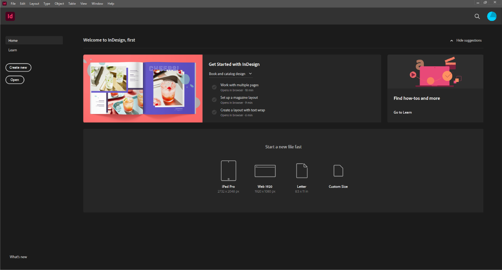

# Lab 2 - Create the Document and Explore the InDesign Workspace

**Topic 01: Get Started on InDesign**  ·  **LO1**  ·  TGS-2021007827

## The Situation

The Harmony Petals specification from Lab 1 is signed off. Priya now needs the empty, correctly specified file created and saved to the shared drive so the copywriter can start dropping text in. She also asks you to standardise your workspace, because last month a colleague spent twenty minutes hunting for the Links panel while a client waited on a call.

## At a Glance

| | |
|---|---|
| **Learning outcome** | LO1 |
| **Objective** | Create an InDesign document to a stated specification and navigate the workspace, panels and selection tools with confidence (TSC A2, A3). |
| **You will produce** | Harmony_Flyer.indd — an A5 landscape, 2-page, CMYK document with 3 mm bleed and 5 mm margins, plus a saved custom workspace named 'Publication Layout'. |
| **Tools and panels** | Adobe InDesign · Start workspace · New Document dialog · Panels & workspaces |
| **Starter InDesign file** | `parent-pages.indd` |
| **Final filename** | `Lab-02-Completed.indd` |

## What You Will Do

Create the flyer document from the signed-off specification, learn the Start workspace and the New Document dialog including presets and Adobe Stock templates, then build and save a custom workspace containing the panels a layout designer actually uses.

## Phase 1 - Prepare and Baseline

1. Read this guide completely, then duplicate `parent-pages.indd` as `Lab-02-Working.indd`.
2. Create an `Evidence/` folder beside the working file.
3. Open the working copy and capture the starting Pages, Links or Preflight panel most relevant to the task.
4. Keep every linked asset inside this lab folder; never relink to Downloads, Desktop or a network path.

> **Starter role:** Workspace exploration sample. Keep it open for comparison while creating Harmony_Flyer.indd from a new document.

## Phase 2 - Build

## Step-by-Step Procedure

1. Launch InDesign, open parent-pages.indd and use it to identify the document tab, page/pasteboard, Tools panel, Control or Properties panel, panel dock and status bar. Close it without saving.
   > `Open parent-pages.indd  ·  close without saving`
2. Study the Start workspace — recent files, presets, and the Adobe Stock template gallery.
3. Choose File > New > Document. Select the Print intent so the colour mode defaults to CMYK and units to millimetres.
   > `File > New > Document  ·  Intent: Print`
4. Set Width 210 mm, Height 148 mm, Orientation Landscape, Pages 2, and clear Facing Pages — this is a single-sided flyer printed both sides, not a spread.
   > `210 x 148 mm  ·  Landscape  ·  2 pages  ·  Facing Pages OFF`
5. Set all four Margins to 5 mm. Expand Bleed and Slug and set Bleed to 3 mm on all four sides.
   > `Margins 5 mm  ·  Bleed 3 mm`
6. Click Create, then File > Save As and name the file Harmony_Flyer.indd in your working folder.
   > `File > Save As  ·  Harmony_Flyer.indd`
7. Identify the red bleed line, the black trim edge and the magenta margin guide on screen. Confirm all three are visible.
8. Explore the Tools panel. Select a frame with the black Selection tool (V), then with the white Direct Selection tool (A), and observe what each one selects.
   > `V = Selection (frame)  ·  A = Direct Selection (content / points)`
9. Open Window > Links, Window > Pages, Window > Colour > Swatches and Window > Output > Preflight, and dock them together on the right.
   > `Window > Links / Pages / Swatches / Preflight`
10. Choose Window > Workspace > New Workspace, name it 'Publication Layout', tick Panel Locations and Menu Customization, and click OK.
   > `Window > Workspace > New Workspace`
11. Press W to toggle Preview mode and see the flyer as it will trim; press W again to return to Normal.
   > `W = Preview / Normal toggle`

## Verify Your Work

> ✅ **Done when:** Harmony_Flyer.indd opens at 210 x 148 mm landscape with a visible 3 mm red bleed guide and 5 mm margins, and 'Publication Layout' appears in the Window > Workspace list.

## Evidence and Submission

- [ ] Harmony_Flyer.indd
- [ ] New Document settings screenshot
- [ ] Saved Publication Layout workspace
- [ ] Final native file saved as `Lab-02-Completed.indd`
- [ ] All linked assets remain inside this lab folder or its subfolders
- [ ] No overset text, missing fonts or missing links remain unless the task explicitly asks you to diagnose them

## Recovery Path

1. If the working file is damaged, close it without saving and duplicate `parent-pages.indd` again.
2. If links are missing, use the Links panel Relink command and select the matching file inside this lab folder.
3. If fonts are missing, activate Adobe Fonts or substitute an approved font, then check for reflow and overset text.
4. Re-run the verification gate and recapture evidence after recovery.

## If It Doesn't Work

No red bleed line visible? Bleed was left at 0 — fix it in File > Document Setup without recreating the file. Guides missing entirely? Press W to leave Preview mode, or use View > Grids & Guides > Show Guides.

## Stretch Challenge

Save the finished document settings as a reusable Harmony A5 Print preset and prove it appears in the New Document dialog.

## Discussion Questions

1. What is the difference between the Print, Web and Mobile intents in the New Document dialog, and what does each one change behind the scenes?
2. You need to move a photograph's frame without changing the photograph inside it. Which selection tool do you use, and why?
3. Where would you find the Links panel, and why does a production designer keep it visible at all times?
4. What does 'Facing Pages' do, and why is it switched OFF for a single-sided flyer but ON for a magazine?
5. How does saving a custom workspace protect against the twenty-minute panel hunt Priya described?

## Reference Artwork

## Reference Basis

ACP guide domain 2: project setup, document presets, interface and workspace navigation.

Current Adobe Help: https://helpx.adobe.com/indesign/desktop.html

---

© 2026 Tertiary Infotech Academy Pte Ltd. All rights reserved.
