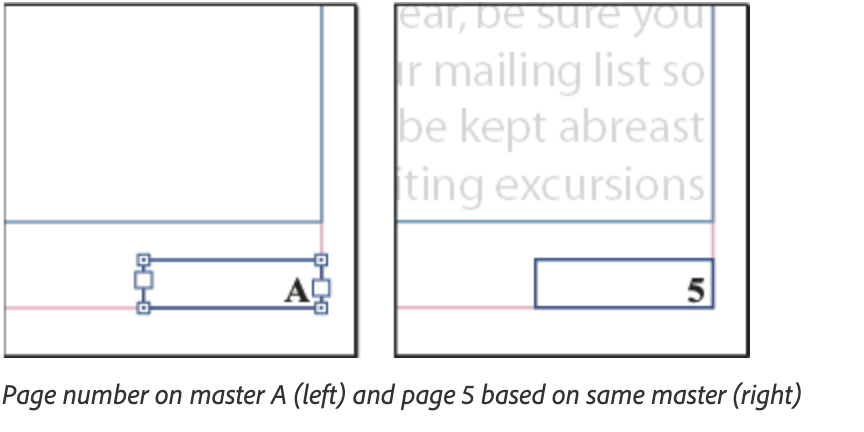

# Lab 3 - Build a Parent Page with Automatic Page Numbering

**Topic 01: Get Started on InDesign**  ·  **LO1**  ·  TGS-2021007827

## The Situation

Harmony Petals is also producing a 16-page **Seasonal Care Guide**. The previous designer typed the page numbers by hand. Marketing has now asked for two extra pages to be inserted at page 4, which means every folio after it is wrong, and the printer has separately advised that the outer margin must increase from 12 mm to 18 mm for the perfect binding. Re-doing this manually would take the rest of the day.

## At a Glance

| | |
|---|---|
| **Learning outcome** | LO1 |
| **Objective** | Manage pages using parent pages, automatic numbering markers and the Adjust Layout feature so a multi-page publication remains maintainable (TSC A2, A4). |
| **You will produce** | HP_LongDoc.indd with an A-Parent carrying an automatic folio and running footer, applied to all pages, surviving a 2-page insertion and an 18 mm margin change. |
| **Tools and panels** | Adobe InDesign · Pages panel · Parent pages · Current Page Number marker · Adjust Layout |
| **Starter InDesign file** | `HP_LongDoc.indd` |
| **Final filename** | `Lab-03-Completed.indd` |

## What You Will Do

Open the supplied long document, build a proper parent page carrying a running footer and an automatic page-number marker, apply it across the publication, then insert pages and change the margins — proving that the automatic numbering and Adjust Layout do the re-work for you.

## Phase 1 - Prepare and Baseline

1. Read this guide completely, then duplicate `HP_LongDoc.indd` as `Lab-03-Working.indd`.
2. Create an `Evidence/` folder beside the working file.
3. Open the working copy and capture the starting Pages, Links or Preflight panel most relevant to the task.
4. Keep every linked asset inside this lab folder; never relink to Downloads, Desktop or a network path.

> **Starter role:** Long-document starter for parent pages, folios and section numbering.

## Phase 2 - Build

## Step-by-Step Procedure

1. Open HP_LongDoc.indd from the Topic 1 lab folder and open Window > Pages.
   > `Open HP_LongDoc.indd`
2. In the Pages panel, double-click A-Parent to edit it. Both parent pages appear in the document window.
3. Select the Type tool (T) and draw a text frame in the bottom outer corner of the left parent page, wide enough for a three-digit number plus a label.
   > `T = Type tool`
4. With the cursor in the frame, choose Type > Insert Special Character > Markers > Current Page Number. The letter 'A' appears.
   > `Type > Insert Special Character > Markers > Current Page Number`
5. Type a space then 'Harmony Petals Seasonal Care Guide'. Set it to 8 pt, and align it to the outer edge.
6. Copy the frame, paste it onto the right parent page, and set its alignment to the opposite outer edge so the folio always sits on the outside.
   > `Edit > Paste in Place, then reposition`
7. Return to page 1 by double-clicking it in the Pages panel. Confirm real page numbers now appear on every page.
8. In the Pages panel menu choose Insert Pages, insert 2 pages after page 3, and confirm every subsequent folio renumbers itself automatically.
   > `Pages panel menu > Insert Pages > 2 pages after page 3`
9. Choose File > Document Setup, click Adjust Layout, change the outer margin to 18 mm, and click OK. Watch the existing page elements re-flow.
   > `File > Document Setup > Adjust Layout  ·  outer margin 18 mm`
10. Review three or four pages and correct any element the automatic adjustment has left visually unbalanced.

## Verify Your Work

> ✅ **Done when:** Every page carries a correct, automatically generated folio; after inserting two pages the numbering is still correct end to end; the outer margin measures 18 mm and content has re-flowed to respect it.

## Evidence and Submission

- [ ] Updated HP_LongDoc.indd
- [ ] Pages panel screenshot
- [ ] Inserted-page numbering proof
- [ ] Final native file saved as `Lab-03-Completed.indd`
- [ ] All linked assets remain inside this lab folder or its subfolders
- [ ] No overset text, missing fonts or missing links remain unless the task explicitly asks you to diagnose them

## Recovery Path

1. If the working file is damaged, close it without saving and duplicate `HP_LongDoc.indd` again.
2. If links are missing, use the Links panel Relink command and select the matching file inside this lab folder.
3. If fonts are missing, activate Adobe Fonts or substitute an approved font, then check for reflow and overset text.
4. Re-run the verification gate and recapture evidence after recovery.

## If It Doesn't Work

Folio shows 'A' on document pages too? You typed the letter A instead of inserting the marker — delete it and use the Markers menu. Cannot select the footer on a document page? That is correct: parent items are locked. Use Ctrl/Cmd+Shift+click to override just that instance.

## Stretch Challenge

Add a second parent for a chapter opener and begin a new section with roman-numeral front matter followed by arabic body pages.

## Discussion Questions

1. Why must a page number be inserted as a Current Page Number *marker* rather than typed digits?
2. The letter 'A' appears in the text frame on the parent page. What will it display on document page 7?
3. Objects from a parent page appear with a dotted border on document pages and cannot be selected normally. How do you override a single parent item on one page, and when is that justified?
4. What exactly does File > Adjust Layout change, and what does it not change?
5. Your document has front matter in roman numerals and a body in arabic numerals. Which feature makes that possible in one file?

## Reference Artwork

## Reference Basis

ACP guide domains 2 and 3: pages, parent pages, automatic numbering and document organisation.

Current Adobe Help: https://helpx.adobe.com/indesign/desktop/create-and-organize-pages/create-and-manage-parent-pages/about-parent-pages.html

---

© 2026 Tertiary Infotech Academy Pte Ltd. All rights reserved.
