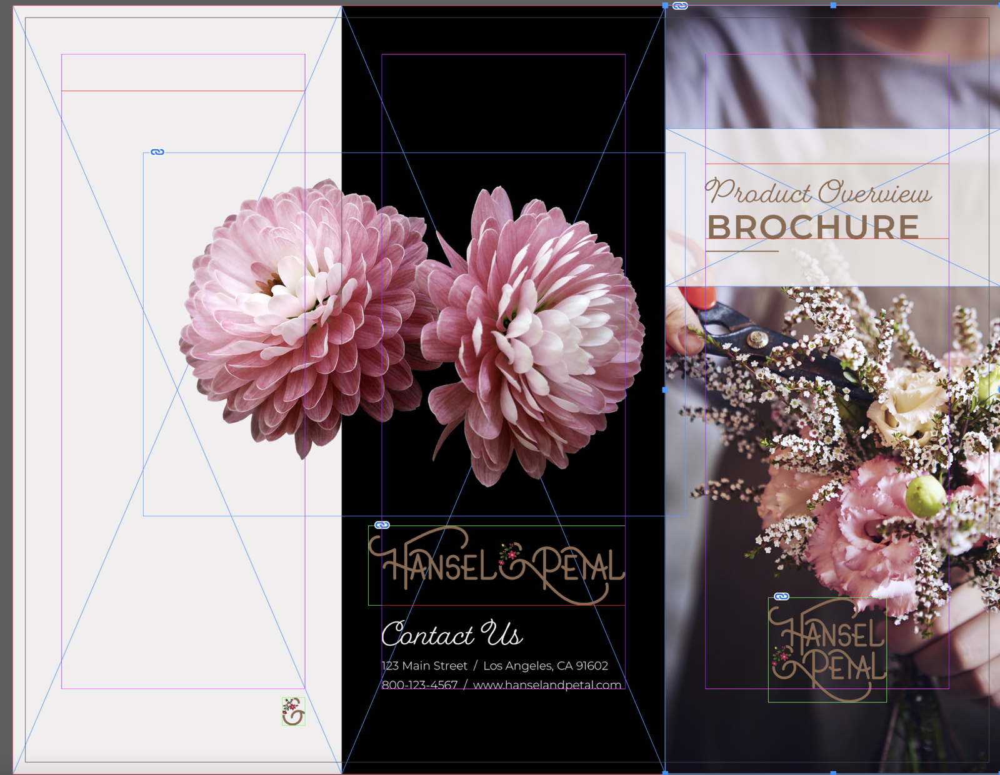

# Lab 5 - Create Text Frames and Import Client Copy from Word

**Topic 02: Basic InDesign Drawing Techniques**  ·  **LO2**  ·  TGS-2021007827

## The Situation

**Harmony Petals** is preparing a three-fold brochure for its new Tiong Bahru outlet. Priya has just e-mailed **HP_Brochure_Mission.docx** — the company mission statement written in Word by the founder, complete with Calibri 11 pt, blue headings and tracked changes. The last time a colleague pasted Word copy straight into a layout, the Calibri styling overrode the brochure's typeface and Sun Ray Printers flagged a missing font at output, delaying the job by two days. Priya needs the mission text placed today, in the brochure's own typography, and she wants the remaining panels filled with dummy text so she can judge the visual balance before the final copy arrives on Friday.

## At a Glance

| | |
|---|---|
| **Learning outcome** | LO2 |
| **Objective** | Determine the text areas of a layout and select the appropriate import method to bring supplied client copy into InDesign without corrupting the document's typography (TSC A2, A3). |
| **You will produce** | HP_Brochure_1.indd with the client mission statement placed into a correctly sized text frame using Remove Styles and Formatting, plus the remaining panels filled with placeholder text and a 3 mm text inset applied. |
| **Tools and panels** | Adobe InDesign · Type tool · File > Place · Import Options · Type > Fill with Placeholder Text · Text Frame Options |
| **Starter InDesign file** | `HP_Brochure_1.indd` |
| **Final filename** | `Lab-05-Completed.indd` |

## What You Will Do

Draw and resize text frames to the brochure's column structure, then import the supplied Word file twice — once retaining its Word formatting and once discarding it — so you can see and explain the difference. You then fill the unwritten panels with placeholder text and inspect the frame's own options: inset, vertical justification and columns.

## Phase 1 - Prepare and Baseline

1. Read this guide completely, then duplicate `HP_Brochure_1.indd` as `Lab-05-Working.indd`.
2. Create an `Evidence/` folder beside the working file.
3. Open the working copy and capture the starting Pages, Links or Preflight panel most relevant to the task.
4. Keep every linked asset inside this lab folder; never relink to Downloads, Desktop or a network path.

> **Starter role:** Brochure starter with panel guides ready for imported client copy.

## Phase 2 - Build

## Step-by-Step Procedure

1. Open HP_Brochure_1.indd from the Topic 2 lab folder and identify the three panel columns established by the guides.
   > `Open HP_Brochure_1.indd`
2. Select the Type tool (T) and drag a text frame inside the left panel, snapping to the column guides top and bottom.
   > `T = Type tool`
3. With the insertion point in the frame, choose File > Place, tick Show Import Options, and select HP_Brochure_Mission.docx.
   > `File > Place  ·  Show Import Options ON`
4. In the Microsoft Word Import Options dialog choose Remove Styles and Formatting from Text and Tables, and set Manual Page Breaks to No Breaks. Click OK.
   > `Import Options > Remove Styles and Formatting from Text and Tables`
5. Undo the place (Ctrl/Cmd+Z), repeat the import choosing Preserve Styles and Formatting instead, and compare the two results on screen before undoing again and re-placing with Remove Styles.
   > `Ctrl/Cmd+Z`
6. Click into the middle panel with the Type tool, draw a second frame, and choose Type > Fill with Placeholder Text to flow dummy copy for layout assessment.
   > `Type > Fill with Placeholder Text`
7. Switch to the Selection tool (V) and resize a frame by dragging a corner handle; then hold Ctrl/Cmd while dragging the same handle and observe that the type now scales — undo that scaling.
   > `V = Selection  ·  Ctrl/Cmd+drag scales content`
8. With the mission frame selected, choose Object > Text Frame Options and set Inset Spacing to 3 mm on all four sides.
   > `Object > Text Frame Options  ·  Inset 3 mm`
9. In the same dialog set Vertical Justification Align to Top, then experiment with Center and Justify to see how each redistributes the copy in the frame.
   > `Text Frame Options > General > Vertical Justification`
10. Still in Text Frame Options, set Columns Number to 1 for the panel, then click Preview to confirm the result before clicking OK.
   > `Text Frame Options > Columns`
11. Save the file and note in the Links panel that a placed Word file appears as a link only if 'Create Links When Placing Text and Spreadsheet Files' was enabled in Preferences.
   > `File > Save  ·  Window > Links`

## Verify Your Work

> ✅ **Done when:** The mission statement sits in the left panel in the brochure's own typeface with no Calibri present in Type > Find/Replace Font, the frame shows a 3 mm inset, and the middle panel is filled with placeholder text.

## Evidence and Submission

- [ ] Updated HP_Brochure_1.indd
- [ ] Import Options screenshot
- [ ] Text Frame Options screenshot
- [ ] Final native file saved as `Lab-05-Completed.indd`
- [ ] All linked assets remain inside this lab folder or its subfolders
- [ ] No overset text, missing fonts or missing links remain unless the task explicitly asks you to diagnose them

## Recovery Path

1. If the working file is damaged, close it without saving and duplicate `HP_Brochure_1.indd` again.
2. If links are missing, use the Links panel Relink command and select the matching file inside this lab folder.
3. If fonts are missing, activate Adobe Fonts or substitute an approved font, then check for reflow and overset text.
4. Re-run the verification gate and recapture evidence after recovery.

## If It Doesn't Work

If blue Word headings and Calibri survive the import, you left 'Preserve Styles and Formatting' selected — undo, re-place with Show Import Options ticked and choose Remove Styles and Formatting. If the type appears stretched, you Ctrl/Cmd-dragged a corner handle and scaled the content: undo, or reset with Object > Transform > Clear Transformations.

## Stretch Challenge

Place the plain-text sample into a second frame, compare it with the Word import and document which formatting survived each route.

## Discussion Questions

1. Priya's Word file carries its own fonts and colours. What are the practical consequences of choosing 'Preserve Styles and Formatting' over 'Remove Styles and Formatting' for a job going to litho print?
2. You drag a text frame with the Selection tool and the type inside gets squashed. What did you do wrong, and which tool or modifier avoids it?
3. What is the difference between drawing a text frame with the Type tool and converting an existing graphic frame into a text frame?
4. Placeholder text is not real copy. Why does a professional designer still use it, and at what point in the workflow must it be removed?
5. A text frame's Inset Spacing is set to 0 mm and the type touches the frame edge, which becomes visible when a fill colour is applied. Explain why inset — not simply moving the frame — is the correct fix.

## Reference Artwork

## Reference Basis

ACP guide domain 4: create text frames, import text, control frame insets and preserve useful source structure.

Current Adobe Help: https://helpx.adobe.com/indesign/desktop.html

---

© 2026 Tertiary Infotech Academy Pte Ltd. All rights reserved.
