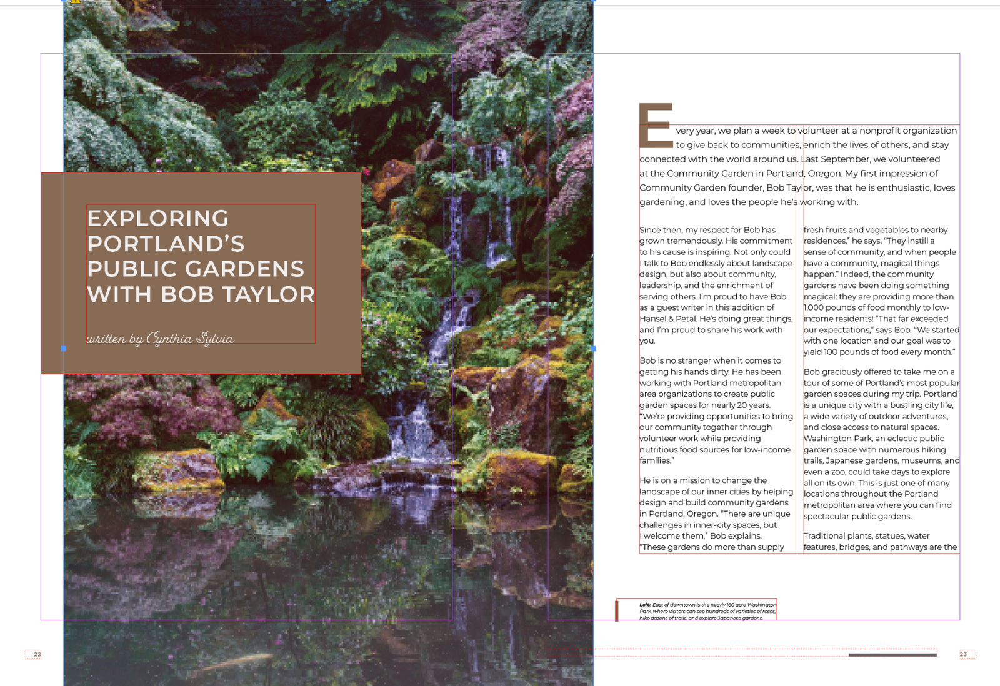

# Lab 7 - Place Graphics, Manage Links and Control Effective Resolution

**Topic 02: Basic InDesign Drawing Techniques**  ·  **LO2**  ·  TGS-2021007827

## The Situation

**Harmony Petals** is producing its first 16-page magazine, *Petals Quarterly*, for distribution at all three outlets. The photographer has supplied images at 300 ppi, but a junior designer enlarged one bouquet photograph to fill a full page and the printed proof came back visibly pixelated — **Sun Ray Printers** confirmed the effective resolution had dropped to 96 ppi. That single page cost a S$480 reprint. Priya now requires every image in the magazine to be checked for effective PPI and every link to be present and up to date before the file is handed over.

## At a Glance

| | |
|---|---|
| **Learning outcome** | LO2 |
| **Objective** | Identify and select appropriate image mediums and formats for print, place them into frames with correct fitting, and verify effective PPI meets the printer's requirement (TSC A3, A4). |
| **You will produce** | HP_Magazine_1.indd with all images placed, fitted with Fill Frame Proportionally, every link showing OK status, and a documented effective-PPI check confirming 300 ppi or better on every print image. |
| **Tools and panels** | Adobe InDesign · File > Place · Links panel · Object > Fitting · Frame Fitting Options · Content Grabber · Info panel |
| **Starter InDesign file** | `HP_Magazine_1.indd` |
| **Final filename** | `Lab-07-Completed.indd` |

## What You Will Do

Place images into existing and new frames, learn the distinction between the frame and its content, apply the five fitting options, and use the Links panel to audit every placed graphic for status, actual PPI and effective PPI. You then deliberately break a link and repair it.

## Phase 1 - Prepare and Baseline

1. Read this guide completely, then duplicate `HP_Magazine_1.indd` as `Lab-07-Working.indd`.
2. Create an `Evidence/` folder beside the working file.
3. Open the working copy and capture the starting Pages, Links or Preflight panel most relevant to the task.
4. Keep every linked asset inside this lab folder; never relink to Downloads, Desktop or a network path.

> **Starter role:** Magazine starter for placing graphics, repairing links and checking effective resolution.

## Phase 2 - Build

## Step-by-Step Procedure

1. Open HP_Magazine_1.indd and open Window > Links so the panel is visible for the whole exercise.
   > `Open HP_Magazine_1.indd  ·  Window > Links`
2. Select an empty graphic frame, then choose File > Place and select a supplied bouquet image so it lands inside that frame.
   > `File > Place`
3. With nothing selected, place a second image and drag with the loaded cursor to draw a new frame at the exact size you want.
   > `File > Place, then drag`
4. Use the Selection tool (V) on the frame, then click the doughnut-shaped Content Grabber at the centre to select the image inside; move the image within the frame without moving the frame.
   > `V  ·  Content Grabber`
5. Apply Object > Fitting > Fill Frame Proportionally to the first image, then try Fit Content Proportionally and Fit Frame to Content to compare the outcomes.
   > `Object > Fitting > Fill Frame Proportionally`
6. Select a frame and choose Object > Fitting > Frame Fitting Options; set Fitting to Fill Frame Proportionally and Align From the centre so future placements auto-fit.
   > `Object > Fitting > Frame Fitting Options`
7. In the Links panel, expand the link information panel at the bottom and read Actual PPI and Effective PPI for each placed image.
   > `Links panel > link info`
8. Scale one image to 200% with the Selection tool and re-read Effective PPI; confirm it has halved and undo the scaling.
   > `Ctrl/Cmd+Z`
9. Outside InDesign, rename one source image file, return to InDesign and observe the red missing-link icon in the Links panel.
10. Select the missing link, click Relink, navigate to the renamed file and restore it; confirm the status changes to OK.
   > `Links panel > Relink`
11. Sort the Links panel by Effective PPI, confirm no print image falls below 300 ppi, and save the file.
   > `Links panel menu > Sort by Effective PPI`

## Verify Your Work

> ✅ **Done when:** The Links panel shows every image with an OK status, no missing or modified icons, and an effective PPI of 300 or higher for every image destined for litho print.

## Evidence and Submission

- [ ] Updated HP_Magazine_1.indd
- [ ] Links panel status screenshot
- [ ] Effective-PPI audit table
- [ ] Final native file saved as `Lab-07-Completed.indd`
- [ ] All linked assets remain inside this lab folder or its subfolders
- [ ] No overset text, missing fonts or missing links remain unless the task explicitly asks you to diagnose them

## Recovery Path

1. If the working file is damaged, close it without saving and duplicate `HP_Magazine_1.indd` again.
2. If links are missing, use the Links panel Relink command and select the matching file inside this lab folder.
3. If fonts are missing, activate Adobe Fonts or substitute an approved font, then check for reflow and overset text.
4. Re-run the verification gate and recapture evidence after recovery.

## If It Doesn't Work

If clicking a fitted image only moves the frame and leaves the picture behind, you are dragging the frame with the Selection tool — click the Content Grabber, or use the Direct Selection tool (A), to move the content instead. A yellow warning triangle in the Links panel means the source file was edited since placing: select it and click Update Link before output.

## Stretch Challenge

Open the text-to-image reference, compare generated/embedded content with linked assets and explain which is safer for printer handoff.

## Discussion Questions

1. Distinguish actual PPI from effective PPI. Which one determines print quality, and why?
2. An image is placed at 300 ppi and then scaled to 200%. What is its effective PPI, and is it acceptable for litho printing?
3. InDesign links to images rather than embedding them. State two advantages of linking and one risk it introduces at handover.
4. Compare Fit Content Proportionally with Fill Frame Proportionally. Which one can leave white space, which one can crop, and how do you decide?
5. Why would a designer choose a PSD or TIFF for a print magazine cover but a PNG or JPEG for a web banner?

## Reference Artwork

## Reference Basis

ACP guide domain 4: place and transform graphics, fitting, link status, image resolution and non-destructive workflows.

Current Adobe Help: https://helpx.adobe.com/indesign/desktop.html

---

© 2026 Tertiary Infotech Academy Pte Ltd. All rights reserved.
