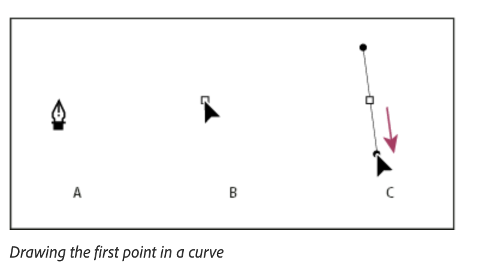

# Lab 8 - Draw Custom Paths with the Pen and Pencil Tools

**Topic 02: Basic InDesign Drawing Techniques**  ·  **LO2**  ·  TGS-2021007827

## The Situation

*Petals Quarterly* needs a custom petal-shaped motif to sit behind the contents page, and a hand-drawn 'Harmony' signature flourish for the editor's letter. The freelance illustrator quoted S$350 and a four-day turnaround; Priya has neither the budget nor the time, because the magazine goes to **Sun Ray Printers** on Thursday. She has asked whether the motif can be drawn natively in InDesign so it stays fully editable and prints as sharp vector artwork at any size, rather than as a raster file that would soften when scaled up for the outlet window posters.

## At a Glance

| | |
|---|---|
| **Learning outcome** | LO2 |
| **Objective** | Establish drawing requirements and construct precise vector paths using anchor points, straight segments and Bezier curves to produce artwork to specification (TSC A1, A4). |
| **You will produce** | A closed, editable petal motif and an open signature flourish drawn as native InDesign vector paths in HP_Magazine_1.indd, with clean anchor points and no stray open segments. |
| **Tools and panels** | Adobe InDesign · Pen tool (P) · Add/Delete/Convert Anchor Point · Pencil tool (N) · Smooth tool · Direct Selection tool (A) · Stroke panel |
| **Starter InDesign file** | `HP_Magazine_1.indd` |
| **Final filename** | `Lab-08-Completed.indd` |

## What You Will Do

Build vector artwork directly in InDesign: straight-edge paths, smooth curves, corner-to-smooth conversions, open versus closed paths and freehand shapes. You use the Pen tool for precision and the Pencil and Smooth tools for organic forms, then refine the result with the Direct Selection tool.

## Phase 1 - Prepare and Baseline

1. Read this guide completely, then duplicate `HP_Magazine_1.indd` as `Lab-08-Working.indd`.
2. Create an `Evidence/` folder beside the working file.
3. Open the working copy and capture the starting Pages, Links or Preflight panel most relevant to the task.
4. Keep every linked asset inside this lab folder; never relink to Downloads, Desktop or a network path.

> **Starter role:** Magazine starter for native vector drawing on a dedicated Motif layer.

## Phase 2 - Build

## Step-by-Step Procedure

1. Open HP_Magazine_1.indd, navigate to the contents page and create a new layer named 'Motif' in Window > Layers so the drawing stays separate from the layout.
   > `Window > Layers > New Layer`
2. Select the Pen tool (P) and click four times without dragging to draw a closed straight-edged shape, clicking back on the first anchor to close it.
   > `P = Pen tool`
3. Draw a second path, this time click-and-dragging at each anchor to pull out direction handles and create smooth curves for the petal outline.
4. While drawing, hold Alt/Option and drag a direction handle to break it, converting a smooth point into a corner so a curve meets a straight segment.
   > `Alt/Opt-drag = convert direction handle`
5. Close the petal path by returning to the first anchor point until a small circle appears beside the cursor, then click.
6. Switch to the Direct Selection tool (A), click an individual anchor point and drag its direction handles to refine the petal shape.
   > `A = Direct Selection tool`
7. Use the Pen tool over an existing segment to add an anchor point, and over an existing point to delete one; then use Object > Paths > Open Path on a copy to see the effect.
   > `Pen tool over segment = Add Anchor Point`
8. Select the Pencil tool (N), nested under the Pen tool, and draw the 'Harmony' flourish freehand in a single stroke.
   > `N = Pencil tool`
9. Choose the Smooth tool from the same flyout and drag along the flourish to reduce excess anchor points and even out the line.
   > `Smooth tool`
10. Open Window > Stroke, set the flourish to 1.5 pt with round caps and round joins, and apply a stroke colour from Swatches.
   > `Window > Stroke  ·  1.5 pt, round cap/join`
11. Select both drawings, zoom to 400% and inspect for stray or doubled anchor points; delete any with the Pen tool, then save the file.
   > `Ctrl/Cmd+4 = 400% zoom`

## Verify Your Work

> ✅ **Done when:** The petal motif is a single closed path that accepts a fill colour, the flourish is an open stroked path, and the Direct Selection tool shows clean, evenly spaced anchor points with no duplicates.

## Evidence and Submission

- [ ] Updated HP_Magazine_1.indd
- [ ] Anchor-point close-up screenshot
- [ ] Layers panel screenshot
- [ ] Final native file saved as `Lab-08-Completed.indd`
- [ ] All linked assets remain inside this lab folder or its subfolders
- [ ] No overset text, missing fonts or missing links remain unless the task explicitly asks you to diagnose them

## Recovery Path

1. If the working file is damaged, close it without saving and duplicate `HP_Magazine_1.indd` again.
2. If links are missing, use the Links panel Relink command and select the matching file inside this lab folder.
3. If fonts are missing, activate Adobe Fonts or substitute an approved font, then check for reflow and overset text.
4. Re-run the verification gate and recapture evidence after recovery.

## If It Doesn't Work

If a fill colour will not apply to the petal, the path never closed — select it and choose Object > Paths > Close Path. If the Pencil line has dozens of anchor points and looks lumpy, double-click the Pencil tool and raise the Smoothness value before redrawing, or run the Smooth tool along the existing path.

## Stretch Challenge

Create a second petal with fewer anchor points, then compare smoothness and editability with the first version.

## Discussion Questions

1. What is the difference between a corner point and a smooth point, and how do you convert one to the other while drawing?
2. You want a curve to end and a straight line to begin from the same anchor. Describe the exact sequence of clicks and modifier keys.
3. Explain the relationship between a direction handle's length and the shape of the curve it controls.
4. When would you choose the Pencil tool over the Pen tool, and what is the production cost of that choice in terms of anchor points?
5. The motif must also be used on a 2-metre outlet window poster. Why does drawing it as a vector path in InDesign solve a problem that a 300 ppi raster file cannot?

## Reference Artwork

## Reference Basis

ACP guide domain 4: Pen, Pencil, anchor points, direction handles and editable vector paths.

Current Adobe Help: https://helpx.adobe.com/indesign/desktop.html

---

© 2026 Tertiary Infotech Academy Pte Ltd. All rights reserved.
