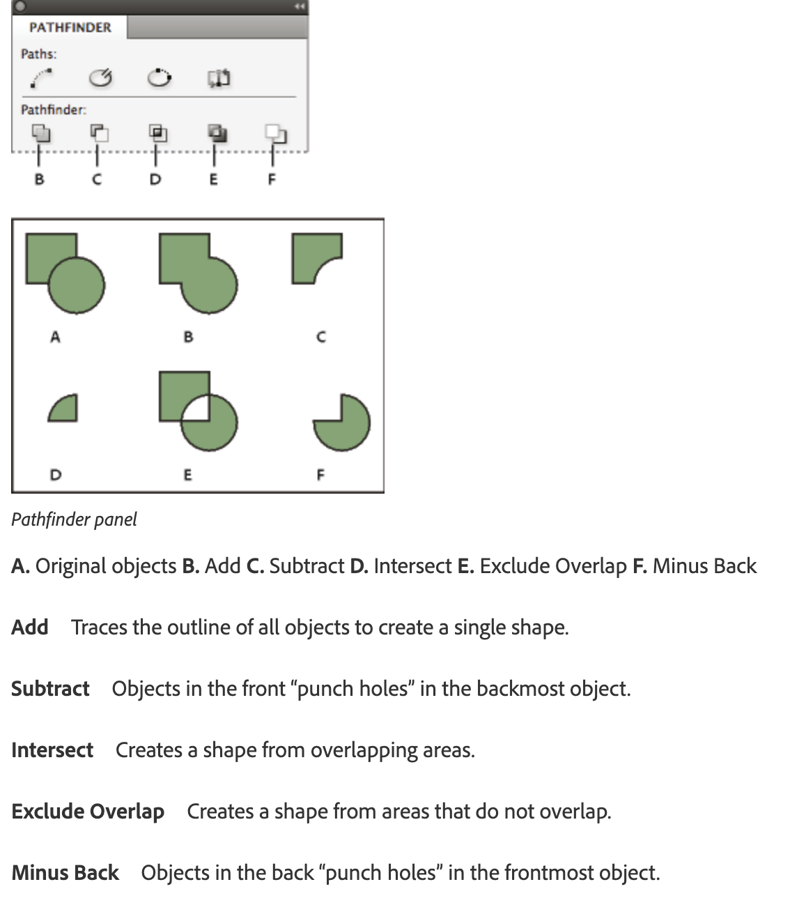

# Lab 9 - Combine Shapes with Pathfinder and Wrap Text Around a Clipping Path

**Topic 02: Basic InDesign Drawing Techniques**  ·  **LO2**  ·  TGS-2021007827

## The Situation

The *Petals Quarterly* feature spread on orchids needs the body copy to hug the outline of a cut-out orchid photograph rather than sit in a plain rectangle. The supplied JPEG has a white background, and Priya's first attempt produced a rectangular text wrap that left an ugly white box in the middle of the column — a client reviewer described it as "looking like a mistake". She also needs a two-colour Harmony Petals logo mark built from overlapping circles, where the overlap must knock through to reveal the background rather than print as a solid. The spread is due at **Sun Ray Printers** on Thursday afternoon.

## At a Glance

| | |
|---|---|
| **Learning outcome** | LO2 |
| **Objective** | Refine drawings to meet project requirements by combining shapes into compound paths, applying Pathfinder operations and wrapping body copy around an irregular image silhouette (TSC A2, A4). |
| **You will produce** | HP_Magazine_2.indd with a knock-through compound-path logo mark, a Pathfinder-combined decorative shape, and body copy wrapping cleanly around the orchid silhouette with a 3 mm offset. |
| **Tools and panels** | Adobe InDesign · Object > Paths > Make Compound Path · Window > Object & Layout > Pathfinder · Window > Text Wrap · Object > Clipping Path > Options · Detect Edges |
| **Starter InDesign file** | `HP_Magazine_2.indd` |
| **Final filename** | `Lab-09-Completed.indd` |

## What You Will Do

Combine and subtract shapes using compound paths and the Pathfinder panel, then apply text wrap in all its variants — including wrapping around an object shape derived from a Photoshop path or detected edges — and control the wrap offset so the type never touches the image.

## Phase 1 - Prepare and Baseline

1. Read this guide completely, then duplicate `HP_Magazine_2.indd` as `Lab-09-Working.indd`.
2. Create an `Evidence/` folder beside the working file.
3. Open the working copy and capture the starting Pages, Links or Preflight panel most relevant to the task.
4. Keep every linked asset inside this lab folder; never relink to Downloads, Desktop or a network path.

> **Starter role:** Magazine starter for compound paths, Pathfinder operations, clipping and text wrap.

## Phase 2 - Build

## Step-by-Step Procedure

1. Open HP_Magazine_2.indd and go to the orchid feature spread.
   > `Open HP_Magazine_2.indd`
2. Draw two overlapping circles with the Ellipse tool (L), select both, and choose Object > Paths > Make Compound Path — the overlap knocks through to reveal the page behind.
   > `Object > Paths > Make Compound Path  ·  Ctrl/Cmd+8`
3. Apply a fill colour to confirm the knock-out, then choose Object > Paths > Release Compound Path to see the two separate shapes again, and re-make the compound path.
   > `Object > Paths > Release Compound Path`
4. Draw a rectangle overlapping a circle, select both and open Window > Object & Layout > Pathfinder; click Add, then undo and click Subtract, Intersect, Exclude Overlap and Minus Back in turn to compare each result.
   > `Window > Object & Layout > Pathfinder`
5. Keep the shape produced by Subtract as the decorative element and position it on the spread.
6. Select the orchid image frame and open Window > Text Wrap.
   > `Window > Text Wrap`
7. Click Wrap Around Bounding Box and observe the rectangular wrap; then click Wrap Around Object Shape.
   > `Text Wrap > Wrap Around Object Shape`
8. In the Text Wrap panel set Contour Options Type to Detect Edges so InDesign traces the orchid silhouette instead of the frame, and set Include Inside Edges if gaps in the flower should also receive text.
   > `Text Wrap > Contour Options > Detect Edges`
9. Set the Top Offset to 3 mm and click the chain icon so all four offsets match, keeping the type clear of the petals.
   > `Text Wrap offset 3 mm`
10. Fine-tune the generated wrap boundary with the Direct Selection tool (A), dragging individual anchor points where the type crowds the image.
   > `A = Direct Selection tool`
11. Select any text frame that is ignoring the wrap, confirm 'Ignore Text Wrap' is unticked in Object > Text Frame Options, then press W to preview the spread and save.
   > `Object > Text Frame Options > Ignore Text Wrap  ·  W = Preview`

## Verify Your Work

> ✅ **Done when:** The logo overlap shows the page through it, the Pathfinder shape is a single path in the Layers panel, and body copy follows the orchid outline with an even 3 mm gap on all sides.

## Evidence and Submission

- [ ] Updated HP_Magazine_2.indd
- [ ] Compound-path screenshot
- [ ] Text-wrap offset screenshot
- [ ] Final native file saved as `Lab-09-Completed.indd`
- [ ] All linked assets remain inside this lab folder or its subfolders
- [ ] No overset text, missing fonts or missing links remain unless the task explicitly asks you to diagnose them

## Recovery Path

1. If the working file is damaged, close it without saving and duplicate `HP_Magazine_2.indd` again.
2. If links are missing, use the Links panel Relink command and select the matching file inside this lab folder.
3. If fonts are missing, activate Adobe Fonts or substitute an approved font, then check for reflow and overset text.
4. Re-run the verification gate and recapture evidence after recovery.

## If It Doesn't Work

If the overlap prints solid instead of knocking through, you grouped the circles rather than making a compound path — ungroup and use Object > Paths > Make Compound Path. If Detect Edges traces a rectangle, the image has no transparency or clipping path: use Object > Clipping Path > Options > Detect Edges on the image first, or ask for a PSD with a proper alpha channel.

## Stretch Challenge

Compare Detect Edges with a Photoshop alpha channel and state which gives the more stable silhouette for this image.

## Discussion Questions

1. What visually distinguishes a compound path from two shapes simply grouped together, and why does the distinction matter for a printed logo?
2. Compare Pathfinder Subtract with Exclude Overlap. What is the difference in the resulting path, and when is each correct?
3. Text wrap is applied to an image but the type in one frame ignores it completely. Name two settings that would cause this.
4. Explain the difference between a clipping path created in Photoshop and one generated in InDesign by Detect Edges, and which you would trust for a client logo.
5. Why should Text Wrap offset be set in the Text Wrap panel rather than by nudging the text frame away from the image?

## Reference Artwork

## Reference Basis

ACP guide domain 4: combine shapes, edit paths, use clipping paths and control text wrap.

Current Adobe Help: https://helpx.adobe.com/indesign/desktop.html

---

© 2026 Tertiary Infotech Academy Pte Ltd. All rights reserved.
