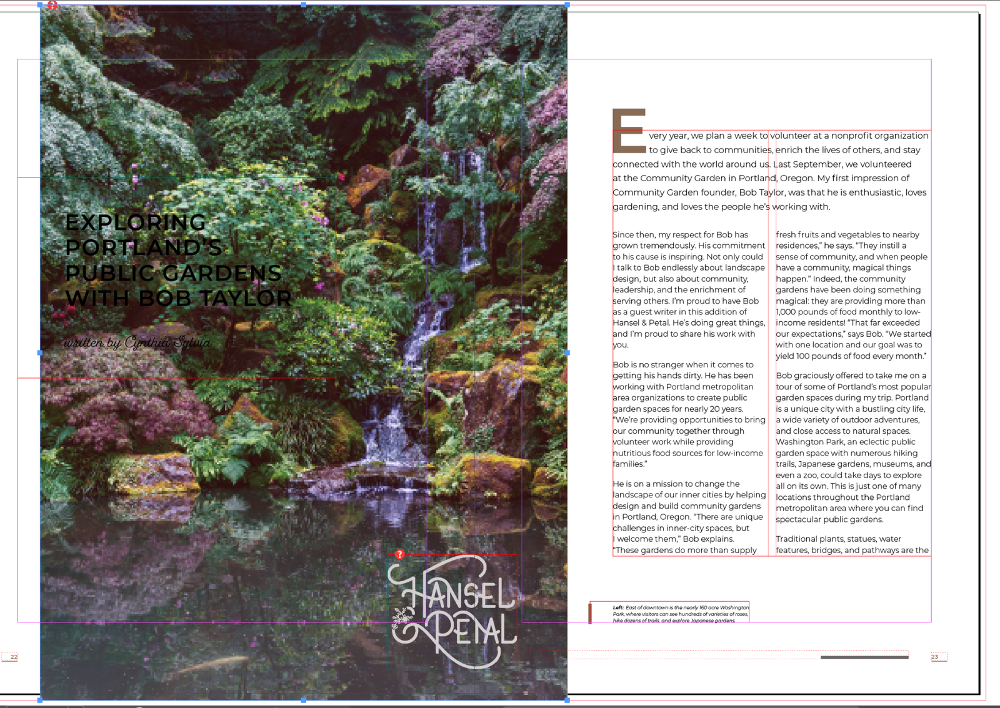

# Lab 10 - Build a Colour System with Swatches, Spot Colours and Gradients

**Topic 02: Basic InDesign Drawing Techniques**  ·  **LO2**  ·  TGS-2021007827

## The Situation

**Harmony Petals** has just registered its brand pink as **Pantone 212 C** because it must match exactly across shop signage, packaging ribbon and *Petals Quarterly*. **Sun Ray Printers** has quoted the magazine as 4-colour process plus one spot, and warned that the last file they received contained 31 unnamed colours, three RGB swatches and two duplicate pinks — which would have produced an unusable set of separations. Priya wants a locked-down swatch palette in the file before any more pages are designed, and she wants a soft pink-to-white gradient for the section dividers.

## At a Glance

| | |
|---|---|
| **Learning outcome** | LO2 |
| **Objective** | Identify and select appropriate colour mediums for the print process, and build a reusable, correctly specified swatch system including spot and process colours and gradients (TSC A1, A3). |
| **You will produce** | HP_Magazine_3.indd carrying a named swatch palette with Pantone 212 C as a spot colour, a Colour Theme palette extracted from the cover photograph, a pink-to-white linear gradient swatch, and zero RGB or unnamed colours. |
| **Tools and panels** | Adobe InDesign · Swatches panel · New Colour Swatch · Colour Books (Pantone+ Solid Coated) · Colour Theme tool · Gradient panel & Gradient Swatch tool · Window > Output > Separations Preview |
| **Starter InDesign file** | `HP_Magazine_3.indd` |
| **Final filename** | `Lab-10-Completed.indd` |

## What You Will Do

Build a disciplined colour system: create and name process swatches, add a Pantone spot colour from a colour book, extract a harmonious palette from a photograph with the Colour Theme tool, create linear and radial gradients, and audit the document so no unnamed or RGB colours survive.

## Phase 1 - Prepare and Baseline

1. Read this guide completely, then duplicate `HP_Magazine_3.indd` as `Lab-10-Working.indd`.
2. Create an `Evidence/` folder beside the working file.
3. Open the working copy and capture the starting Pages, Links or Preflight panel most relevant to the task.
4. Keep every linked asset inside this lab folder; never relink to Downloads, Desktop or a network path.

> **Starter role:** Magazine starter for a controlled process/spot colour system and reusable gradients.

## Phase 2 - Build

## Step-by-Step Procedure

1. Open HP_Magazine_3.indd and open Window > Colour > Swatches.
   > `Window > Colour > Swatches`
2. From the Swatches panel menu choose New Colour Swatch, set Colour Type to Process, Colour Mode to CMYK, mix the brand secondary green, name it 'HP Leaf Green' and click OK.
   > `Swatches panel menu > New Colour Swatch`
3. Create another new swatch, set Colour Type to Spot and Colour Mode to Pantone+ Solid Coated, type 212 to jump to Pantone 212 C, and add it.
   > `New Colour Swatch > Spot > Pantone+ Solid Coated > 212 C`
4. Select the Pantone swatch, choose New Tint Swatch from the panel menu and create a 30% tint for background panels.
   > `Swatches panel menu > New Tint Swatch`
5. Select the Colour Theme tool (nested with the Eyedropper, Shift+I) and click the cover photograph to extract a five-colour harmony; open the theme flyout and add the theme to Swatches.
   > `Shift+I = Colour Theme tool`
6. Draw a rectangle for a section divider, then open Window > Colour > Gradient and set Type to Linear.
   > `Window > Colour > Gradient`
7. Drag the Pantone 212 C swatch onto the left gradient stop and Paper onto the right stop to build a pink-to-white blend, then set the Angle to 90 degrees.
   > `Gradient panel  ·  Angle 90`
8. Save the blend permanently by choosing New Gradient Swatch from the Swatches panel menu so it can be reused across the magazine.
   > `Swatches panel menu > New Gradient Swatch`
9. Select the Gradient Swatch tool (G) and drag across the rectangle to reset the gradient's start point, end point and direction.
   > `G = Gradient Swatch tool`
10. From the Swatches panel menu choose Select All Unused, then Delete Swatch, to strip the palette of colours nobody applied.
   > `Swatches panel menu > Select All Unused`
11. Open Window > Output > Separations Preview, set View to Separations, confirm exactly Cyan, Magenta, Yellow, Black and PANTONE 212 C are listed, then save and record the palette on your specification sheet.
   > `Window > Output > Separations Preview  ·  File > Save`

## Verify Your Work

> ✅ **Done when:** Separations Preview lists exactly five plates — CMYK plus PANTONE 212 C — the Swatches panel contains only named swatches with no RGB icons, and the divider rectangle carries a saved gradient swatch.

## Evidence and Submission

- [ ] Updated HP_Magazine_3.indd
- [ ] Swatches panel screenshot
- [ ] Separations or colour-space check
- [ ] Final native file saved as `Lab-10-Completed.indd`
- [ ] All linked assets remain inside this lab folder or its subfolders
- [ ] No overset text, missing fonts or missing links remain unless the task explicitly asks you to diagnose them

## Recovery Path

1. If the working file is damaged, close it without saving and duplicate `HP_Magazine_3.indd` again.
2. If links are missing, use the Links panel Relink command and select the matching file inside this lab folder.
3. If fonts are missing, activate Adobe Fonts or substitute an approved font, then check for reflow and overset text.
4. Re-run the verification gate and recapture evidence after recovery.

## If It Doesn't Work

If Separations Preview shows six or seven plates, duplicate or misnamed spot colours exist: use the Swatches panel menu > Merge Swatches, or double-click a stray spot swatch and change Colour Type to Process. RGB swatches show a distinctive icon in the Swatches panel — double-click each one and switch Colour Mode to CMYK, accepting that saturated blues and greens will visibly dull.

## Stretch Challenge

Build a colour group from one supplied photograph, then convert only the colours intended for print into named CMYK swatches.

## Discussion Questions

1. Explain the difference between a process colour and a spot colour in terms of what happens on the printing press and what it costs.
2. Why is a named swatch preferable to a colour mixed in the Colour panel, especially when a client changes the brand pink three weeks into a job?
3. The client supplied their brand pink as an RGB value. What must you do before that colour is used in a litho job, and what will change visually?
4. A tint swatch and a lighter mixed colour can look identical on screen. What is the production advantage of the tint?
5. How does Separations Preview let you prove to Sun Ray Printers that the file will output on exactly five plates?

## Reference Artwork

## Reference Basis

ACP guide domains 1 and 4: colour creation, CMYK/RGB decisions, swatches, spot colours and gradients.

Current Adobe Help: https://helpx.adobe.com/indesign/desktop.html

---

© 2026 Tertiary Infotech Academy Pte Ltd. All rights reserved.
