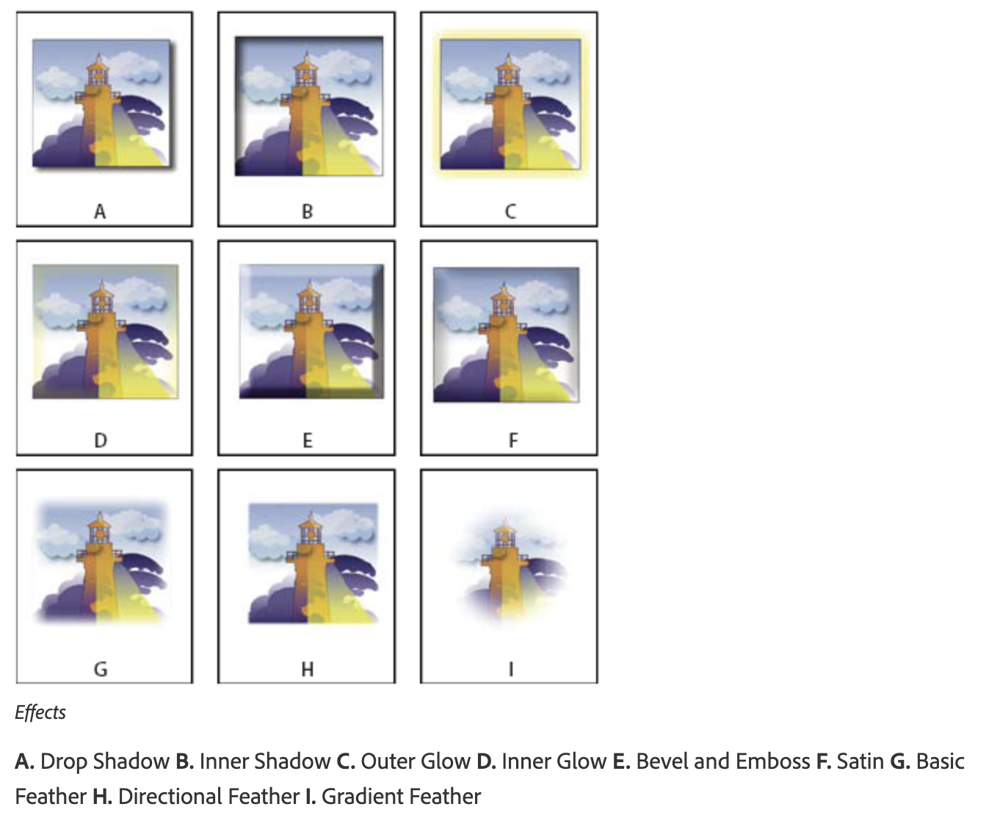

# Lab 11 - Apply Transparency, Blending Modes and Effects for Print

**Topic 02: Basic InDesign Drawing Techniques**  ·  **LO2**  ·  TGS-2021007827

## The Situation

The *Petals Quarterly* cover needs the masthead to sit over a full-bleed bouquet photograph with a soft dark gradient behind the type so the words stay readable. A previous attempt used a drop shadow set to Multiply at 100% opacity, and **Sun Ray Printers** returned the file with a transparency-flattening warning: the shadow had created a visible grey box on the proof where it crossed a spot-colour panel. Priya needs the cover finished by Wednesday and wants you to demonstrate that the effects will flatten predictably, because a second S$480 reprint is not in the budget.

## At a Glance

| | |
|---|---|
| **Learning outcome** | LO2 |
| **Objective** | Refine layout elements using transparency, blending modes and the Effects panel while selecting settings appropriate to the chosen print medium (TSC A3, A4). |
| **You will produce** | HP_Magazine_3.indd cover with a gradient-feathered dark panel behind the masthead, a controlled drop shadow on the cover line, and a Flattener Preview showing no unexpected transparency interactions over the spot colour. |
| **Tools and panels** | Adobe InDesign · Window > Effects · Blending modes · Object > Effects > Drop Shadow / Gradient Feather · Window > Output > Flattener Preview · Transparency Blend Space |
| **Starter InDesign file** | `HP_Magazine_3.indd` |
| **Final filename** | `Lab-11-Completed.indd` |

## What You Will Do

Work through the Effects panel systematically — object, stroke, fill and text level opacity, blending modes, drop shadow, inner shadow, feather, gradient feather and bevel — then check the result with the Flattener Preview and the Separations Preview so the transparency behaves at output.

## Phase 1 - Prepare and Baseline

1. Read this guide completely, then duplicate `HP_Magazine_3.indd` as `Lab-11-Working.indd`.
2. Create an `Evidence/` folder beside the working file.
3. Open the working copy and capture the starting Pages, Links or Preflight panel most relevant to the task.
4. Keep every linked asset inside this lab folder; never relink to Downloads, Desktop or a network path.

> **Starter role:** Magazine cover starter for transparency, blending modes and print-safe effects.

## Phase 2 - Build

## Step-by-Step Procedure

1. Open HP_Magazine_3.indd, go to the cover page and open Window > Effects.
   > `Window > Effects`
2. Select the bouquet photograph frame and reduce Object opacity to 80% in the Effects panel; observe how the whole frame including its stroke changes.
   > `Effects panel > Object > Opacity 80%`
3. Undo, then target Fill only in the Effects panel list and reduce its opacity, proving that the stroke stays fully opaque.
   > `Effects panel > Fill > Opacity`
4. Draw a dark rectangle across the lower third of the cover, set its blending mode to Multiply and study how it darkens the photograph without hiding it.
   > `Effects panel > Blending Mode > Multiply`
5. With the rectangle still selected, choose Object > Effects > Gradient Feather and drag the gradient so the panel fades from solid at the bottom to transparent at the top.
   > `Object > Effects > Gradient Feather`
6. Select the cover-line text frame and apply Object > Effects > Drop Shadow; set Mode Multiply, Opacity 60%, X and Y offset 1 mm, Size 2 mm and Blur appropriate to the type size.
   > `Object > Effects > Drop Shadow  ·  Multiply, 60%`
7. In the same Effects dialog, tick Preview and try Inner Shadow, Outer Glow and Bevel and Emboss on a duplicate object to compare their character.
   > `Object > Effects`
8. Use the fx icon at the foot of the Effects panel to copy an effect from one object to another by dragging it in the panel.
   > `Effects panel > drag fx icon`
9. Choose Edit > Transparency Blend Space > Document CMYK so transparency is calculated in the print colour space, not RGB.
   > `Edit > Transparency Blend Space > Document CMYK`
10. Open Window > Output > Flattener Preview, set Highlight to All Affected Objects, inspect where the shadow interacts with the spot-colour panel, adjust the shadow opacity until nothing unwanted is highlighted, and save.
   > `Window > Output > Flattener Preview  ·  File > Save`

## Verify Your Work

> ✅ **Done when:** The masthead is legible over a smoothly faded dark panel, Flattener Preview highlights no transparency crossing the spot-colour element unexpectedly, and Transparency Blend Space is set to Document CMYK.

## Evidence and Submission

- [ ] Updated HP_Magazine_3.indd
- [ ] Effects panel screenshot
- [ ] Flattener Preview screenshot
- [ ] Final native file saved as `Lab-11-Completed.indd`
- [ ] All linked assets remain inside this lab folder or its subfolders
- [ ] No overset text, missing fonts or missing links remain unless the task explicitly asks you to diagnose them

## Recovery Path

1. If the working file is damaged, close it without saving and duplicate `HP_Magazine_3.indd` again.
2. If links are missing, use the Links panel Relink command and select the matching file inside this lab folder.
3. If fonts are missing, activate Adobe Fonts or substitute an approved font, then check for reflow and overset text.
4. Re-run the verification gate and recapture evidence after recovery.

## If It Doesn't Work

A grey box behind a shadow almost always means the shadow's blending mode was left at Normal, or the object sits over a spot colour in an RGB blend space — set Mode to Multiply and switch Edit > Transparency Blend Space to Document CMYK. If effects vanish on screen, View > Display Performance is set to Fast Display; switch to High Quality Display to judge the result.

## Stretch Challenge

Apply the same effect separately at object, fill and text level and capture the visible difference between the three targets.

## Discussion Questions

1. The Effects panel lists Object, Stroke, Fill and Text as separate targets. Why does InDesign separate them, and give a design case for applying an effect to Fill only.
2. Explain what the Multiply blending mode actually does to the colours beneath it, and why it behaves differently over white than over a dark photograph.
3. Why can transparency over a spot colour cause problems on press, and what does the Flattener Preview show you about it?
4. A drop shadow looks correct on screen but prints as a hard grey rectangle. Identify the two most likely causes.
5. Compare Feather, Directional Feather and Gradient Feather. Which would you choose to fade a photograph into a white margin, and why?

## Reference Artwork

## Reference Basis

ACP guide domain 4: opacity, blending, object effects, feathers and output-aware transparency.

Current Adobe Help: https://helpx.adobe.com/indesign/desktop.html

---

© 2026 Tertiary Infotech Academy Pte Ltd. All rights reserved.
