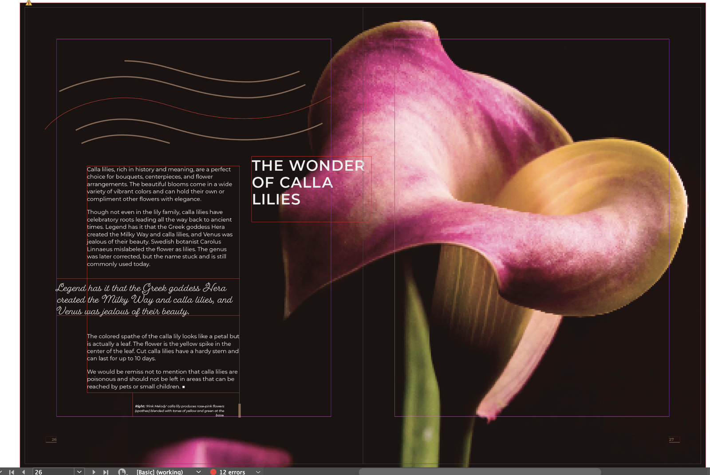

# Lab 13 - Set Type on a Path for a Curved Masthead

**Topic 03: Refine InDesign Drawings**  ·  **LO3**  ·  TGS-2021007827

## The Situation

**Harmony Petals** is running a full-page advertorial in a Singapore lifestyle magazine for the Orchard outlet's first anniversary. The agency has supplied a circular wreath photograph and Priya wants the strapline "Fresh from our Orchard Road studio since 2024" to curve around the top of the wreath, exactly as it appears on the shop window decal. The junior designer tried to fake the curve by rotating each word into place; at 100% the letters visibly stagger and the magazine's art director has rejected the page. The reprint deadline is 5 pm and the magazine charges a S$450 late-artwork fee.

## At a Glance

| | |
|---|---|
| **Learning outcome** | LO3 |
| **Objective** | Refine a layout by placing and controlling type on a path so display typography follows the artwork geometry accurately (TSC A4). |
| **You will produce** | HP_Magazine_5.indd with a live curved strapline set on an elliptical path, correctly flipped, spaced and aligned — editable text, not outlines. |
| **Tools and panels** | Adobe InDesign · Type on a Path tool · Ellipse & Pen tools · Type > Type on a Path > Options · Character panel (tracking) · Stroke panel |
| **Starter InDesign file** | `HP_Magazine_5.indd` |
| **Final filename** | `Lab-13-Completed.indd` |

## What You Will Do

Draw a path with the Pen and Ellipse tools, attach live editable type to it with the Type on a Path tool, then control the result properly — flipping the type inside the curve, changing the path type effect, and correcting the letter spacing that curves always distort.

## Phase 1 - Prepare and Baseline

1. Read this guide completely, then duplicate `HP_Magazine_5.indd` as `Lab-13-Working.indd`.
2. Create an `Evidence/` folder beside the working file.
3. Open the working copy and capture the starting Pages, Links or Preflight panel most relevant to the task.
4. Keep every linked asset inside this lab folder; never relink to Downloads, Desktop or a network path.

> **Starter role:** Magazine starter with a masthead area ready for editable type on a path.

## Phase 2 - Build

## Step-by-Step Procedure

1. Open HP_Magazine_5.indd from the Topic 3 lab folder and delete the rotated word frames the previous designer left on the page.
   > `Open HP_Magazine_5.indd`
2. Select the Ellipse tool (L) and, holding Shift, draw a circle concentric with the wreath image, slightly larger than the wreath's outer edge.
   > `L = Ellipse tool  ·  Shift-drag for a circle`
3. Set the ellipse Fill to None and Stroke to None — the path is a guide for the type, not a drawn ring.
   > `Fill None  ·  Stroke None`
4. Choose the Type on a Path tool (nested under the Type tool) and click on the top of the circle's edge when the cursor shows a small plus sign.
   > `Type on a Path tool (Shift+T)`
5. Type the strapline 'Fresh from our Orchard Road studio since 2024' and set it to 18 pt in the house display font.
6. Switch to the Selection tool and drag the Center bracket to slide the whole strapline around the circle until it is centred at 12 o'clock.
   > `V = Selection tool  ·  drag the Center bracket`
7. Drag the Start and End brackets inwards to define the arc the text may occupy, so the words do not wrap round the bottom of the circle.
8. Choose Type > Type on a Path > Options. Try each Effect — Rainbow, Skew, 3D Ribbon, Stair Step and Gravity — and settle on Rainbow for a masthead.
   > `Type > Type on a Path > Options`
9. In the same dialog set Align to Center and To Path Ascender, and tick Flip if the type needs to sit inside the curve.
   > `Options: Align Center · To Path Ascender · Flip`
10. Open the Character panel and increase Tracking to about 40 to counteract the crowding that the curve introduces at the baseline.
   > `Window > Type & Tables > Character  ·  Tracking 40`
11. Press W for Preview, zoom to 200% and confirm every letter sits evenly on the arc with no visible stagger before saving.
   > `W = Preview`

## Verify Your Work

> ✅ **Done when:** The strapline curves smoothly around the wreath as a single live text object — you can click into it with the Type tool and edit a word — and no stroke or fill from the guide path prints in Preview.

## Evidence and Submission

- [ ] Updated HP_Magazine_5.indd
- [ ] Type on a Path Options screenshot
- [ ] Editable-path screenshot
- [ ] Final native file saved as `Lab-13-Completed.indd`
- [ ] All linked assets remain inside this lab folder or its subfolders
- [ ] No overset text, missing fonts or missing links remain unless the task explicitly asks you to diagnose them

## Recovery Path

1. If the working file is damaged, close it without saving and duplicate `HP_Magazine_5.indd` again.
2. If links are missing, use the Links panel Relink command and select the matching file inside this lab folder.
3. If fonts are missing, activate Adobe Fonts or substitute an approved font, then check for reflow and overset text.
4. Re-run the verification gate and recapture evidence after recovery.

## If It Doesn't Work

Clicking on the path creates a new text frame instead of path type? You used the ordinary Type tool — switch to the Type on a Path tool and wait for the cursor's plus sign. If the text reads upside down along the bottom half, drag the flip indicator (the small marker at the centre bracket) across the path, or tick Flip in Type on a Path Options.

## Stretch Challenge

Duplicate the masthead and compare Rainbow, Skew and Gravity effects, then justify the most readable choice.

## Discussion Questions

1. Type on a path stays live and editable while converted outlines do not. What production risk does converting to outlines create when the client changes one word?
2. Why does the Rainbow effect distort letter spacing more on a tight curve than on a shallow one, and what two controls correct it?
3. You need the strapline to read the right way up on the *inside* of the circle. Describe two different ways to achieve that.
4. The path itself is currently showing a 1 pt black stroke in the printed proof. Why does that happen, and how do you remove it without deleting the type?
5. Start, Center, End and the flip indicator are all handles on a path type object. Explain what each one moves and why they are easy to confuse.

## Reference Artwork

## Reference Basis

ACP guide domain 4: create and edit paths, apply text to paths and refine position and spacing.

Current Adobe Help: https://helpx.adobe.com/indesign/desktop.html

---

© 2026 Tertiary Infotech Academy Pte Ltd. All rights reserved.
