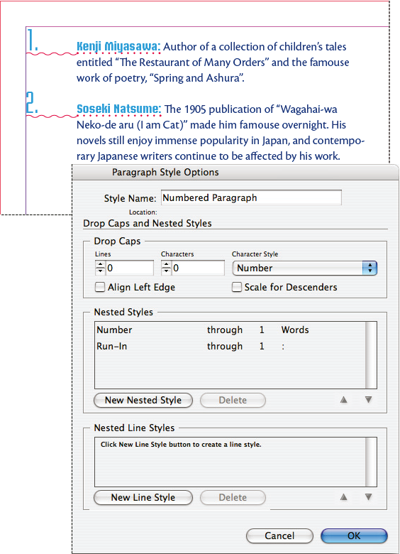

# Lab 15 - Build and Apply a House Style Set

**Topic 03: Refine InDesign Drawings**  ·  **LO3**  ·  TGS-2021007827

## The Situation

**Harmony Petals** has grown to three outlets and Priya now commissions two freelance designers alongside you. The three of you have produced the same brochure template three different ways: one used 11 pt Helvetica headings, one 12 pt Arial, one 11.5 pt with a different green. A franchise partner spotted the inconsistency and asked whether the brand guidelines were real. Priya wants a single locked style set built into the brochure template so that any designer who opens it produces identical typography, and a global colour change takes seconds not hours.

## At a Glance

| | |
|---|---|
| **Learning outcome** | LO3 |
| **Objective** | Refine drawings to project requirements by constructing a reusable paragraph, character and object style set that enforces a consistent house look across a publication (TSC A1, A4). |
| **You will produce** | HP_Brochure_7.indd carrying a complete house style set — Body / Body First / Heading 1 / Heading 2 / Caption paragraph styles with Based On and Next Style, two character styles, and an object style for image frames. |
| **Tools and panels** | Adobe InDesign · Paragraph Styles panel · Character Styles panel · Object Styles panel · Based On · Next Style · Quick Apply |
| **Starter InDesign file** | `HP_Brochure_7.indd` |
| **Final filename** | `Lab-15-Completed.indd` |

## What You Will Do

Convert manually formatted text into a structured style system: build paragraph styles with Based On inheritance, character styles for local emphasis, object styles for picture frames and callout boxes, then chain the styles with Next Style so a whole article formats in one command. Finally, prove the value of the system by changing one parent style.

## Phase 1 - Prepare and Baseline

1. Read this guide completely, then duplicate `HP_Brochure_7.indd` as `Lab-15-Working.indd`.
2. Create an `Evidence/` folder beside the working file.
3. Open the working copy and capture the starting Pages, Links or Preflight panel most relevant to the task.
4. Keep every linked asset inside this lab folder; never relink to Downloads, Desktop or a network path.

> **Starter role:** Brochure starter with inconsistent manual formatting to replace with a maintainable style system.

## Phase 2 - Build

## Step-by-Step Procedure

1. Open HP_Brochure_7.indd and inspect the manually formatted text — note the three different heading treatments across the spread.
   > `Open HP_Brochure_7.indd`
2. Click into a well-formatted body paragraph, then open Window > Styles > Paragraph Styles and choose New Paragraph Style from the panel menu; the sampled formatting is pre-loaded.
   > `Window > Styles > Paragraph Styles > New Paragraph Style`
3. Name it 'Body', confirm 10 pt / 13 pt in Basic Character Formats, set a 3 mm Space After in Indents and Spacing, and click OK.
   > `Style Name: Body  ·  Space After 3 mm`
4. Create 'Body First' with Based On set to Body, and override only one thing — First Line Indent 0 mm — to prove inheritance.
   > `New Paragraph Style > Based On: Body`
5. Create 'Heading 1' at 20 pt bold in the Harmony Petals green, with Space Before 6 mm and Keep With Next 2 lines in the Keep Options pane.
   > `Keep Options > Keep with Next 2 lines`
6. Create 'Heading 2' Based On Heading 1 at 14 pt, then create 'Caption' at 8 pt italic.
7. Edit Heading 1 and set Next Style to Body First; edit Body First and set Next Style to Body, so the chain runs automatically.
   > `Style Options > General > Next Style`
8. Select the whole article, right-click Heading 1 in the panel and choose 'Apply Heading 1 then Next Style' to format the article in one action.
   > `Right-click style > Apply [style] then Next Style`
9. Clear any remaining local overrides by Alt/Option-clicking the style name, and confirm the plus sign disappears from the panel.
   > `Alt/Option + click the style name`
10. Select a formatted image frame with a 0.5 pt green stroke and a 2 mm text wrap, then choose New Object Style from the Object Styles panel menu and name it 'Product Image'.
   > `Window > Styles > Object Styles > New Object Style`
11. Apply 'Product Image' to the other three picture frames, then edit the 'Body' style's typeface once and watch every dependent style update across the document.

## Verify Your Work

> ✅ **Done when:** Every paragraph in the brochure shows a style name with no plus sign, all four image frames report the 'Product Image' object style, and changing the Body typeface propagates to Body First automatically.

## Evidence and Submission

- [ ] Updated HP_Brochure_7.indd
- [ ] Styles panel screenshot
- [ ] Redefine-style before/after proof
- [ ] Final native file saved as `Lab-15-Completed.indd`
- [ ] All linked assets remain inside this lab folder or its subfolders
- [ ] No overset text, missing fonts or missing links remain unless the task explicitly asks you to diagnose them

## Recovery Path

1. If the working file is damaged, close it without saving and duplicate `HP_Brochure_7.indd` again.
2. If links are missing, use the Links panel Relink command and select the matching file inside this lab folder.
3. If fonts are missing, activate Adobe Fonts or substitute an approved font, then check for reflow and overset text.
4. Re-run the verification gate and recapture evidence after recovery.

## If It Doesn't Work

A style applies but the text does not change? Local overrides are winning — Alt/Option-click the style name to apply and clear overrides, or use Clear Overrides in the panel footer. If editing the parent does not change a child, the child's own definition overrides that attribute; delete the attribute from the child rather than editing it again.

## Stretch Challenge

Open the menu reference and load your house styles into it, resolving same-name conflicts without flattening local content.

## Discussion Questions

1. What does the Based On field actually inherit, and what happens to every child style when you change the parent's typeface?
2. A style name in the Paragraph Styles panel shows a plus sign next to it. What does that mean and how do you clear it?
3. Explain when you would use a character style rather than a second paragraph style.
4. Next Style lets you format an entire article in one command. What must be true about the text's paragraph order for that to work?
5. An object style can control fill, stroke, effects, text wrap and frame fitting. Why is that more valuable on a 40-page catalogue than on a one-page flyer?

## Reference Artwork

## Reference Basis

ACP guide domain 4: paragraph, character, object, table and cell styles plus local-override control.

Current Adobe Help: https://helpx.adobe.com/indesign/desktop.html

---

© 2026 Tertiary Infotech Academy Pte Ltd. All rights reserved.
