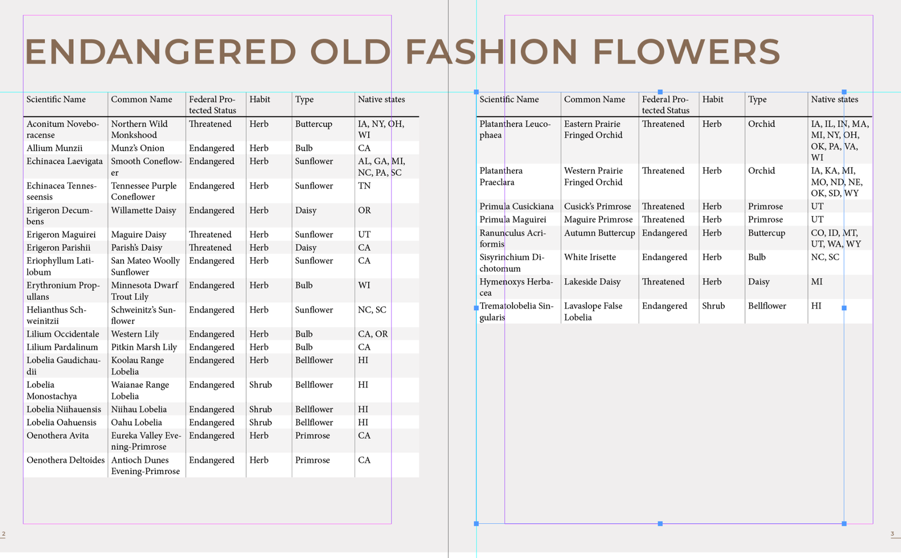

# Lab 16 - Import Data and Build a Formatted Price Table

**Topic 03: Refine InDesign Drawings**  ·  **LO3**  ·  TGS-2021007827

## The Situation

**Harmony Petals** is publishing its 2026 corporate price list for hotel and events clients. Finance has supplied the 42-line rate card as a tab-delimited text file, TableData.txt, exported from their accounting system. The previous edition was retyped by hand into text frames; two prices were transcribed wrongly and Harmony Petals had to honour a S$2,800 quotation at the misprinted rate. Priya's instruction is explicit: no retyping, and the table must repeat its header row when it flows onto the second page.

## At a Glance

| | |
|---|---|
| **Learning outcome** | LO3 |
| **Objective** | Refine a publication by importing tabular data, converting it to an InDesign table and formatting it with table and cell styles for repeatable, accurate presentation (TSC A3, A4). |
| **You will produce** | Tables_A.indd containing the imported 2026 rate card as a live InDesign table with a repeating header row, alternating fills, and a saved 'Rate Card' table style plus 'Price Cell' and 'Header Cell' cell styles. |
| **Tools and panels** | Adobe InDesign · File > Place · Table > Convert Text to Table · Table panel · Table Styles & Cell Styles panels · Table > Table Options |
| **Starter InDesign file** | `Tables_A.indd` |
| **Final filename** | `Lab-16-Completed.indd` |

## What You Will Do

Place a tab-delimited data file, convert the text to a table, then control it properly — setting header rows that repeat across frames, adjusting row and column dimensions, applying alternating fills, and locking the presentation into a table style plus cell styles so the next quarterly update is a five-minute job.

## Phase 1 - Prepare and Baseline

1. Read this guide completely, then duplicate `Tables_A.indd` as `Lab-16-Working.indd`.
2. Create an `Evidence/` folder beside the working file.
3. Open the working copy and capture the starting Pages, Links or Preflight panel most relevant to the task.
4. Keep every linked asset inside this lab folder; never relink to Downloads, Desktop or a network path.

> **Starter role:** Table starter for imported tab-delimited data, repeating headers and table/cell styles.

## Phase 2 - Build

## Step-by-Step Procedure

1. Open Tables_A.indd and draw a text frame inside the margins on page 1 with the Type tool.
   > `Open Tables_A.indd  ·  T = Type tool`
2. With the cursor in the frame choose File > Place, select TableData.txt, tick Show Import Options and confirm the delimiter is Tab.
   > `File > Place  ·  TableData.txt  ·  Show Import Options`
3. Select all the placed text and choose Table > Convert Text to Table with Column Separator: Tab and Row Separator: Paragraph.
   > `Table > Convert Text to Table`
4. Click into the first row, then choose Table > Convert Rows > To Header so the row repeats on every frame the table flows into.
   > `Table > Convert Rows > To Header`
5. Drag the frame's out port and flow the overset portion of the table to page 2; confirm the header row reappears at the top.
6. Select all cells and choose Table > Cell Options > Text to set 1.5 mm inset on all four sides and vertical justification to Centre.
   > `Table > Cell Options > Text`
7. Select the price column and use the Control panel to right-align it, then set a fixed column width so figures align on the decimal.
   > `Control panel > Align Right`
8. Choose Table > Table Options > Alternating Fills, set Alternating Pattern to Every Other Row, and apply a 10% tint of the house green.
   > `Table > Table Options > Alternating Fills`
9. In Table > Table Options > Table Setup, set the Table Border to 0.5 pt and the row strokes to 0.25 pt so the rules do not overpower the data.
   > `Table > Table Options > Table Setup`
10. Create cell styles 'Header Cell' and 'Price Cell' from the formatted cells via Window > Styles > Cell Styles > New Cell Style.
   > `Window > Styles > Cell Styles > New Cell Style`
11. Create a table style named 'Rate Card' via Window > Styles > Table Styles, assigning the two cell styles to the Header and Body rows, then apply it to the whole table.
   > `Window > Styles > Table Styles > New Table Style`

## Verify Your Work

> ✅ **Done when:** All 42 rate lines appear as a live table with no retyped figures, the header row repeats at the top of page 2, and applying the 'Rate Card' table style to a fresh table reproduces the formatting exactly.

## Evidence and Submission

- [ ] Updated Tables_A.indd
- [ ] Table/Cell Styles screenshot
- [ ] Repeated-header proof
- [ ] Final native file saved as `Lab-16-Completed.indd`
- [ ] All linked assets remain inside this lab folder or its subfolders
- [ ] No overset text, missing fonts or missing links remain unless the task explicitly asks you to diagnose them

## Recovery Path

1. If the working file is damaged, close it without saving and duplicate `Tables_A.indd` again.
2. If links are missing, use the Links panel Relink command and select the matching file inside this lab folder.
3. If fonts are missing, activate Adobe Fonts or substitute an approved font, then check for reflow and overset text.
4. Re-run the verification gate and recapture evidence after recovery.

## If It Doesn't Work

Convert Text to Table produces one giant column? The file uses commas or multiple spaces rather than tabs — reopen Show Import Options and set the correct delimiter, or use Edit > Find/Change to normalise the separators first. A red overset marker in the bottom-right cell means the text does not fit that cell: increase the row height or reduce the cell inset — never delete characters from the price data.

## Stretch Challenge

Thread the table across two frames and confirm its header repeats; then compare your result with the supplied progression references.

## Discussion Questions

1. The data arrives tab-delimited. Which two delimiters does Convert Text to Table ask for, and what does each map to?
2. A header row is different from simply formatting the first row. What behaviour do you gain, and when does it matter?
3. Explain the difference between a table style and a cell style, and the order in which InDesign applies them.
4. Your table is too tall for the frame and shows a red overset symbol. List two legitimate fixes and one that would falsify the data.
5. Finance will re-issue TableData.txt every quarter. What is the fastest correct way to refresh the table without rebuilding the formatting?

## Reference Artwork

## Reference Basis

ACP guide domain 4: create, import, format and style tables that flow with surrounding text.

Current Adobe Help: https://helpx.adobe.com/in/indesign/using/creating-tables.html

---

© 2026 Tertiary Infotech Academy Pte Ltd. All rights reserved.
