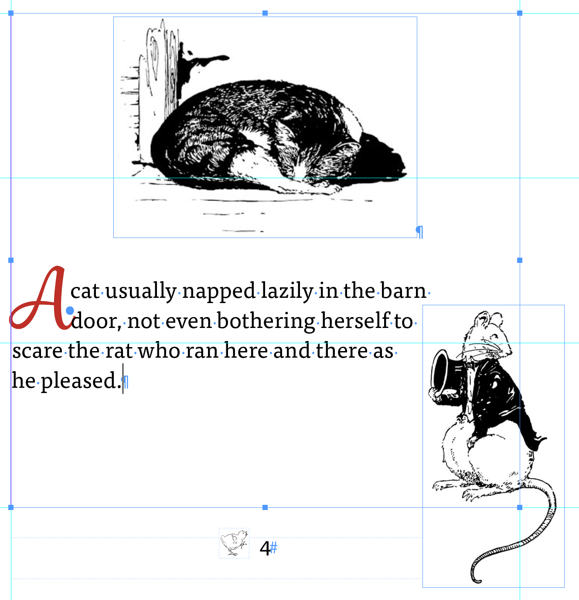

# Lab 18 - Animate Objects with Motion Presets and Page Transitions

**Topic 03: Refine InDesign Drawings**  ·  **LO3**  ·  TGS-2021007827

## The Situation

**Harmony Petals** sponsors a children's reading corner at a Bukit Timah community library and has commissioned an animated version of *The Little Red Hen* to play on the touchscreen kiosk. The library's IT officer reports that the current version "plays everything at once and then stops" — every object animates on page load with no sequencing, so children cannot follow the story. Priya also wants a Harmony Petals branded slide-in on the final page. The kiosk goes live at the school-holiday launch in nine days.

## At a Glance

| | |
|---|---|
| **Learning outcome** | LO3 |
| **Objective** | Refine a digital publication by applying animation, motion paths, timing controls and page transitions appropriate to the delivery medium (TSC A3, A4). |
| **You will produce** | An animated Harmony Petals page in HP_Magazine_7.indd with at least three sequenced animations, one custom motion path and a page transition, benchmarked against Little_Red_Hen-anim-after.indd. |
| **Tools and panels** | Adobe InDesign · Animation panel · Timing panel · Object > Interactive > Convert to Motion Path · Page Transitions panel · EPUB Interactivity Preview |
| **Starter InDesign file** | `HP_Magazine_7.indd` |
| **Final filename** | `Lab-18-Completed.indd` |

## What You Will Do

Study a finished animated file to see how sequencing is constructed, then build your own: apply motion presets, convert a drawn path into a motion path, control the event, duration and play order in the Timing panel, and finish with a page transition — always weighing whether the animation serves the reader or merely decorates.

## Phase 1 - Prepare and Baseline

1. Read this guide completely, then duplicate `HP_Magazine_7.indd` as `Lab-18-Working.indd`.
2. Create an `Evidence/` folder beside the working file.
3. Open the working copy and capture the starting Pages, Links or Preflight panel most relevant to the task.
4. Keep every linked asset inside this lab folder; never relink to Downloads, Desktop or a network path.

> **Starter role:** Magazine page to animate after studying the supplied completed animation example.

## Phase 2 - Build

## Step-by-Step Procedure

1. Open Little_Red_Hen-anim-after.indd and preview it with Window > Interactive > EPUB Interactivity Preview to see a properly sequenced animation.
   > `Open Little_Red_Hen-anim-after.indd  ·  EPUB Interactivity Preview`
2. Open the Timing panel and study how the delays stagger the objects; note which animations are grouped to play together.
   > `Window > Interactive > Timing`
3. Open HP_Magazine_7.indd, select the hero product image and open Window > Interactive > Animation.
   > `Window > Interactive > Animation`
4. Apply the preset 'Fly in from Left', set Event to On Page Load, Duration 1 second, and Speed to Ease Out.
   > `Animation panel > Preset: Fly in from Left`
5. Select the headline text frame, apply 'Fade In', and set its Duration to 0.75 seconds.
   > `Animation panel > Preset: Fade In`
6. Draw a gentle curve across the page with the Pen tool, then select both the curve and a petal graphic and choose Object > Interactive > Convert to Motion Path.
   > `Object > Interactive > Convert to Motion Path`
7. In the Animation panel adjust the motion path animation's Duration to 2 seconds and tick Animate: From Current Appearance.
   > `Animation panel > Animate: From Current Appearance`
8. Open the Timing panel, drag the three animations into the order hero image, headline, petal, and set a 0.5 second Delay on the headline and 1 second on the petal.
   > `Window > Interactive > Timing  ·  set Delay values`
9. Select two animations in the Timing panel and click Play Together at the panel footer to see the difference between sequential and simultaneous play.
   > `Timing panel > Play Together`
10. Open Window > Interactive > Page Transitions, apply the Push transition to the final page only, and set Direction and Speed.
   > `Window > Interactive > Page Transitions`
11. Preview the whole document again in EPUB Interactivity Preview and cut any animation that does not help the reader follow the page.
   > `EPUB Interactivity Preview > Play`

## Verify Your Work

> ✅ **Done when:** In EPUB Interactivity Preview the three objects animate in the intended order with visible delays between them, the petal follows the drawn curve, and the page transition fires only on the final page.

## Evidence and Submission

- [ ] Updated HP_Magazine_7.indd
- [ ] Timing panel screenshot
- [ ] Interactivity Preview evidence
- [ ] Final native file saved as `Lab-18-Completed.indd`
- [ ] All linked assets remain inside this lab folder or its subfolders
- [ ] No overset text, missing fonts or missing links remain unless the task explicitly asks you to diagnose them

## Recovery Path

1. If the working file is damaged, close it without saving and duplicate `HP_Magazine_7.indd` again.
2. If links are missing, use the Links panel Relink command and select the matching file inside this lab folder.
3. If fonts are missing, activate Adobe Fonts or substitute an approved font, then check for reflow and overset text.
4. Re-run the verification gate and recapture evidence after recovery.

## If It Doesn't Work

Nothing animates in preview? The preview is set to Preview Spread rather than Preview Document, or the objects were animated on a parent page — animation on parent pages does not play. Animation missing from your exported file means you exported a Print PDF or a reflowable EPUB; use File > Export > Adobe PDF (Interactive), Publish Online or a fixed-layout EPUB instead.

## Stretch Challenge

Place the supplied MP4, set a poster frame and compare what survives in Interactive PDF, fixed-layout EPUB and print PDF.

## Discussion Questions

1. Animation in InDesign exports to some formats and is silently discarded by others. Which formats retain it, and what does that mean for a client who also wants a print version?
2. The Animation panel offers Event choices such as On Page Load, On Click and On Roll Over. Which is appropriate for an unattended kiosk, and why?
3. Explain the difference between the Duration and the Delay of an animation, and how the Timing panel uses each to sequence a scene.
4. You drew a curved path and converted it to a motion path. What happens to the animation if you later reshape that path with the Direct Selection tool?
5. Page transitions can be applied to one page or all pages. Give a design reason for restricting a transition to a single page rather than the whole document.

## Reference Artwork

## Reference Basis

ACP guide domains 4 and 5: motion presets, timing, media, page transitions and export compatibility.

Current Adobe Help: https://helpx.adobe.com/indesign/desktop.html

---

© 2026 Tertiary Infotech Academy Pte Ltd. All rights reserved.
